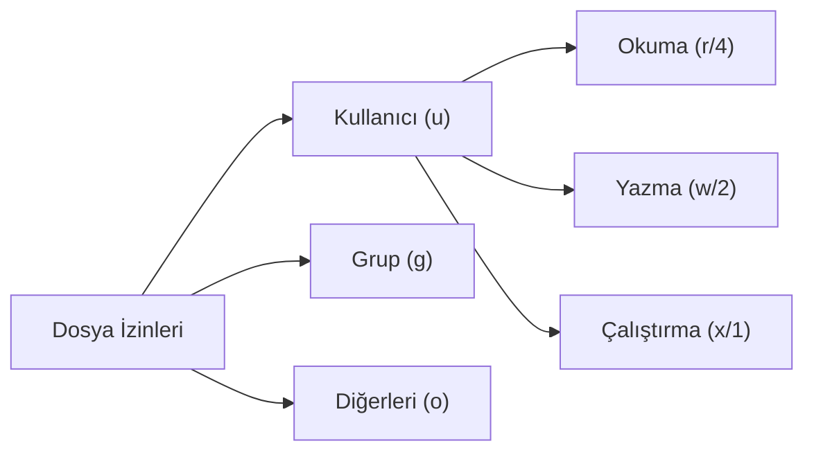

## 📌 Özet
Linux, çok kullanıcılı ve çok görevli bir işletim sistemi olduğu için, dosya ve dizinlerin güvenliği "izinler (permissions)" mekanizması ile sağlanır. Her dosyanın bir sahibi (user) ve ait olduğu bir grup (group) vardır. İzinler; okuma (read), yazma (write) ve çalıştırma (execute) olarak üç temel seviyeye ayrılır ve bu izinler "Sahip", "Grup" ve "Diğerleri" için ayrı ayrı tanımlanır. Dosya veya dizin izinlerini değiştirmek için `chmod` (change mode), sahiplik bilgilerini değiştirmek için ise `chown` (change owner) komutları kullanılır. İzinler sembolik harfler (r, w, x) veya sekizlik (octal) sayı sistemi (4, 2, 1) kullanılarak atanabilir. Doğru yapılandırılmış dosya izinleri, yetkisiz erişimleri engelleyerek sistem güvenliğinin temelini oluşturur.

## 🧠 Detay

### İzin Yapısını Okumak
`ls -l` komutu çalıştırıldığında sol başta 10 karakterlik bir dizi görülür (Örn: `-rwxr-xr--`).
- **1. Karakter:** Dosyanın tipi (`-` normal dosya, `d` dizin, `l` sembolik link).
- **2-4. Karakterler (User/Sahip):** `rwx` (Okuma, Yazma, Çalıştırma).
- **5-7. Karakterler (Group/Grup):** `r-x` (Okuma, Çalıştırma, yazma yok).
- **8-10. Karakterler (Other/Diğerleri):** `r--` (Sadece Okuma).

### Octal (Sayısal) İzin Gösterimi
- Okuma (`r`) = 4
- Yazma (`w`) = 2
- Çalıştırma (`x`) = 1
Bu değerler toplanarak izinler verilir. Örneğin; `754` izni:
- User (Sahip): 4+2+1 = 7 (rwx)
- Group (Grup): 4+1 = 5 (r-x)
- Other (Diğerleri): 4 = 4 (r--)

### chmod (Change Mode) Kullanımı
- **Sembolik Yönetim:**
  - `chmod u+x script.sh` (Kullanıcıya çalıştırma izni ekler)
  - `chmod g-w dosya.txt` (Gruptan yazma iznini alır)
  - `chmod o=r dosya.txt` (Diğerlerine sadece okuma izni verir)
- **Sayısal Yönetim:**
  - `chmod 755 script.sh` (rwxr-xr-x)
  - `chmod 600 private_key` (rw-------, SSH anahtarları için gereklidir)

### chown (Change Owner) ve chgrp Kullanımı
- `chown root dosya.txt` (Dosyanın sahibini root yapar)
- `chown www-data:www-data /var/www/html` (Hem sahibini hem de grubunu değiştirir)
- `chown -R kullanici:grup dizin/` (Özyineli olarak tüm içeriğin sahipliğini değiştirir)

### Özel İzinler (SUID, SGID, Sticky Bit)
- **SUID (Set-user-ID):** Çalıştırılabilir dosyaya sahibinin yetkileriyle çalışma hakkı verir (`chmod 4755`).
- **SGID (Set-group-ID):** Dizinler için yeni oluşturulan dosyaların dizinin grubunu almasını sağlar (`chmod 2755`).
- **Sticky Bit:** Bir dizinde sadece dosya sahibinin veya root'un o dosyayı silebilmesini sağlar (`chmod 1777`, örn: `/tmp` dizini).

## 💡 Bağlantılar
- [[Linux - Temel Komutlar (ls, cd, cp, mv, rm, find)]]
- [[Linux - Process Yönetimi (ps, top, kill, systemd)]]

## ❓ Sorular / Anlamadıklarım

## 🔗 Kaynaklar
- [Linux File Permissions Explained](https://linuxize.com/post/understanding-linux-file-permissions/)