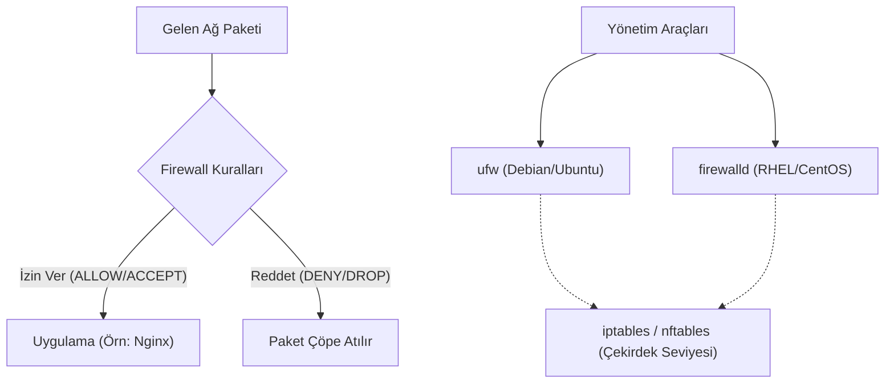

## 📌 Özet
Bir Linux sunucusunu internete veya yerel ağa açtığınızda, hangi portların ve IP adreslerinin sisteme erişebileceğini belirlemek hayati bir güvenlik önlemidir. Linux çekirdeğinde yerleşik olarak bulunan `netfilter` modülü bu paket filtreleme işini yapar. `iptables`, netfilter ile konuşan ve kuralları belirleyen geleneksel, çok güçlü ancak öğrenmesi zor bir komut satırı aracıdır. Karmaşık iptables sözdizimini basitleştirmek ve son kullanıcıların/yöneticilerin hayatını kolaylaştırmak için Ubuntu/Debian sistemlerinde `ufw` (Uncomplicated Firewall), Red Hat/CentOS sistemlerinde ise `firewalld` geliştirilmiştir. Genellikle "önce tüm gelen bağlantıları reddet, sonra sadece ihtiyaç duyulanlara (Örn: SSH için 22, HTTP için 80) izin ver" (Default Deny) mantığıyla çalışılır.

## 🧠 Detay

### UFW (Uncomplicated Firewall) Kullanımı
Ubuntu sistemlerinde iptables'ı yönetmenin en kolay yoludur.
- **Durumu Kontrol Etme:** `sudo ufw status verbose`
- **Aktifleştirme / Kapatma:** `sudo ufw enable` / `sudo ufw disable`
  *(Dikkat: Uzak sunucuda enable etmeden önce SSH'a izin vermeyi unutmayın, yoksa dışarıda kalırsınız!)*
- **Kural Ekleme (İzin Verme):**
  - `sudo ufw allow 22/tcp` (SSH için izin)
  - `sudo ufw allow http` veya `sudo ufw allow 80`
  - `sudo ufw allow 443/tcp` (HTTPS için izin)
- **Kural Silme / Reddetme:**
  - `sudo ufw deny 3306` (MySQL portunu dışarıya kapat)
  - `sudo ufw delete allow 80` (Daha önce verilmiş izni kaldır)
- **Belirli bir IP'ye İzin Verme:**
  - `sudo ufw allow from 192.168.1.100 to any port 22`

### Iptables: Arka Plandaki Güç
UFW sadece iptables için bir arayüzdür. İleri düzey yönlendirmeler (NAT) için doğrudan iptables kullanılır. İptables tablolar (tables) ve zincirlerden (chains: INPUT, OUTPUT, FORWARD) oluşur.
- **Mevcut Kuralları Listeleme:** `sudo iptables -L -n -v`
- **Kural Ekleme (INPUT zincirine, 80 portunu kabul et):**
  `sudo iptables -A INPUT -p tcp --dport 80 -j ACCEPT`
- **Kural Ekleme (Belirli bir IP'yi blokla/drop):**
  `sudo iptables -A INPUT -s 10.10.10.50 -j DROP`
- **Kuralları Silme (Flush):** `sudo iptables -F` (Tüm kuralları temizler).

### Fail2Ban ile Otomatik Koruma
Firewall kuralları statiktir. Eğer bir saldırgan sürekli farklı şifrelerle SSH'a girmeye çalışıyorsa, `fail2ban` adlı yazılım logları (`auth.log`) takip eder ve arka arkaya x defa hata yapan IP'yi otomatik olarak iptables/ufw üzerinden banlar.

## 💡 Bağlantılar
- [[Linux - Ağ Komutları (ip, netstat, curl, ssh)]]
- [[Linux - SSH Sertifika ve Tünel]]

## ❓ Sorular / Anlamadıklarım

## 🔗 Kaynaklar
- [UFW Essentials (DigitalOcean)](https://www.digitalocean.com/community/tutorials/ufw-essentials-common-firewall-rules-and-commands)