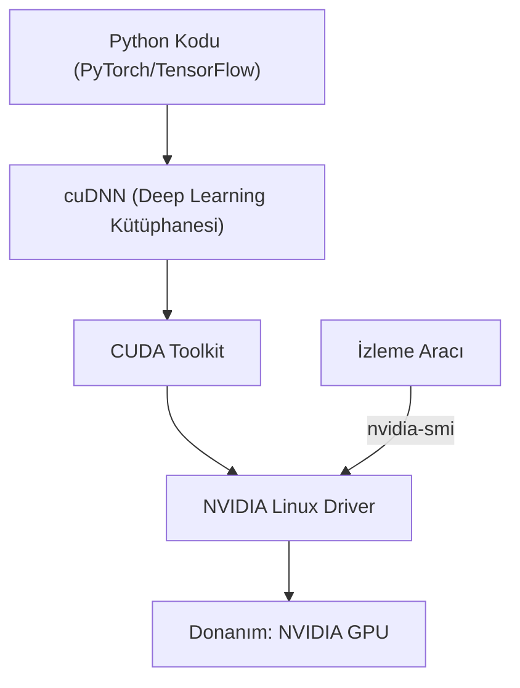

## 📌 Özet
Özellikle derin öğrenme (Deep Learning), yapay zeka ve yüksek performanslı hesaplama (HPC) alanlarında Linux sunucularının gücü, sahip oldukları Ekran Kartlarına (GPU) bağlıdır. NVIDIA marka GPU'ların Linux üzerinde düzgün çalışabilmesi için özel NVIDIA sürücülerinin (drivers) kurulması gerekir. Sürücünün ötesinde, GPU çekirdeklerini (CUDA cores) paralel hesaplama için kullanabilmek amacıyla NVIDIA tarafından geliştirilen CUDA (Compute Unified Device Architecture) Toolkit yazılımı şarttır. Sistemde GPU'ların anlık durumunu, sıcaklığını, bellek (VRAM) kullanımını ve hangi process'in hangi GPU'yu ne kadar kullandığını izlemek için `nvidia-smi` komutu kullanılır. TensorFlow veya PyTorch gibi kütüphanelerin GPU'yu görebilmesi için sistemde sürücü, CUDA Toolkit ve bazen cuDNN (CUDA Deep Neural Network library) versiyonlarının tam bir uyum içinde olması hayati önem taşır.

## 🧠 Detay



### Sürücü ve CUDA Kurulum Mantığı
GPU ortamının kurulması, genellikle sistem yöneticileri için en sancılı süreçlerden biridir çünkü versiyon uyuşmazlıkları çok sık yaşanır.
1. **Sürücü (Driver):** Çekirdeğin donanımla konuşmasını sağlar. (Örn: `nvidia-driver-535`)
2. **CUDA Toolkit:** GPU'yu genel amaçlı hesaplama (GPGPU) için açar. (Örn: CUDA 11.8 veya 12.1)
*Not:* Çoğu zaman `apt` üzerinden kurmak yerine NVIDIA'nın kendi depolarından (repo) resmi `.run` veya `.deb` paketlerini indirmek daha kararlı sonuçlar verir.

### GPU İzleme: nvidia-smi
`nvidia-smi` (NVIDIA System Management Interface), GPU yönetiminin kalbidir.
- **Tek seferlik görüntüleme:** Sadece `nvidia-smi` yazıp entera basılır. Ekrana bir tablo gelir.
  - *Driver Version / CUDA Version:* Yüklü sürücü ve desteklenen maksimum CUDA sürümünü gösterir.
  - *GPU Fan, Temp, Pwr:* Fan hızı, sıcaklık ve harcanan güç (Watt) bilgisidir. Aşırı ısınmalarda (Örn: 85°C üstü) GPU "Thermal Throttling" yaparak performansını bilerek düşürür.
  - *Memory-Usage:* GPU üzerindeki RAM'in (VRAM) ne kadarının kullanıldığını gösterir. Derin öğrenme modellerinde Batch Size çok büyükse burası dolar ve "Out of Memory (OOM)" hatası alınır.
  - *Volatile Uncorr. ECC:* Bellek hatalarını gösterir.
  - *Processes:* En altta hangi PID numaralı uygulamanın hangi GPU'yu kullandığını listeler.

- **Canlı İzleme (Sürekli Güncelleme):** `watch -n 1 nvidia-smi` (Her 1 saniyede bir ekranı günceller).

### Çoklu GPU Yönetimi (CUDA_VISIBLE_DEVICES)
Eğer sistemde 4 adet GPU varsa (0, 1, 2, 3), bir Python scriptinin veya Docker konteynerinin sadece 2 numaralı GPU'yu görmesini isteyebilirsiniz. Bunun için ortam değişkeni (environment variable) kullanılır:
```bash
CUDA_VISIBLE_DEVICES=2 python egitim.py
```
*(Bu durumda PyTorch, sistemi sanki tek bir GPU'su varmış gibi görecek ve sadece 2 numaralı donanımı kullanacaktır).*

## 💡 Bağlantılar
- [[Linux - Python ve ML Ortamı Kurulumu]]
- [[Linux - Sistem İzleme ve Performans]]

## ❓ Sorular / Anlamadıklarım

## 🔗 Kaynaklar
- [NVIDIA CUDA Installation Guide for Linux](https://docs.nvidia.com/cuda/cuda-installation-guide-linux/index.html)