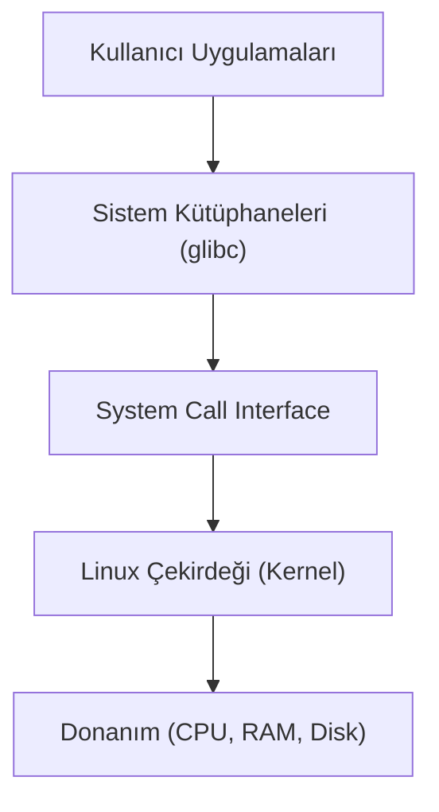

## 📌 Özet
Linux, açık kaynaklı ve özgür bir işletim sistemi çekirdeğidir ve bu çekirdek etrafında şekillenen işletim sistemlerine "Linux Dağıtımı" adı verilir. 1991 yılında Linus Torvalds tarafından geliştirilmeye başlanan Linux, günümüzde sunuculardan akıllı telefonlara, gömülü sistemlerden süper bilgisayarlara kadar geniş bir yelpazede kullanılmaktadır. Bir Linux dağıtımı; çekirdek (kernel), sistem kütüphaneleri, yönetim araçları, paket yöneticisi ve genellikle bir masaüstü ortamından oluşur. Debian, Red Hat, Arch ve SUSE gibi farklı kökenlere sahip dağıtımlar, kullanıcıların ihtiyaçlarına göre özelleşmiş çözümler sunar. Geliştiriciler ve sistem yöneticileri için komut satırı arayüzü (CLI), Linux'un en güçlü ve esnek araçlarından biridir. Linux mimarisi donanımla en altta etkileşime giren kernel'in üzerinde çalışan user-space uygulamalarıyla yüksek güvenlik ve kararlılık sağlar.

## 🧠 Detay

### Linux Mimarisi ve Bileşenleri
Linux işletim sistemi katmanlı bir mimariye sahiptir. En altta **Donanım (Hardware)** yer alır ve işletim sisteminin temel görevlerinden biri bu donanım kaynaklarını yönetmektir. Donanımın hemen üzerinde **Linux Çekirdeği (Kernel)** bulunur; kernel, süreç yönetimi, bellek yönetimi, donanım sürücüleri ve ağ yığınını içerir. Çekirdeğin üzerinde **System Call Interface** yer alır ve kullanıcı uzayı (user-space) uygulamalarının çekirdek ile güvenli bir şekilde iletişim kurmasını sağlar.

### Popüler Linux Dağıtımları (Distros)
1. **Debian Ailesi (Ubuntu, Linux Mint):** Paket yöneticisi olarak `APT` (Advanced Package Tool) ve `dpkg` kullanır. Özellikle Ubuntu, kullanıcı dostu olması ve geniş topluluk desteği ile sunucu ve masaüstü dünyasında çok yaygındır.
2. **Red Hat Ailesi (RHEL, CentOS, Fedora):** Paket yöneticisi olarak `YUM` veya `DNF` ve `rpm` kullanır. Kurumsal alanda (Enterprise) tercih edilir, yüksek kararlılık ve uzun süreli destek sunar.
3. **Arch Ailesi (Arch Linux, Manjaro):** Paket yöneticisi olarak `pacman` kullanır. "Rolling release" (sürekli güncel) modeli ile bilinir. En güncel yazılımları kullanmak isteyen ileri düzey kullanıcılar içindir.

### Neden Linux?
- **Açık Kaynak:** Kaynak kodları herkes tarafından incelenebilir ve değiştirilebilir.
- **Güvenlik:** Kullanıcı yetkileri (permissions) katıdır ve virüs bulaşma riski düşüktür.
- **Kararlılık:** Uzun süre yeniden başlatılmadan sorunsuz çalışabilir.
- **Özelleştirilebilirlik:** Masaüstü ortamlarından, kullanılacak servislere kadar her şey baştan sona değiştirilebilir.

## 💡 Bağlantılar
- [[Linux - Dosya Sistemi Yapısı]]
- [[Linux - Temel Komutlar (ls, cd, cp, mv, rm, find)]]

## ❓ Sorular / Anlamadıklarım

## 🔗 Kaynaklar
- [Linux Kernel Official Documentation](https://www.kernel.org/doc/html/latest/)
- [DistroWatch - Dağıtım İncelemeleri](https://distrowatch.com/)