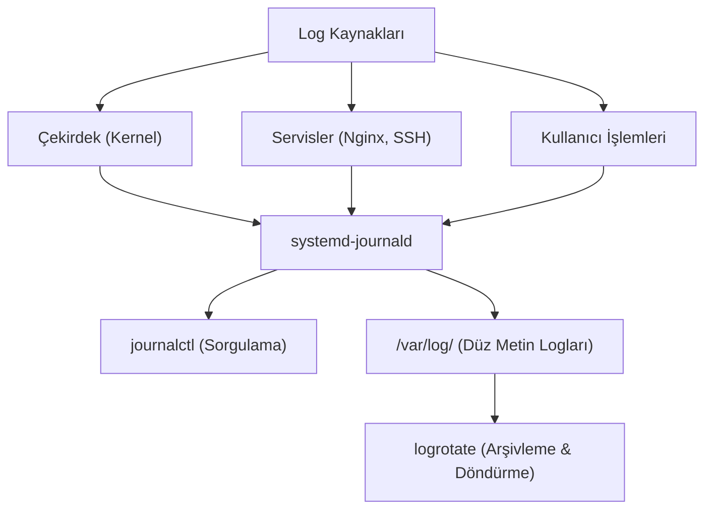

## 📌 Özet
Linux sistemlerinde çekirdek mesajları, servis hataları, kullanıcı giriş çıkışları ve sistem olayları sürekli olarak "log" (günlük) dosyalarına kaydedilir. Bu kayıtlar, sistem yöneticilerinin arızaları teşhis etmesinde (troubleshooting) ve güvenlik denetimlerinde en önemli rehberdir. Geleneksel olarak bu dosyalar `/var/log` dizini altında düz metin olarak tutulur (örn: `syslog`, `auth.log`). Ancak modern `systemd` kullanan Linux dağıtımlarında, tüm loglar merkezi ve indekslenmiş ikili (binary) bir veritabanında toplanır ve bu kayıtlar `journalctl` aracı ile sorgulanır. Log dosyalarının boyutlarının kontrolsüzce büyüyüp diski doldurmasını engellemek için ise `logrotate` adlı araç kullanılır. `logrotate`, dosyaları belirli periyotlarla arşivler, sıkıştırır ve eskiyenleri silerek depolama alanını optimize eder.

## 🧠 Detay

### Geleneksel Log Dosyaları (/var/log)
Bu dosyalar `tail`, `less`, `grep` veya `cat` gibi klasik metin araçlarıyla okunabilir.
- `/var/log/syslog` (veya `/var/log/messages`): Sistemin genel loglarıdır.
- `/var/log/auth.log` (veya `/var/log/secure`): Başarılı/başarısız giriş denemeleri, sudo kullanımları ve SSH bağlantıları buraya düşer.
- `/var/log/dmesg` (veya `kern.log`): Sadece kernel (çekirdek) ve donanım loglarını barındırır.
- `/var/log/nginx/` veya `/var/log/httpd/`: Web sunucularının kendine ait log dizinleridir (access.log, error.log).

**Anlık Log İzleme:**
- `tail -f /var/log/syslog` (Dosyaya eklenen yeni satırları canlı olarak ekrana basar).

### journalctl Kullanımı
`journalctl`, systemd'nin günlük yöneticisidir ve logları zamana, servise veya önceliğe göre çok hızlı filtrelemenizi sağlar.
- `journalctl` (Tüm logları gösterir, sayfalandırarak).
- `journalctl -u nginx.service` (Sadece Nginx servisine ait logları gösterir).
- `journalctl -f` (Tıpkı `tail -f` gibi logları canlı olarak takip eder).
- `journalctl --since "1 hour ago"` (Son 1 saat içindeki logları getirir).
- `journalctl -p err` (Sadece hata (error) ve daha kritik seviyedeki logları gösterir. Uyarı ve bilgileri gizler).
- `journalctl -k` (Sadece kernel mesajlarını - dmesg benzeri - gösterir).

### Logrotate ile Logları Döndürme
`logrotate`, cron tarafından periyodik olarak çalıştırılır. Konfigürasyonu `/etc/logrotate.conf` dosyasında ve `/etc/logrotate.d/` dizininde yer alır.
- **Döndürme (Rotation):** Log dosyası belli bir boyuta ulaştığında veya her hafta sonu, mevcut dosyanın adı değiştirilir (örn: `syslog.1.gz`), yerine yeni ve boş bir `syslog` oluşturulur.
- **Retention (Saklama Süresi):** Örneğin sadece son 4 haftalık logların tutulması ayarlanabilir, 5. haftada en eski log otomatik silinir.

## 💡 Bağlantılar
- [[Linux - Process Yönetimi (ps, top, kill, systemd)]]
- [[Linux - Metin İşleme (grep, sed, awk)]]

## ❓ Sorular / Anlamadıklarım

## 🔗 Kaynaklar
- [systemd journalctl Tutorial](https://www.digitalocean.com/community/tutorials/how-to-use-journalctl-to-view-and-manipulate-systemd-logs)