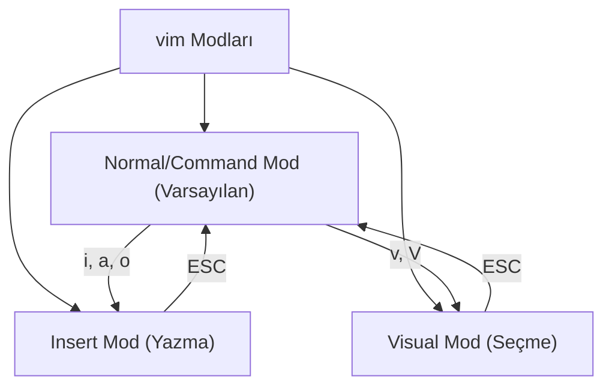

## 📌 Özet
Linux ortamında grafik arayüz (GUI) olmadan konfigürasyon dosyalarını düzenlemek, kod yazmak veya not almak için komut satırı tabanlı metin editörleri kullanılır. En yaygın kullanılan iki editör `nano` ve `vim`'dir. `nano`, öğrenmesi çok kolay, sade ve yön tuşlarıyla gezinebildiğiniz kullanıcı dostu bir editördür. Buna karşın `vim` (Vi IMproved), başlangıçta öğrenme eğrisi çok dik olan ancak ustalaşıldığında fare kullanmadan muazzam hızlarda metin düzenlemeye olanak tanıyan, modüler (mod tabanlı) bir editördür. `vim`'in Komut (Command), Ekleme (Insert) ve Görsel (Visual) modları bulunur. Sistem yöneticileri ve geliştiriciler, her Linux sisteminde varsayılan olarak bulunduğu ve büyük dosyaları çok hızlı açabildiği için genellikle `vim`'i tercih ederler. Hangi editörün seçileceği genellikle kullanım amacına ve kullanıcının deneyimine bağlıdır.

## 🧠 Detay

### nano: Yeni Başlayanlar İçin İdeal
`nano` kullanımı çok basittir. Terminalde `nano dosya.txt` yazarak açılır. Ekranın altında kısayollar her zaman görünür (Örn: `^O` Kaydetmek için, `^X` Çıkmak için). `^` işareti `Ctrl` tuşunu temsil eder.
- **Kaydetme:** `Ctrl + O` (Enter ile onaylanır)
- **Çıkış:** `Ctrl + X`
- **Arama:** `Ctrl + W`

### vim: İleri Düzey Güç
`vim`, klavye kısayolları ile çalışmak üzere tasarlanmıştır. `vim dosya.txt` ile açıldığında doğrudan "Normal Mod"da başlarsınız, bu modda harf tuşları metin girmek için değil, gezinmek ve komut vermek için kullanılır.

#### vim Temel Kısayolları (Normal Mod)
- **Gezinme:** `h` (sol), `j` (aşağı), `k` (yukarı), `l` (sağ).
- **Yazmaya Başlama (Insert Mode):**
  - `i` (İmlecin olduğu yerden başla)
  - `a` (İmlecin bir sonrasından başla)
  - `o` (Alt satıra geç ve başla)
- **Silme / Kopyalama / Yapıştırma:**
  - `dd` (Bulunulan satırı sil/kes)
  - `yy` (Bulunulan satırı kopyala / yank)
  - `p` (Kesilen veya kopyalanan satırı yapıştır)
  - `u` (Geri al / undo)
- **Kaydetme ve Çıkma:** (Normal moddayken `:` basılarak Command-Line moduna geçilir)
  - `:w` (Kaydet / write)
  - `:q` (Çık / quit)
  - `:wq` veya `:x` (Kaydet ve Çık)
  - `:q!` (Kaydetmeden zorla çık)
- **Arama:** `/kelime` (Sonrakini bulmak için `n`, öncekini bulmak için `N`)

## 💡 Bağlantılar
- [[Linux - Shell Scripting (bash)]]
- [[Linux - Dosya Sistemi Yapısı]]

## ❓ Sorular / Anlamadıklarım

## 🔗 Kaynaklar
- [Vim Documentation](https://www.vim.org/docs.php)
- [Nano Editor Manual](https://www.nano-editor.org/docs.php)