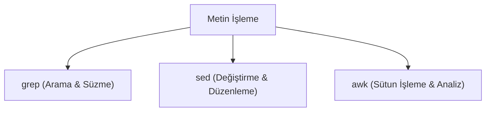

## 📌 Özet
Linux ortamında büyük log dosyalarını incelemek, verileri süzmek ve yapısal metinleri değiştirmek için komut satırı araçları kullanılır. Bu araçların "Kutsal Üçlüsü" `grep`, `sed` ve `awk` komutlarıdır. `grep` (Global Regular Expression Print), dosyalar içinde belirli kelimeleri veya düzenli ifadeleri (Regex) arayıp bulmak için kullanılır. `sed` (Stream Editor), metin akışında anlık olarak bul-değiştir işlemleri yapmak veya satır silmek/eklemek için kullanılan güçlü bir araçtır. `awk` ise sadece bir komut değil, sütunlara ve alanlara (fields) ayrılmış veriler (CSV, boşlukla ayrılmış loglar) üzerinde matematiksel işlemler yapabilen, kendi döngüleri olan başlı başına bir programlama dilidir. Bu üç araç genellikle pipe (`|`) ile birleştirilerek veri mühendisliği ve sistem log analizi gibi ileri düzey görevlerde kullanılır.

## 🧠 Detay

### grep (Arama Aracı)
Satır bazlı arama yapar ve eşleşen satırları ekrana basar.
- **Basit Arama:** `grep "hata" log.txt` (İçinde "hata" kelimesi geçen satırları bulur)
- **Büyük/Küçük Harf Duyarsız:** `grep -i "hata" log.txt` (HATA, Hata, hata vs.)
- **Satır Numarası Gösterme:** `grep -n "hata" log.txt`
- **Ters Arama (Hariç Tutma):** `grep -v "info" log.txt` ("info" geçmeyenleri gösterir)
- **Recursive (Özyineli) Arama:** `grep -r "AramaMetni" /var/log/` (Dizin içindeki tüm dosyalarda arar)

### sed (Stream Editor)
Genellikle bir dosya içindeki kelimeleri değiştirmek (find and replace) için kullanılır.
- **Bul ve Değiştir:** `sed 's/eski_kelime/yeni_kelime/' dosya.txt` (Her satırdaki İLK eşleşmeyi değiştirir)
- **Global Değiştirme:** `sed 's/eski/yeni/g' dosya.txt` (Satırdaki TÜM eşleşmeleri değiştirir)
- **Dosyanın İçine Kaydetme:** `sed -i 's/eski/yeni/g' dosya.txt` (`-i` parametresi değişikliği doğrudan dosyaya uygular)
- **Belirli Satırı Silme:** `sed '2d' dosya.txt` (2. satırı siler), `sed '/hata/d' dosya.txt` (İçinde hata geçen satırları siler).

### awk (Veri Analizi ve Sütun İşleme)
`awk`, veriyi satır satır okur ve her satırı boşluklara göre (varsayılan) sütunlara ayırır. `$1` birinci sütunu, `$2` ikinci sütunu temsil eder.
- **Belirli Sütunları Yazdırma:** `ls -l | awk '{print $1, $9}'` (Dosya izinleri ve dosya isimlerini yazdırır).
- **Ayrıştırıcı Değiştirme (Delimiter):** `awk -F":" '{print $1}' /etc/passwd` (Sütun ayırıcıyı iki nokta üst üste yapar ve sadece kullanıcı adlarını çeker).
- **Koşullu İşlemler:** `awk '$3 > 100 {print $1}' veri.txt` (3. sütunu 100'den büyük olan satırların 1. sütununu yazdırır).

## 💡 Bağlantılar
- [[Linux - Pipe ve Yönlendirme (vbar, gt, ggt)]]
- [[Linux - Log Yönetimi (journalctl, logrotate)]]

## ❓ Sorular / Anlamadıklarım

## 🔗 Kaynaklar
- [GNU Grep Manual](https://www.gnu.org/software/grep/manual/grep.html)
- [Sed & Awk Book (O'Reilly)](https://www.oreilly.com/library/view/sed-awk/1565922255/)