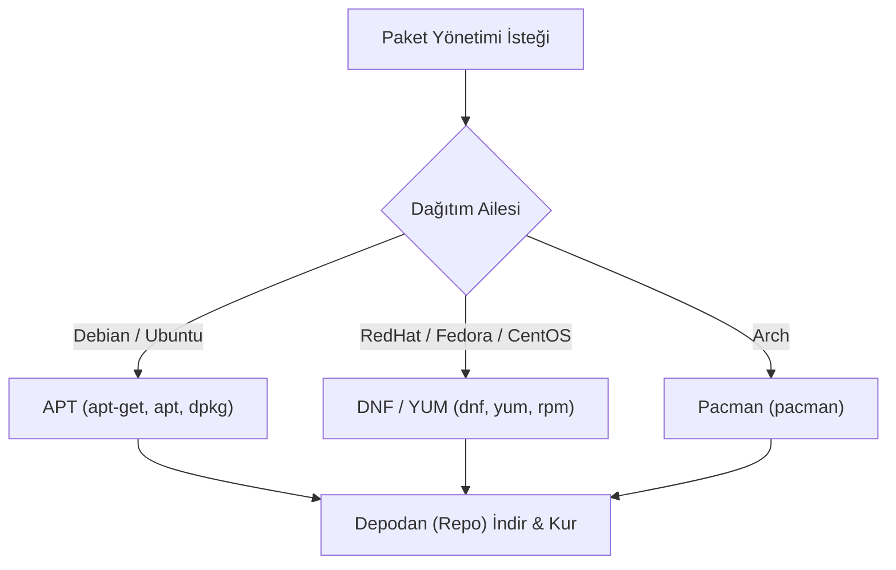

## 📌 Özet
Linux'ta program yükleme, güncelleme ve kaldırma işlemleri, merkezi bir depo (repository) üzerinden "Paket Yöneticileri" vasıtasıyla yapılır. Windows'taki "internetten .exe indirip kurma" mantığının aksine, paket yöneticileri yazılımları güvenilir sunuculardan indirir, kurar ve o yazılımın ihtiyaç duyduğu diğer kütüphaneleri (bağımlılıkları / dependencies) otomatik olarak çözer. Dağıtım ailelerine göre paket yöneticileri değişiklik gösterir: Debian/Ubuntu tabanlı sistemler `apt` (Advanced Package Tool), Red Hat/CentOS tabanlı sistemler eski `yum` yerine modern `dnf`, Arch Linux tabanlı sistemler ise `pacman` kullanır. Paket yöneticileri sayesinde sistemin genel güvenliği sağlanır ve tüm işletim sistemi tek bir komutla kolayca güncel tutulabilir.

## 🧠 Detay

### APT (Debian / Ubuntu)
Apt, `.deb` uzantılı paketleri yönetir.
- **Depo Listesini Güncelleme:** `sudo apt update` (Kurulabilir paketlerin en güncel listesini çeker, yükleme yapmaz).
- **Sistemi Güncelleme:** `sudo apt upgrade` (Kurulu olan paketleri yeni versiyonlarına yükseltir).
- **Paket Kurma:** `sudo apt install nginx`
- **Paket Kaldırma:** `sudo apt remove nginx` (Ayarları bırakır)
- **Paket ve Ayarları Kaldırma (Temizleme):** `sudo apt purge nginx`
- **Artık Gerekmeyen Bağımlılıkları Silme:** `sudo apt autoremove`
- **Yerel bir .deb dosyası kurma:** `sudo dpkg -i paket.deb` (Bağımlılıkları çözmez, ardından `apt -f install` gerekebilir).

### DNF / YUM (Red Hat / CentOS / Fedora)
RPM (Red Hat Package Manager) tabanlı sistemlerin paket yöneticisidir. `yum` eskiyip yerini daha hızlı olan `dnf`'ye bırakmıştır, komutlar aynıdır.
- **Güncelleme Kontrolü:** `sudo dnf check-update`
- **Sistemi Güncelleme:** `sudo dnf upgrade` veya `sudo dnf update`
- **Paket Kurma:** `sudo dnf install httpd`
- **Paket Kaldırma:** `sudo dnf remove httpd`
- **Paket Arama:** `sudo dnf search apache`
- **Yerel bir .rpm dosyası kurma:** `sudo rpm -ivh paket.rpm`

### Neden Kaynaktan Derlemek Yerine Paket Yöneticisi?
Eskiden (veya özel durumlarda) programlar `make` ve `make install` kullanılarak kaynaktan (source) derlenirdi. Paket yöneticileri; yazılımın güncellenmesini, sistemden tamamen temizlenmesini ve kütüphane çakışmalarının (Dependency Hell) önlenmesini otomatikleştirerek büyük zaman kazandırır.

## 💡 Bağlantılar
- [[Linux - Giriş ve Dağıtımlar]]
- [[Linux - Docker ile Linux]]

## ❓ Sorular / Anlamadıklarım

## 🔗 Kaynaklar
- [Debian APT Guide](https://wiki.debian.org/Apt)
- [DNF Command Reference](https://dnf.readthedocs.io/en/latest/command_ref.html)