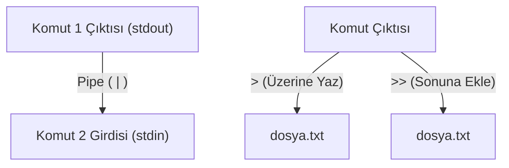

## 📌 Özet
Linux felsefesinin en güçlü özelliklerinden biri, küçük ve tek bir işi iyi yapan araçları birleştirerek karmaşık işlemler yapabilmektir. Bu birleştirme işlemi "Boru" (Pipe, `|`) operatörü ile sağlanır; bir komutun çıktısı (stdout), diğer bir komutun girdisi (stdin) olarak aktarılır. Yönlendirme (Redirection) operatörleri olan büyüktür işareti (`>`) ve çift büyüktür işareti (`>>`) ise komutların çıktılarını ekrana yazdırmak yerine bir dosyaya yazmak için kullanılır. `>` operatörü dosyanın içeriğini tamamen ezerken (üzerine yazarken), `>>` operatörü yeni veriyi mevcut dosyanın sonuna ekler (append). Aynı zamanda, hataların (stderr) da ayrı dosyalara yönlendirilmesi sayesinde log yönetimi ve hata ayıklama süreçleri son derece profesyonelce yapılabilir.

## 🧠 Detay

### Standart Akışlar (Standard Streams)
Linux'ta 3 temel veri akışı (stream) vardır:
1. **stdin (0):** Standart Girdi (Genellikle klavye).
2. **stdout (1):** Standart Çıktı (Ekrana yazılan başarılı sonuçlar).
3. **stderr (2):** Standart Hata (Ekrana yazılan hata mesajları).

### Pipe ( | ) Kullanımı
Pipe işareti, komutları zincirlemek için kullanılır.
- `ls -l | grep "txt"` (Listeleme komutunun çıktısını `grep`'e atar, sadece içinde "txt" geçenleri süzer).
- `ps aux | sort -nrk 3 | head -n 5` (Çalışan süreçleri listeler, 3. sütuna (CPU) göre büyükten küçüğe sıralar, sadece ilk 5'ini gösterir).

### Çıktı Yönlendirme (> ve >>)
- **`>` (Overwrite - Üzerine Yazma):**
  - `echo "Merhaba Dünya" > merhaba.txt` (Dosya yoksa oluşturur, varsa içindekini silip bunu yazar).
- **`>>` (Append - Sonuna Ekleme):**
  - `echo "Yeni Satır" >> merhaba.txt` (Dosyanın mevcut içeriğini bozmadan en alta ekleme yapar).

### Hata (Stderr) Yönlendirme
Bazen sadece hataları loglamak veya ekrandan gizlemek isteriz.
- `find / -name "gizli.txt" 2> hatalar.log` (Erişim reddedildi gibi "hata" mesajlarını log dosyasına yazar, başarılı olanları ekranda gösterir).
- **Hem Çıktıyı Hem Hatayı Aynı Dosyaya Yazma:**
  - `komut > tam_log.txt 2>&1` (2 numaralı stderr'i, 1 numaralı stdout'un gittiği yere yönlendirir).

### "Kara Delik": /dev/null
Sistemde istenmeyen çıktıları yok etmek için yönlendirilen özel bir dosyadır.
- `ping 8.8.8.8 > /dev/null 2>&1` (Ping işleminin hiçbir çıktısını veya hatasını ekranda göstermez).

## 💡 Bağlantılar
- [[Linux - Metin İşleme (grep, sed, awk)]]
- [[Linux - Temel Komutlar (ls, cd, cp, mv, rm, find)]]

## ❓ Sorular / Anlamadıklarım

## 🔗 Kaynaklar
- [GNU Bash Redirections](https://www.gnu.org/software/bash/manual/html_node/Redirections.html)