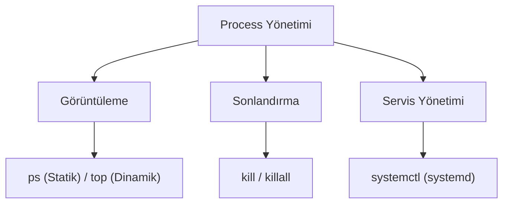

## 📌 Özet
Linux'ta çalışan her programa veya komuta bir süreç (process) adı verilir ve işletim sistemi bunları benzersiz bir PID (Process ID) ile takip eder. Sistemdeki kaynak tüketimini (CPU, RAM) izlemek, donan veya gereksiz çalışan process'leri sonlandırmak sistem kararlılığı için elzemdir. Anlık süreçleri görmek için `ps`, canlı ve dinamik kaynak tüketimini izlemek için `top` veya `htop` kullanılır. Bir süreci durdurmak veya sinyal göndermek için `kill` komutundan yararlanılır. Modern Linux dağıtımlarında arka planda sürekli çalışan hizmetlerin (daemon) ve genel sistem durumunun yönetimi `systemd` ve onun temel aracı olan `systemctl` ile gerçekleştirilir. `systemctl` sayesinde servisler başlatılır, durdurulur ve sistem açılışında otomatik başlamaları sağlanır.

## 🧠 Detay

### Süreçleri Görüntüleme (ps ve top)
- **`top`:** Sistemdeki process'leri CPU kullanımına göre canlı olarak sıralar. Çıkmak için `q` tuşuna basılır. (Daha renkli ve gelişmiş alternatifi `htop`'tur).
- **`ps` (Process Status):** O anki process'lerin anlık görüntüsünü (snapshot) verir.
  - `ps aux`: Sistemdeki tüm process'leri detaylı listeler (a: all users, u: user info, x: without tty).
  - `ps aux | grep nginx`: Çalışan nginx servislerini bulmak için pipe ile kullanılır.

### Süreçleri Sonlandırma (kill)
`kill` komutu aslında süreçlere sinyal gönderir. Varsayılan sinyal `SIGTERM`'dir (15 - Nazikçe kapat). Süreç kapanmıyorsa `SIGKILL` (9 - Zorla kapat) kullanılır.
- `kill 1234` (PID'si 1234 olan sürece SIGTERM gönderir)
- `kill -9 1234` (Süreci zorla ve anında öldürür)
- `killall nginx` (İsmi nginx olan tüm süreçleri sonlandırır)

### systemd ve systemctl
Linux'un modern "init" sistemidir. Süreçlerin ve servislerin bağımlılıklarını yönetir.
- **Servis Durumu:** `systemctl status sshd`
- **Servis Başlatma:** `sudo systemctl start sshd`
- **Servis Durdurma:** `sudo systemctl stop sshd`
- **Yeniden Başlatma:** `sudo systemctl restart sshd`
- **Açılışta Otomatik Başlasın (Enable):** `sudo systemctl enable sshd`
- **Açılışta Başlamayı İptal Et:** `sudo systemctl disable sshd`

### Arka Plan İşlemleri (Background Jobs)
Terminalde çalışan bir komutun sonuna `&` eklerseniz arka planda çalışır (`tar -czvf yedek.tar.gz /var &`).
- `jobs`: Arka plandaki işleri listeler.
- `fg %1`: 1 numaralı işi ön plana (foreground) alır.

## 💡 Bağlantılar
- [[Linux - Sistem İzleme ve Performans]]
- [[Linux - Log Yönetimi (journalctl, logrotate)]]

## ❓ Sorular / Anlamadıklarım

## 🔗 Kaynaklar
- [systemd System and Service Manager](https://systemd.io/)