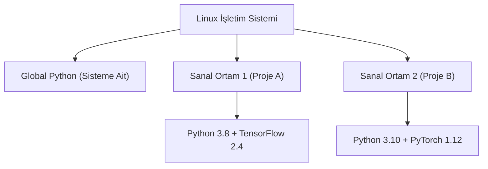

## 📌 Özet
Linux, veri bilimi ve makine öğrenmesi (ML) projeleri için endüstri standardı işletim sistemidir. Ancak projelerin bağımlılıkları (TensorFlow, PyTorch, Pandas versiyonları vb.) birbirinden farklı olabilir. Bu bağımlılıkların sistem genelindeki (global) Python sürümünü bozmasını veya projelerin birbiriyle çakışmasını engellemek için "Sanal Ortamlar" (Virtual Environments) kullanılır. Linux üzerinde bu izolasyonu sağlamak için standart `venv` modülü veya özellikle veri bilimciler arasında popüler olan `Conda` (Miniconda / Anaconda) paket yöneticisi kullanılır. İyi yapılandırılmış bir sanal ortam, projenin başka bir makineye, örneğin bir bulut sunucusuna veya bir Docker konteynerine taşınmasını tek satırlık bir komut (`pip install -r requirements.txt` veya `conda env create`) ile mümkün kılar.

## 🧠 Detay



### Neden Global Python'u Kullanmamalıyız?
Linux sisteminin çalışması (örneğin paket yöneticileri olan `apt` veya `dnf`) kendi içindeki sistem Python'una bağlıdır. `sudo pip install ...` komutuyla sistem geneline kurulacak paketler, Linux'un temel fonksiyonlarını bozabilir. Bu nedenle projeler daima izole edilmelidir.

### Yöntem 1: Standart venv ile Kurulum
En hafif ve yerleşik yöntemdir.
1. **Python3 ve venv paketinin yüklenmesi (Ubuntu):**
   `sudo apt update && sudo apt install python3 python3-venv python3-pip`
2. **Sanal ortamın oluşturulması:**
   `python3 -m venv proje_ortami`
   *(Bu komut, bulunduğunuz dizinde `proje_ortami` adında bir klasör oluşturur).*
3. **Ortamın aktifleştirilmesi:**
   `source proje_ortami/bin/activate`
   *(Terminalinizin başında `(proje_ortami)` ibaresi belirecektir).*
4. **Paket kurulumu ve gereksinimlerin dışa aktarılması:**
   `pip install numpy pandas scikit-learn`
   `pip freeze > requirements.txt`
5. **Ortamdan çıkış:** `deactivate`

### Yöntem 2: Conda (Miniconda) ile Kurulum
Conda, sadece Python paketlerini değil, C/C++ kütüphanelerini (örneğin GPU için CUDA araçlarını) da kendi içinde izole edebilir. Bu nedenle derin öğrenme projelerinde çok tercih edilir.
1. **Miniconda İndirme ve Kurma:**
   ```bash
   wget https://repo.anaconda.com/miniconda/Miniconda3-latest-Linux-x86_64.sh
   bash Miniconda3-latest-Linux-x86_64.sh
   ```
2. **Conda Ortamı Oluşturma (Belirli bir Python sürümü ile):**
   `conda create --name ml_projem python=3.9`
3. **Ortamı Aktifleştirme:**
   `conda activate ml_projem`
4. **Paket Kurulumu:**
   `conda install numpy pandas` veya PyTorch için özel kanaldan: `conda install pytorch torchvision torchaudio pytorch-cuda=11.7 -c pytorch -c nvidia`
5. **Ortamı Dışa Aktarma:**
   `conda env export > environment.yml`

## 💡 Bağlantılar
- [[Linux - GPU Kullanımı (nvidia-smi, CUDA)]]
- [[Linux - Docker ile Linux]]

## ❓ Sorular / Anlamadıklarım

## 🔗 Kaynaklar
- [Python venv Documentation](https://docs.python.org/3/library/venv.html)
- [Conda Environment Management](https://docs.conda.io/projects/conda/en/latest/user-guide/tasks/manage-environments.html)