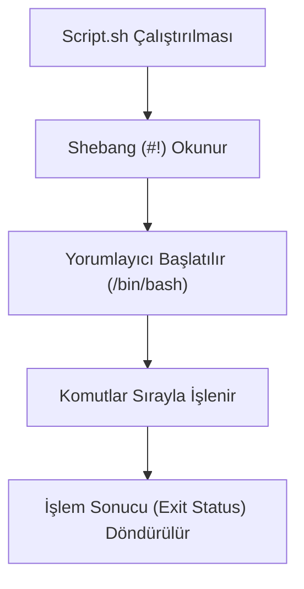

## 📌 Özet
Shell scripting (kabuk programlama), Linux sistemlerinde komutları arka arkaya çalıştırarak rutin görevleri, sistem bakımını ve süreç yönetimini otomatikleştirmek için kullanılan bir yöntemdir. En popüler kabuk programı `bash` (Bourne Again SHell)'dir. Bir bash script dosyası, en üst satırında hangi yorumlayıcının kullanılacağını belirten `#!/bin/bash` (shebang) ifadesi ile başlar. Değişkenler, döngüler (`for`, `while`), koşullu ifadeler (`if-else`) ve fonksiyonlar gibi temel programlama yapılarını destekler. Manuel olarak defalarca yazılması gereken log temizleme, yedek alma veya kullanıcı oluşturma gibi işlemler, scriptler sayesinde tek bir komutla ve hatasız şekilde yürütülebilir. Scriptin çalışabilmesi için dosyaya `chmod +x` ile çalıştırma izni verilmesi zorunludur.

## 🧠 Detay



### Temel Script Yapısı
Bir script dosyası oluşturmak için:
```bash
nano yedekle.sh
```
İçeriği:
```bash
#!/bin/bash
# Bu bir açıklama (comment) satırıdır.
echo "Yedekleme işlemi başlıyor..."
cp -r /var/www/html /backup/
echo "Yedekleme tamamlandı!"
```
Çalıştırmak için önce yetki verilmelidir:
```bash
chmod +x yedekle.sh
./yedekle.sh
```

### Değişkenler ve Argümanlar
- **Değişken Tanımlama:** Boşluk bırakılmaz. `ISIM="Ahmet"`
- **Değişken Okuma:** Başına `$` işareti konur. `echo $ISIM`
- **Argümanlar:** Scripte dışarıdan parametre yollanabilir (`./script.sh arg1 arg2`).
  - `$0` (Scriptin adı)
  - `$1`, `$2` (Birinci ve ikinci argüman)
  - `$#` (Toplam argüman sayısı)

### Koşullu İfadeler (if-else)
```bash
#!/bin/bash
DOSYA="log.txt"

if [ -f "$DOSYA" ]; then
    echo "$DOSYA bulundu."
else
    echo "$DOSYA bulunamadı."
fi
```
*(Not: `-f` dosyanın varlığını kontrol eder, `-d` dizin kontrolü yapar.)*

### Döngüler (For ve While)
```bash
#!/bin/bash
# For Döngüsü
for i in 1 2 3 4 5; do
    echo "Sayı: $i"
done

# Dizin içindeki dosyaları dönme
for dosya in /var/log/*.log; do
    echo "Log dosyası: $dosya"
done
```

## 💡 Bağlantılar
- [[Linux - Cron ve Zamanlama]]
- [[Linux - Pipe ve Yönlendirme (vbar, gt, ggt)]]

## ❓ Sorular / Anlamadıklarım

## 🔗 Kaynaklar
- [Bash Reference Manual](https://www.gnu.org/software/bash/manual/bash.html)