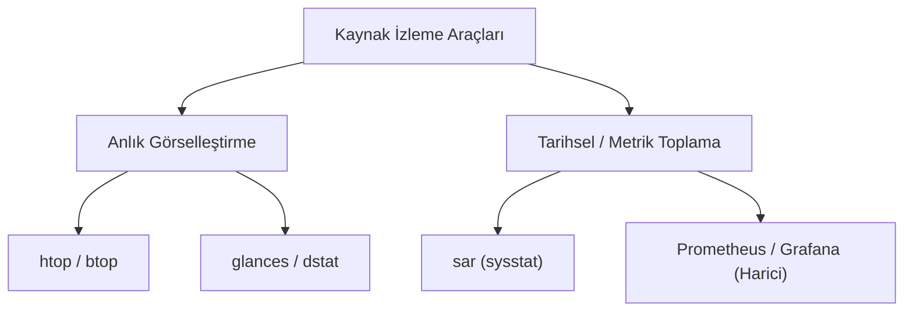

## 📌 Özet
Sistem yönetimi, bir sunucunun sağlık durumunu yalnızca bir sorun olduğunda değil, proaktif (sorun oluşmadan önce) olarak izlemeyi gerektirir. Temel araçlar olan `top` ve `free` anlık görünüm sunarken, sistemdeki ani anormallikleri veya uzun vadeli trendleri yakalamak için daha gelişmiş "Monitoring" (İzleme) araçlarına ihtiyaç vardır. Terminal tabanlı modern araçlardan `htop`, görsel olarak süreçleri ve CPU çekirdeklerini çok daha iyi yansıtır. Ağ, disk ve CPU istatistiklerini tek bir ekranda, renkli ve kompakt biçimde sunan `glances` ve `dstat` popüler alternatiflerdir. Kurumsal ortamlarda ise tarihsel veri toplamak ve "Geçen hafta Salı günü saat 3'te sunucu neden kilitlendi?" sorusuna yanıt verebilmek için `sysstat` paketinden gelen `sar` (System Activity Report) komutu vazgeçilmez bir yere sahiptir.

## 🧠 Detay

### Görsel ve Modern İzleme: htop & btop
- **`htop`:** `top` komutunun çok daha renkli ve etkileşimli halidir. 
  - F2 tuşuyla ayarlar yapılır, F9 ile bir süreç kolayca (kill komutu yazmadan) öldürülebilir, F5 ile süreçler ağaç (tree) yapısında görülerek hangi servisin hangi alt servisleri başlattığı (Parent-Child ilişkisi) anlaşılabilir.
- **`btop` / `bashtop`:** htop'tan daha yeni olan, harika bir arayüzle CPU, RAM, Disk I/O ve Network istatistiklerini grafiksel olarak (ASCII art ile) tek terminal ekranında sunan harika bir gösterge panelidir.

### Çok Yönlü İzleyiciler: dstat ve glances
- **`dstat`:** Eski `vmstat`, `iostat`, `netstat` ve `ifstat` araçlarının yerini almayı hedefleyen çok amaçlı bir araçtır.
  - Sadece `dstat` yazıldığında CPU, disk okuma/yazma, ağ gönderme/alma, sayfalama ve sistem kesintilerini aynı satırda saniye saniye akarak gösterir.
- **`glances`:** Python ile yazılmıştır. Sisteminizdeki her şeyi (CPU, Load, RAM, Swap, Network, Disk I/O, Mount noktaları, Docker konteynerleri, Sensör sıcaklıkları) tek bir panele sıkıştırır. Web arayüzü sunabilme özelliği de vardır (`glances -w`).

### Tarihsel Analiz: sar (System Activity Report)
Sunucunun dünü veya geçen haftasını görmek istediğinizde canlı izleme araçları işe yaramaz. `sysstat` paketi kurulduğunda, arka planda bir cron görevi çalışarak sistemin anlık durumunu düzenli olarak diske yazar.
- `sar` (Sadece bugünün genel CPU ortalamasını saat saat verir)
- `sar -r` (Bugünün RAM kullanım geçmişini gösterir)
- `sar -d` (Bugünün disk I/O geçmişini gösterir)
- `sar -f /var/log/sysstat/sa15` (Ayın 15. gününe ait geçmiş kayıtları dosyadan okur).

*Büyük çaplı projelerde (Production ortamlarında) bu komut satırı araçları yerine metrikleri toplayan ajanlar (Prometheus, Telegraf, Zabbix) ve bu verileri grafiklere döken web tabanlı sistemler (Grafana) kullanılır.*

## 💡 Bağlantılar
- [[Linux - Sistem İzleme ve Performans]]
- [[Linux - Log Yönetimi (journalctl, logrotate)]]

## ❓ Sorular / Anlamadıklarım

## 🔗 Kaynaklar
- [Glances System Monitor](https://nicolargo.github.io/glances/)
- [Sysstat / sar documentation](http://sebastien.godard.pagesperso-orange.fr/)