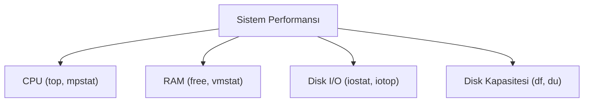

## 📌 Özet
Bir Linux sisteminin sağlıklı ve verimli çalışabilmesi için işlemci (CPU), bellek (RAM), disk G/Ç (I/O) ve ağ kullanımının sürekli olarak izlenmesi gerekir. Sistem kaynaklarının anlık tüketimini görmek için `top`, `htop` ve `free` gibi araçlar kullanılırken; darboğaz (bottleneck) analizi yapmak için `vmstat`, `iostat` ve `sar` gibi araçlar tercih edilir. Disk alanındaki doluluk oranını görmek için `df`, dizinlerin kapladığı alanı ölçmek için ise `du` komutları kullanılır. Performans sorunları genellikle CPU'nun aşırı yüklenmesi (Load Average yüksekliği), RAM'in tükenip sistemin Swap alanına (sanal bellek) düşmesi (Thrashing) veya disk okuma/yazma hızlarının limitlere ulaşması şeklinde ortaya çıkar. İyi bir sistem yöneticisi, bu metrikleri okuyarak sorunun kaynağını hızlıca tespit edebilir.

## 🧠 Detay

### CPU ve Load Average (Yük Ortalaması)
- **`uptime` veya `top`:** Çıktının sağ üst köşesinde "Load Average: 0.15, 0.05, 0.01" gibi üç değer görünür. Bunlar sırasıyla son 1, 5 ve 15 dakikadaki ortalama işlemci kuyruğunu gösterir. 4 çekirdekli bir işlemcide Load Average 4.0'ı geçerse, sistem darboğaza giriyor demektir.
- **`mpstat -P ALL 1`:** (sysstat paketinden gelir). Tüm CPU çekirdeklerinin kullanımını 1 saniyelik aralıklarla gösterir.

### Bellek (RAM ve Swap) İzleme
- **`free -h`:** RAM ve Swap kullanımını okunabilir formatta (MB, GB) gösterir.
  - *available:* Gerçekte kullanılabilecek boş bellektir. (buff/cache içindeki serbest bırakılabilir alanları da kapsar).
  - *Swap:* RAM dolduğunda diskin RAM gibi kullanılan kısmıdır. Swap kullanımının yüksek olması sistemin aşırı yavaşlamasına (thrashing) sebep olur.
- **`vmstat 1`:** Sanal bellek ve işlemci istatistiklerini saniyelik güncelleyerek verir.

### Disk G/Ç (I/O) Performansı
Disk yavaşlıkları sistemi doğrudan kilitler. "iowait" değerinin yüksek olması, işlemcinin diski beklediği anlamına gelir.
- **`iostat -x 1`:** Disklerin okuma/yazma hızlarını ve bekleme sürelerini gösterir.
- **`iotop`:** Hangi uygulamanın (process) diski en çok kullandığını (yazdığını/okuduğunu) canlı olarak gösterir (root yetkisi gerektirir).

### Disk Alanı Kullanımı
- **`df -h` (Disk Free):** Sisteme bağlı disk bölümlerinin toplam kapasitesini, kullanılanı ve boş alanı gösterir.
- **`du -sh /var/log` (Disk Usage):** Belirli bir dizinin toplamda ne kadar alan kapladığını özetler (`-s` summary, `-h` human readable).
- **`ncdu`:** Ncurses tabanlı interaktif bir disk kullanım analiz aracıdır, dizinler içinde gezerek boyutu büyük dosyaları kolayca bulmayı sağlar.

## 💡 Bağlantılar
- [[Linux - Process Yönetimi (ps, top, kill, systemd)]]
- [[Linux - Disk ve Depolama Yönetimi (lvm, mount)]]

## ❓ Sorular / Anlamadıklarım

## 🔗 Kaynaklar
- [Linux Performance Tools (Brendan Gregg)](https://www.brendangregg.com/linuxperf.html)