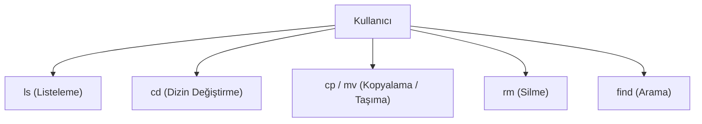

## 📌 Özet
Linux işletim sistemini verimli bir şekilde kullanmanın anahtarı, komut satırı arayüzü (CLI) üzerinde temel dosya işlemleri komutlarına hakim olmaktır. `ls`, `cd`, `cp`, `mv`, `rm` ve `find` gibi komutlar, kullanıcının dizinlerde gezinmesini, dosya listelemesini, dosyaları kopyalayıp taşımasını veya silmesini sağlar. Bu komutlar sistemde gezinmeyi grafik arayüze göre çok daha hızlı ve otomatikleştirilebilir hale getirir. Her komutun davranışını değiştiren parametreleri (bayrak/flags) bulunur; örneğin `ls -l` detaylı liste sunarken, `rm -rf` dizinleri ve içindekileri zorla siler. Özellikle büyük dosya sistemlerinde belirli kriterlere göre dosya aramak için `find` komutu eşsiz bir güce sahiptir. Bu temel araçlar (GNU coreutils), kabuk (shell) ortamının vazgeçilmez yapıtaşlarıdır.

## 🧠 Detay

### Dizin Gezinme ve Listeleme
- **`pwd` (Print Working Directory):** Mevcut bulunduğunuz dizinin tam yolunu yazdırır.
- **`cd` (Change Directory):** Dizinler arası geçiş yapar.
  - `cd /var/log` (Belirtilen dizine gider)
  - `cd ..` (Bir üst dizine çıkar)
  - `cd ~` (Kullanıcının ev dizinine döner)
- **`ls` (List):** Dizin içeriğini listeler.
  - `ls -l` (Detaylı liste: izinler, sahip, boyut, tarih)
  - `ls -a` (Gizli dosyaları, yani "." ile başlayanları da gösterir)
  - `ls -lh` (Boyutları okunabilir formatta (KB, MB) gösterir)

### Dosya Yönetimi
- **`cp` (Copy):** Dosya veya dizin kopyalar.
  - `cp dosya.txt kopya.txt` (Dosyayı kopyalar)
  - `cp -r dizin1 dizin2` (Dizini özyineli / recursive kopyalar)
- **`mv` (Move/Rename):** Dosyayı taşır veya yeniden adlandırır.
  - `mv eski.txt yeni.txt` (Dosya adını değiştirir)
  - `mv dosya.txt /tmp/` (Dosyayı /tmp dizinine taşır)
- **`rm` (Remove):** Dosya veya dizin siler.
  - `rm dosya.txt` (Dosyayı siler)
  - `rm -r dizin/` (Dizini ve içeriğini siler)
  - `rm -rf dizin/` (Onay istemeden dizini ve tüm içeriğini zorla siler. **DİKKAT!**)

### Güçlü Arama Aracı: find
`find`, dosyaları isme, boyuta, değiştirilme tarihine veya izinlere göre bulmak için kullanılır.
- `find / -name "log.txt"` (Tüm sistemde log.txt adında dosya arar)
- `find . -type f -size +100M` (Bulunulan dizinde 100MB'dan büyük dosyaları bulur)
- `find /var/log -mtime -7` (Son 7 gün içinde değiştirilmiş dosyaları bulur)
- `find . -type f -name "*.tmp" -exec rm {} \;` (Bulunan .tmp dosyalarını anında siler)

## 💡 Bağlantılar
- [[Linux - Dosya Sistemi Yapısı]]
- [[Linux - Metin İşleme (grep, sed, awk)]]

## ❓ Sorular / Anlamadıklarım

## 🔗 Kaynaklar
- [GNU Coreutils Documentation](https://www.gnu.org/software/coreutils/manual/coreutils.html)