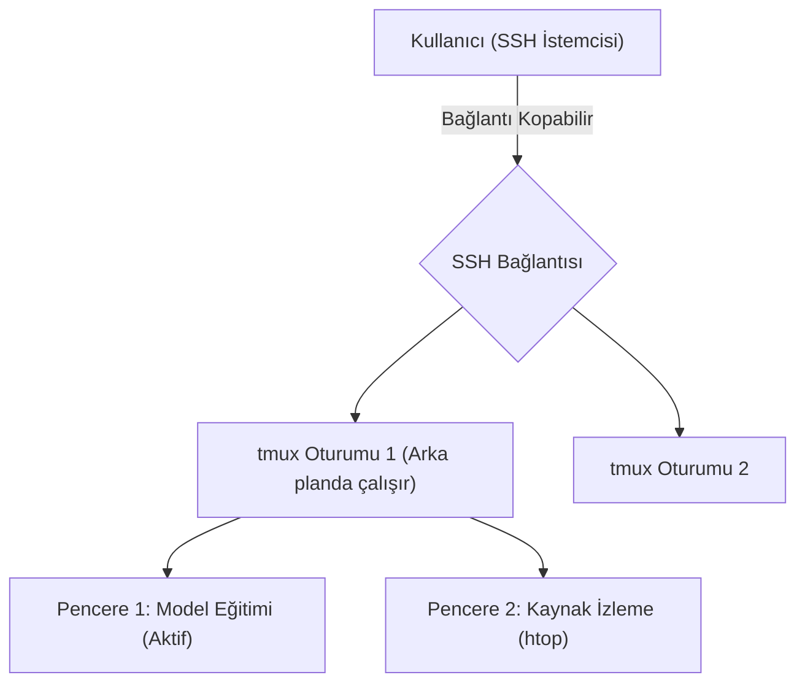

## 📌 Özet
Bir uzak Linux sunucusuna SSH ile bağlandığınızda uzun sürecek bir komut (örneğin büyük bir modelin eğitimi, devasa bir dosyanın indirilmesi veya sistem güncellemesi) başlattığınızı varsayalım. Eğer bu işlem sırasında internetiniz kopar veya bilgisayarınızı kapatırsanız, SSH bağlantınız düşer ve sunucuda çalışan işlem yarıda kesilir. `tmux` (Terminal Multiplexer), bu sorunu çözen mucizevi bir araçtır. `tmux` sayesinde sunucu üzerinde bağımsız "oturumlar" (sessions) oluşturulur. SSH bağlantınız kopsa bile oturumlar arka planda çalışmaya devam eder; daha sonra tekrar bağlandığınızda tam kaldığınız yerden terminal ekranına geri dönebilirsiniz (attach). Ayrıca tek bir SSH penceresi içini birden fazla bölmeye (pane) veya sekmeye (window) ayırarak, aynı anda log izlerken diğer tarafta kod yazmanıza olanak tanır.

## 🧠 Detay

### Neden tmux Kullanmalıyız?
- **Oturum Sürekliliği:** İnternet kopsa veya bilgisayarı kapatsanız bile işlemleriniz (process) ölmez.
- **Ekran Bölme (Tiling):** Grafik arayüz olmaksızın, tek terminali yatay ve dikey olarak parçalara ayırabilirsiniz.
- **Birden Fazla Pencere:** Tarayıcı sekmeleri gibi terminalde de pencereler arası geçiş yapılabilir.

### Temel Komutlar ve Kullanım
`tmux` komutları iki aşamalıdır. Öncelikle dışarıdan (normal terminalden) girilen komutlar, ardından tmux içindeyken kullanılan "Prefix" (Ön ek) tuş kombinasyonları vardır. Varsayılan prefix `Ctrl + b` tuşudur. Önce bu tuşlara basılıp bırakılır, sonra asıl komut tuşuna basılır.

#### 1. Oturum Yönetimi (Dışarıdan)
- **Yeni oturum başlatma:** `tmux new -s oturum_adi` (Örn: `tmux new -s egitim`)
- **Arka plana atma (Detach):** tmux içindeyken `Ctrl + b` sonra `d` harfi. (Sizi asıl terminale atar, işlemler içerde devam eder).
- **Mevcut oturumları listeleme:** `tmux ls`
- **Oturuma geri dönme (Attach):** `tmux attach -t oturum_adi` (Örn: `tmux attach -t egitim`)

#### 2. Bölme (Pane) Yönetimi (İçeriden)
*(Aşağıdaki işlemler için önce `Ctrl + b` tuşlarına basıp bırakın).*
- **Dikey (Yan yana) bölme:** `%` işareti. (Yani `Ctrl+b` bırak, sonra `%`)
- **Yatay (Alt alta) bölme:** `"` (Çift tırnak) işareti.
- **Bölmeler arası geçiş:** Yön tuşları (Yukarı, aşağı, sağ, sol).
- **Mevcut bölmeyi kapatma:** `d` yerine komut satırına `exit` yazarak veya `Ctrl + d`.

#### 3. Pencere (Window) Yönetimi (İçeriden)
- **Yeni pencere açma:** `c` (create).
- **Sonraki pencereye geçme:** `n` (next).
- **Önceki pencereye geçme:** `p` (previous).
- **Pencereleri listeleme ve seçme:** `w` (window list).

## 💡 Bağlantılar
- [[Linux - Ağ Komutları (ip, netstat, curl, ssh)]]
- [[Linux - Process Yönetimi (ps, top, kill, systemd)]]

## ❓ Sorular / Anlamadıklarım

## 🔗 Kaynaklar
- [tmux Cheat Sheet](https://tmuxcheatsheet.com/)