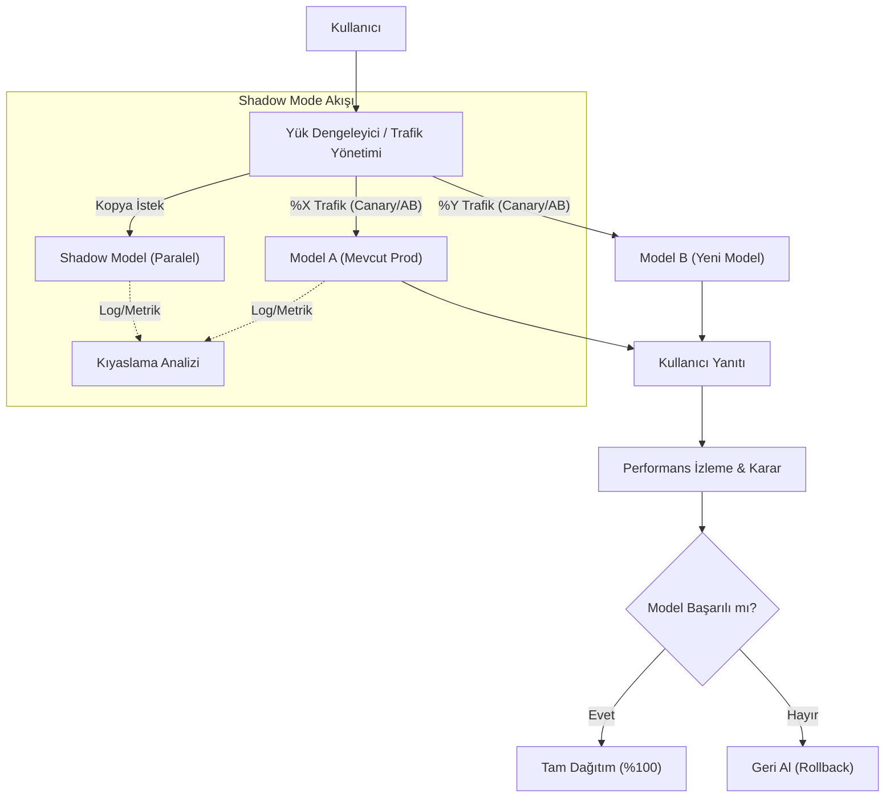

## 📌 Özet
Makine öğrenmesi modellerini yayına alırken riskleri minimize etmek ve en doğru modeli seçmek için çeşitli stratejik yaklaşımlar kullanılır. A/B testi, kullanıcı kitlesini farklı segmentlere ayırarak hangi modelin daha yüksek performans (dönüşüm oranı, tıklama vb.) sergilediğini istatistiksel anlamlılık düzeyinde belirlemeyi sağlar. Shadow Mode (Gölge Modu) ise yeni modeli üretim ortamında, sonuçlarını kullanıcıya yansıtmadan arka planda çalıştırarak gerçek dünya verileri üzerindeki doğruluğunu ve sistem yükünü sıfır riskle test etmeye yarar. Canary Deployment yöntemiyle de trafik küçük adımlarla yeni modele kaydırılarak olası hataların tüm kullanıcı tabanını etkilemesi engellenmiş olur.

## 🧠 Detay

### Model Dağıtım Stratejileri Görseli


### Deployment Stratejileri
```
Blue/Green:
  → Yeni (green) hazır olunca tüm trafik geçer
  → Rollback hızlı ama kaynak iki katı

Canary:
  → Trafiğin %5 → %25 → %100'ü kademeli geçer
  → Sorun olursa hızlı geri dön

A/B Test:
  → Kullanıcı segmentlerine farklı model
  → İstatistiksel anlamlılık ölçülür

Shadow Mode:
  → Yeni model paralel çalışır ama sonuç dönmez
  → Gerçek yük altında test, sıfır risk
```

### Shadow Mode
```python
# FastAPI ile shadow mode
import asyncio
from fastapi import FastAPI, BackgroundTasks
import logging

app = FastAPI()

async def shadow_tahmin(giris: dict, gercek_tahmin: int):
    """Yeni model paralel çalışır ama sonuç üretime yansımaz"""
    try:
        X = prepare_features(giris)
        yeni_tahmin = yeni_model.predict(X)[0]

        # Farklılıkları logla
        if yeni_tahmin != gercek_tahmin:
            logging.warning(f"Shadow model farklı: eski={gercek_tahmin}, yeni={yeni_tahmin}")

        # Metrikleri güncelle (monitoring için)
        shadow_sayaci.labels(eslesme=str(yeni_tahmin == gercek_tahmin)).inc()

    except Exception as e:
        logging.error(f"Shadow tahmin hatası: {e}")

@app.post("/tahmin")
async def tahmin_yap(giris: TahminGiris, background_tasks: BackgroundTasks):
    X = prepare_features(giris.dict())

    # Üretim modeli
    tahmin = int(uretim_modeli.predict(X)[0])

    # Shadow model arka planda çalışır
    background_tasks.add_task(shadow_tahmin, giris.dict(), tahmin)

    return {"tahmin": tahmin}
```

### Canary Deployment
```python
import random

# Trafik ağırlıkları
TRAFIK_DAGILIMI = {
    "model_v1": 0.80,   # %80 eski model
    "model_v2": 0.20    # %20 yeni model
}

def model_sec() -> str:
    r = random.random()
    kumulatif = 0
    for model_adi, agirlik in TRAFIK_DAGILIMI.items():
        kumulatif += agirlik
        if r < kumulatif:
            return model_adi
    return list(TRAFIK_DAGILIMI.keys())[-1]

@app.post("/tahmin")
def canary_tahmin(giris: TahminGiris):
    secilen_model = model_sec()
    model = ml_modeller[secilen_model]

    X = prepare_features(giris.dict())
    tahmin = int(model.predict(X)[0])

    # Hangi model kullandığını logla
    logging.info(f"Model: {secilen_model}, Tahmin: {tahmin}")

    return {
        "tahmin": tahmin,
        "model": secilen_model  # Debug için, prod'da kaldır
    }
```

### A/B Test Analizi
```python
import pandas as pd
from scipy import stats

# Log verilerini yükle
loglar = pd.read_sql("""
    SELECT model_versiyonu, tahmin, gercek_sonuc
    FROM tahmin_loglar
    WHERE tarih >= DATEADD(day, -14, GETDATE())
""", engine)

# Model başına metrikler
ozet = loglar.groupby("model_versiyonu").apply(
    lambda g: pd.Series({
        "tahmin_sayisi": len(g),
        "dogruluk": (g["tahmin"] == g["gercek_sonuc"]).mean(),
        "onay_orani": g["tahmin"].mean()
    })
)
print(ozet)

# İstatistiksel anlamlılık testi
a_dogru = loglar[loglar["model_versiyonu"] == "v1"]["dogruluk"]
b_dogru = loglar[loglar["model_versiyonu"] == "v2"]["dogruluk"]

t_stat, p_deger = stats.ttest_ind(a_dogru, b_dogru)
print(f"p-değeri: {p_deger:.4f}")
print("Fark anlamlı ✅" if p_deger < 0.05 else "Fark anlamlı değil ❌")
```

### Nginx ile Canary
```nginx
upstream model_v1 {
    server ml-api-v1:8000 weight=80;
}
upstream model_v2 {
    server ml-api-v2:8000 weight=20;
}

server {
    location /tahmin {
        proxy_pass http://model_v2;  # 20% v2'ye gider
    }
}
```

### Rollback
```python
def rollback():
    """Sorun varsa hızlıca eski modele dön"""
    from mlflow.tracking import MlflowClient
    client = MlflowClient()

    # Production'daki modeli Staging'e geri al
    client.transition_model_version_stage(
        name="KrediOnayModeli",
        version="yeni_versiyon",
        stage="Archived"
    )

    # Önceki versiyonu Production'a al
    client.transition_model_version_stage(
        name="KrediOnayModeli",
        version="onceki_versiyon",
        stage="Production"
    )
    logging.info("✅ Rollback tamamlandı")
```

## 💡 Bağlantılar
- [[MLOps - Model Monitoring ve Drift Tespiti]]
- [[MLOps - MLflow ile Deney Takibi]]
- [[API - FastAPI Middleware ve Güvenlik]]

## ❓ Sorular / Anlamadıklarım
- A/B test için ne kadar veri / süre yeterli?
- Multi-armed bandit A/B test'ten ne zaman daha iyi?

## 🔗 Kaynaklar
- https://martinfowler.com/articles/feature-toggles.html
