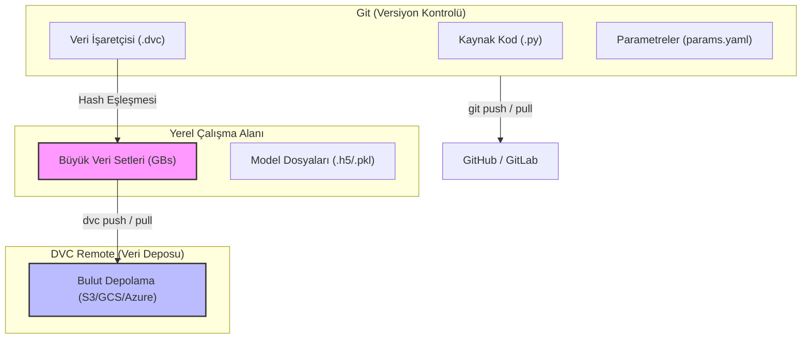

## 📌 Özet
Data Version Control (DVC), büyük boyutlu veri setlerini, makine öğrenmesi modellerini ve ara çıktıları Git ile uyumlu bir şekilde versiyonlamak için geliştirilmiş açık kaynaklı bir araçtır. Git kod dosyalarındaki değişiklikleri takip ederken, DVC bu koda karşılık gelen devasa veri dosyalarının meta verilerini (.dvc dosyaları) Git üzerinde saklayarak, asıl veriyi S3, Google Drive veya Azure Blob Storage gibi harici depolama alanlarında güvenle muhafaza eder. Bu yaklaşım, ML projelerinde deneylerin tam tekrarlanabilirliğini (reproducibility) garanti altına alır ve hangi veri setiyle hangi modelin üretildiğinin takibini kusursuzlaştırır. Ayrıca sunduğu pipeline yapısı sayesinde, veri işleme ve eğitim adımlarını birbirine bağlayarak sadece değişen kısımların yeniden çalıştırılmasını otomatik olarak koordine eder.

## 🧠 Detay

### Git ve DVC Çalışma Prensibi


### Kurulum ve Başlangıç
```bash
pip install dvc dvc-s3  # veya dvc-gdrive, dvc-azure

# Git repo içinde başlat
git init
dvc init
git add .dvc
git commit -m "DVC başlatıldı"
```

### Veri Takibi
```bash
# Büyük veriyi DVC'ye ekle
dvc add data/raw/egitim_verisi.csv
dvc add model/rf_model.pkl

# .gitignore otomatik güncellendi
# .dvc dosyaları oluştu → bunları git'e ekle
git add data/raw/egitim_verisi.csv.dvc .gitignore
git commit -m "Veri dosyası eklendi"
```

### Remote Storage
```bash
# S3 remote ekle
dvc remote add -d myremote s3://my-bucket/dvc-store

# Google Drive
dvc remote add -d gdrive gdrive://klasor-id

# Local (test için)
dvc remote add -d localremote /tmp/dvc-storage

# Push (veriyi remote'a yükle)
dvc push

# Pull (veriyi indir)
dvc pull
```

### DVC Pipeline
```yaml
# dvc.yaml
stages:
  on_isle:
    cmd: python src/on_isleme.py
    deps:
      - src/on_isleme.py
      - data/raw/egitim_verisi.csv
    outs:
      - data/processed/temiz_veri.csv

  ozellik_uret:
    cmd: python src/ozellik_muhendisligi.py
    deps:
      - src/ozellik_muhendisligi.py
      - data/processed/temiz_veri.csv
    outs:
      - data/features/ozellikler.csv

  egit:
    cmd: python src/egitim.py --n_estimators 100
    deps:
      - src/egitim.py
      - data/features/ozellikler.csv
    outs:
      - model/rf_model.pkl
    metrics:
      - metrics/sonuclar.json:
          cache: false
    params:
      - params.yaml:
        - egitim.n_estimators
        - egitim.max_depth
```

```yaml
# params.yaml
egitim:
  n_estimators: 100
  max_depth: 5
  random_state: 42
test_boyutu: 0.2
```

### Pipeline Çalıştırma
```bash
# Pipeline çalıştır (sadece değişen adımları)
dvc repro

# Tüm adımları zorla çalıştır
dvc repro --force

# Grafik göster
dvc dag

# Metrikleri karşılaştır
dvc metrics show
dvc metrics diff HEAD~1
```

### Veri Sürümleri
```bash
# Veri güncellemesi
cp yeni_veri.csv data/raw/egitim_verisi.csv
dvc add data/raw/egitim_verisi.csv
git add data/raw/egitim_verisi.csv.dvc
git commit -m "Veri güncellendi - Mayıs 2026"
dvc push

# Eski versiyona dön
git checkout HEAD~1 -- data/raw/egitim_verisi.csv.dvc
dvc checkout
```

### Deney Karşılaştırma
```bash
# Farklı parametrelerle denemeler
dvc exp run --set-param egitim.n_estimators=200
dvc exp run --set-param egitim.max_depth=10

# Karşılaştır
dvc exp show
dvc exp diff
```

## 💡 Bağlantılar
- [[MLOps - Giriş ve Temel Kavramlar]]
- [[MLOps - MLflow ile Deney Takibi]]
- [[MLOps - GitHub Actions ile CI-CD]]

## ❓ Sorular / Anlamadıklarım
- DVC ve Git LFS arasındaki fark?
- Çok büyük veri setleri için en iyi remote hangisi?

## 🔗 Kaynaklar
- https://dvc.org/doc
