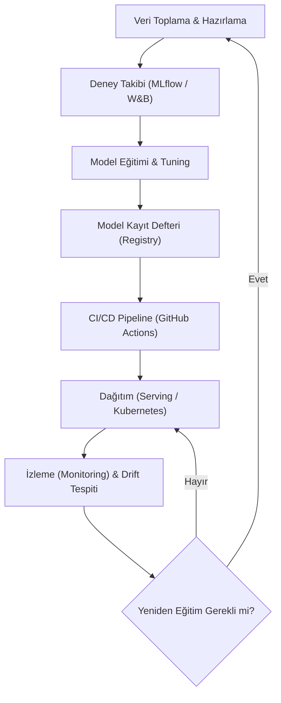

## 📌 Özet
MLOps, ML sistemlerini production'da güvenilir ve verimli şekilde çalıştırmak için DevOps prensiplerini makine öğrenmesine uygular. Model geliştirmeden deployment ve izlemeye kadar tüm yaşam döngüsünü kapsar.

## 🧠 Detay

### 🗺️ MLOps Yaşam Döngüsü (Lifecycle)



---

### MLOps Nedir?
```
DevOps + DataOps + ModelOps = MLOps

Hedef:
  - Modelleri hızlı ve güvenli production'a almak
  - Model kalitesini sürekli izlemek
  - Tekrarlanabilir deney ve eğitim süreci
  - Otomatik yeniden eğitim
```

### ML Yaşam Döngüsü
```
1. Problem Tanımı
2. Veri Toplama ve EDA
3. Feature Engineering
4. Model Eğitimi (Deney)
5. Model Değerlendirme
6. Model Kaydı (Registry)
7. Deployment (Servis Etme)
8. İzleme (Monitoring)
9. Yeniden Eğitim (Retraining)
   ↑_________________________↓
```

### MLOps Olgunluk Seviyeleri
```
Seviye 0 - Manuel:
  → Her şey notebook'ta
  → Elle deploy
  → İzleme yok

Seviye 1 - ML Pipeline Otomasyonu:
  → Otomatik eğitim pipeline
  → Feature store
  → Model registry

Seviye 2 - CI/CD Pipeline:
  → Kod push → otomatik test → deploy
  → A/B test
  → Otomatik retraining
```

### Temel MLOps Araçları
| Kategori | Araçlar |
|----------|---------|
| Deney Takibi | MLflow, W&B, Neptune |
| Pipeline | Apache Airflow, Prefect, ZenML |
| Model Registry | MLflow, BentoML |
| Servis | FastAPI, BentoML, Seldon |
| İzleme | Evidently, WhyLogs, Prometheus |
| Versiyon | DVC, Git |
| Container | Docker, Kubernetes |
| CI/CD | GitHub Actions, GitLab CI |

### MLOps vs DevOps Farkları
```
Ek Zorluklar:
  - Veri versiyonlama (kod gibi değil)
  - Model versiyonlama
  - Model decay / data drift
  - Deney takibi
  - Yeniden eğitim tetikleyicileri
```

## 💡 Bağlantılar
- [[MLOps - MLflow ile Deney Takibi]]
- [[MLOps - DVC ile Veri Versiyonlama]]
- [[MLOps - Model Monitoring]]
- [[API - ML Modeli Servis Etmek]]

## ❓ Sorular / Anlamadıklarım
- Ne zaman MLOps'a yatırım yapmaya değer?
- Küçük projeler için minimum MLOps stack nedir?

## 🔗 Kaynaklar
- https://ml-ops.org/
- https://madewithml.com/
