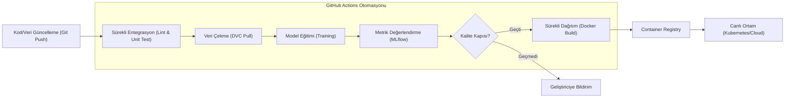

## 📌 Özet
GitHub Actions, makine öğrenmesi projelerinde yazılım geliştirme döngüsünü (SDLC) otomatize etmek için kullanılan güçlü bir sürekli entegrasyon ve sürekli teslimat (CI/CD) aracıdır. Kod deposuna yapılan her müdahalede statik kod analizi, birim testler, veri bütünlüğü kontrolleri ve model eğitim süreçlerini otomatik olarak tetikleyerek geliştirme sürecindeki hataları erkenden tespit etmeyi sağlar. MLOps ekosisteminde özellikle model performansını ölçen "kalite kapıları" (quality gates) aracılığıyla, sadece hedeflenen metrikleri karşılayan modellerin otomatik olarak paketlenip (Docker) canlı ortama aktarılmasını koordine eder. Bu sayede modellerin manuel müdahale gerektirmeden, hızlı ve güvenilir bir şekilde güncellenmesi mümkün olur.

## 🧠 Detay

### MLOps CI/CD Akış Diyagramı


### Temel CI Pipeline
```yaml
# .github/workflows/ci.yml
name: ML CI Pipeline

on:
  push:
    branches: [main, develop]
  pull_request:
    branches: [main]

jobs:
  test:
    runs-on: ubuntu-latest

    steps:
      - uses: actions/checkout@v4

      - name: Python Kur
        uses: actions/setup-python@v5
        with:
          python-version: "3.11"
          cache: "pip"

      - name: Bağımlılıkları Kur
        run: |
          pip install -r requirements.txt
          pip install pytest pytest-cov

      - name: Linting
        run: |
          pip install flake8 black
          black --check src/
          flake8 src/ --max-line-length=100

      - name: Testleri Çalıştır
        run: pytest tests/ -v --cov=src --cov-report=xml

      - name: Coverage Yükle
        uses: codecov/codecov-action@v4
```

### Model Eğitim ve Kayıt Pipeline
```yaml
# .github/workflows/model-train.yml
name: Model Eğitim Pipeline

on:
  schedule:
    - cron: "0 2 * * 1"  # Her Pazartesi 02:00
  workflow_dispatch:       # Elle tetikleme

jobs:
  egit-ve-kaydet:
    runs-on: ubuntu-latest

    steps:
      - uses: actions/checkout@v4

      - name: Python Kur
        uses: actions/setup-python@v5
        with:
          python-version: "3.11"

      - name: Bağımlılıkları Kur
        run: pip install -r requirements.txt

      - name: Veriyi İndir (DVC)
        run: |
          pip install dvc dvc-s3
          dvc pull
        env:
          AWS_ACCESS_KEY_ID: ${{ secrets.AWS_ACCESS_KEY_ID }}
          AWS_SECRET_ACCESS_KEY: ${{ secrets.AWS_SECRET_ACCESS_KEY }}

      - name: Model Eğit
        run: python src/egitim.py
        env:
          MLFLOW_TRACKING_URI: ${{ secrets.MLFLOW_URI }}

      - name: Model Testleri
        run: pytest tests/test_model.py -v

      - name: Metrikleri Kaydet
        run: |
          cat metrics/sonuclar.json
          # Başarısızsa fail et
          python src/metrik_kontrol.py
```

### CD - Docker Build ve Push
```yaml
# .github/workflows/cd.yml
name: CD - Build ve Deploy

on:
  push:
    branches: [main]
    tags: ["v*"]

jobs:
  build-push:
    runs-on: ubuntu-latest
    if: github.ref == 'refs/heads/main'

    steps:
      - uses: actions/checkout@v4

      - name: Docker Hub Giriş
        uses: docker/login-action@v3
        with:
          username: ${{ secrets.DOCKERHUB_USERNAME }}
          password: ${{ secrets.DOCKERHUB_TOKEN }}

      - name: Docker Image Build ve Push
        uses: docker/build-push-action@v5
        with:
          push: true
          tags: |
            kullanici/ml-api:latest
            kullanici/ml-api:${{ github.sha }}
          cache-from: type=gha
          cache-to: type=gha,mode=max

  deploy:
    needs: build-push
    runs-on: ubuntu-latest

    steps:
      - name: Sunucuya Deploy
        uses: appleboy/ssh-action@v1
        with:
          host: ${{ secrets.SERVER_HOST }}
          username: ${{ secrets.SERVER_USER }}
          key: ${{ secrets.SSH_KEY }}
          script: |
            cd /opt/ml-api
            docker pull kullanici/ml-api:latest
            docker-compose up -d --no-deps ml-api
            docker image prune -f
```

### Model Kalite Kapısı (Quality Gate)
```python
# src/metrik_kontrol.py
import json
import sys

MINIMUM_METRIKLER = {
    "accuracy": 0.85,
    "f1_score": 0.80,
    "auc_roc": 0.88
}

with open("metrics/sonuclar.json") as f:
    metrikler = json.load(f)

basarisiz = []
for metrik, minimum in MINIMUM_METRIKLER.items():
    gercek = metrikler.get(metrik, 0)
    if gercek < minimum:
        basarisiz.append(f"{metrik}: {gercek:.3f} < {minimum}")

if basarisiz:
    print("❌ Kalite kapısı başarısız:")
    for b in basarisiz:
        print(f"  {b}")
    sys.exit(1)

print("✅ Tüm metrik kontrolleri geçti")
```

### Secrets Yönetimi
```bash
# GitHub CLI ile secret ekle
gh secret set MLFLOW_URI --body "http://mlflow.server:5000"
gh secret set API_KEY --body "gizli-anahtar"
gh secret set DOCKERHUB_TOKEN --body "docker-token"
```

## 💡 Bağlantılar
- [[MLOps - Giriş ve Temel Kavramlar]]
- [[MLOps - MLflow ile Deney Takibi]]
- [[MLOps - DVC ile Veri Versiyonlama]]
- [[API - Docker ile Deploy]]

## ❓ Sorular / Anlamadıklarım
- Self-hosted runner ne zaman gerekli?
- GitHub Actions yerine GitLab CI ne zaman tercih edilir?

## 🔗 Kaynaklar
- https://docs.github.com/en/actions
