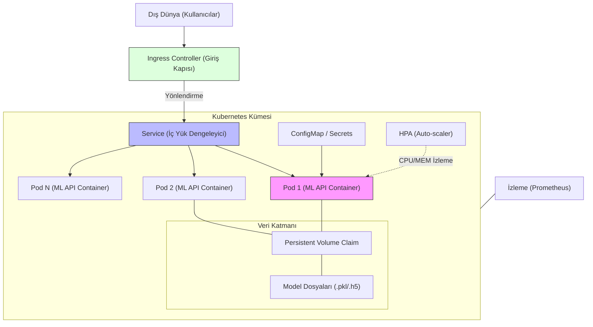

## 📌 Özet
Kubernetes (K8s), konteynerize edilmiş makine öğrenmesi modellerini üretim ortamında ölçeklenebilir ve dayanıklı bir şekilde çalıştırmak için kullanılan endüstri standardı bir orkestrasyon platformudur. ML servislerinin trafik yoğunluğuna göre otomatik olarak ölçeklenmesini (HPA), yük dengeleme (Load Balancing) mekanizmalarıyla isteklerin verimli dağıtılmasını ve arızalanan servislerin kendi kendine iyileşmesini (Self-healing) sağlar. Docker Compose'un kurumsal düzeydeki karşılığı olarak kabul edilen Kubernetes; rolling update stratejileri sayesinde modelleri sıfır kesintiyle güncellemeyi ve gerektiğinde hızlıca eski sürüme dönmeyi (rollback) mümkün kılar. Bu özellikler, ML modellerinin yüksek erişilebilirlik ve güvenilirlik standartlarında servis edilmesi için kritiktir.

## 🧠 Detay

### Kubernetes ML Servis Mimarisi


### Temel Kavramlar
```
Pod       → En küçük çalışma birimi (1+ container)
Deployment → Pod'ları yöneten, güncelleme yapan kaynak
Service   → Pod'lara ağ erişimi sağlar
Ingress   → Dış dünyadan gelen trafiği yönlendirir
ConfigMap → Konfigürasyon değerleri
Secret    → Hassas veriler (API key, şifre)
HPA       → Horizontal Pod Autoscaler (otomatik ölçek)
```

### ML API Deployment
```yaml
# deployment.yaml
apiVersion: apps/v1
kind: Deployment
metadata:
  name: ml-api
  labels:
    app: ml-api
    versiyon: v1.0.0
spec:
  replicas: 3
  selector:
    matchLabels:
      app: ml-api
  strategy:
    type: RollingUpdate
    rollingUpdate:
      maxSurge: 1
      maxUnavailable: 0      # Sıfır downtime
  template:
    metadata:
      labels:
        app: ml-api
    spec:
      containers:
        - name: ml-api
          image: kullanici/ml-api:v1.0.0
          ports:
            - containerPort: 8000
          resources:
            requests:
              cpu: "500m"
              memory: "512Mi"
            limits:
              cpu: "2000m"
              memory: "2Gi"
          env:
            - name: API_KEY
              valueFrom:
                secretKeyRef:
                  name: ml-api-secrets
                  key: api-key
            - name: MODEL_PATH
              value: "/app/model/rf_model.pkl"
          livenessProbe:
            httpGet:
              path: /saglik
              port: 8000
            initialDelaySeconds: 30
            periodSeconds: 10
          readinessProbe:
            httpGet:
              path: /hazir
              port: 8000
            initialDelaySeconds: 10
            periodSeconds: 5
```

### Service
```yaml
# service.yaml
apiVersion: v1
kind: Service
metadata:
  name: ml-api-service
spec:
  selector:
    app: ml-api
  ports:
    - protocol: TCP
      port: 80
      targetPort: 8000
  type: ClusterIP
```

### Ingress
```yaml
# ingress.yaml
apiVersion: networking.k8s.io/v1
kind: Ingress
metadata:
  name: ml-api-ingress
  annotations:
    nginx.ingress.kubernetes.io/rewrite-target: /
spec:
  rules:
    - host: ml-api.sirket.com
      http:
        paths:
          - path: /
            pathType: Prefix
            backend:
              service:
                name: ml-api-service
                port:
                  number: 80
```

### Horizontal Pod Autoscaler
```yaml
# hpa.yaml
apiVersion: autoscaling/v2
kind: HorizontalPodAutoscaler
metadata:
  name: ml-api-hpa
spec:
  scaleTargetRef:
    apiVersion: apps/v1
    kind: Deployment
    name: ml-api
  minReplicas: 2
  maxReplicas: 10
  metrics:
    - type: Resource
      resource:
        name: cpu
        target:
          type: Utilization
          averageUtilization: 70
    - type: Resource
      resource:
        name: memory
        target:
          type: Utilization
          averageUtilization: 80
```

### Secret ve ConfigMap
```bash
# Secret oluştur
kubectl create secret generic ml-api-secrets \
  --from-literal=api-key="gizli-anahtar" \
  --from-literal=db-password="db-sifre"

# ConfigMap
kubectl create configmap ml-api-config \
  --from-literal=model-version="1.0.0" \
  --from-literal=log-level="INFO"
```

### Kubectl Komutları
```bash
# Deploy et
kubectl apply -f deployment.yaml
kubectl apply -f service.yaml
kubectl apply -f ingress.yaml

# Durum kontrol
kubectl get pods -l app=ml-api
kubectl get deployments
kubectl describe pod ml-api-xxxxx

# Log izle
kubectl logs -f deployment/ml-api
kubectl logs -f ml-api-xxxxx

# Güncelleme
kubectl set image deployment/ml-api ml-api=kullanici/ml-api:v1.1.0

# Rollback
kubectl rollout undo deployment/ml-api

# Ölçeklendir
kubectl scale deployment ml-api --replicas=5

# Port forward (test için)
kubectl port-forward service/ml-api-service 8080:80
```

## 💡 Bağlantılar
- [[API - Docker ile Deploy]]
- [[MLOps - GitHub Actions ile CI-CD]]
- [[MLOps - Model Monitoring ve Drift Tespiti]]

## ❓ Sorular / Anlamadıklarım
- Ne zaman Docker Compose'dan Kubernetes'e geçmeli?
- GPU destekli pod nasıl tanımlanır?

## 🔗 Kaynaklar
- https://kubernetes.io/docs/home/
