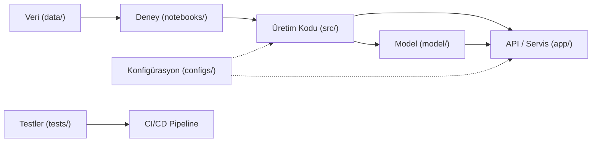

## 📌 Özet
Başarılı bir MLOps stratejisinin temeli, standartlaştırılmış ve ölçeklenebilir bir proje klasör yapısından geçer. Bu yapı, veri bilimcilerin modellerini geliştirirken kullandıkları deneysel ortamlar (notebooks) ile mühendislerin bu modelleri canlıya aldığı üretim ortamı (src/app) arasındaki boşluğu doldurur. İyi tasarlanmış bir hiyerarşi, veri versiyonlama (DVC), model takibi (MLflow) ve sürekli entegrasyon (CI/CD) süreçlerinin sorunsuz çalışmasını sağlayarak projeyi kişiye bağımlı olmaktan çıkarır. Ayrıca, konfigürasyon dosyaları (params.yaml) ve otomasyon araçları (Makefile) aracılığıyla tüm yaşam döngüsünün merkezi ve tekrarlanabilir bir şekilde yönetilmesine imkan tanır.

## 🧠 Detay



### Önerilen Proje Yapısı
```
ml-proje/
│
├── .github/
│   └── workflows/
│       ├── ci.yml            ← Test & lint
│       ├── cd.yml            ← Build & deploy
│       └── retrain.yml       ← Otomatik eğitim
│
├── data/
│   ├── raw/                  ← Ham veri (DVC)
│   ├── processed/            ← İşlenmiş veri (DVC)
│   └── features/             ← Özellikler (DVC)
│
├── notebooks/
│   ├── 01_eda.ipynb
│   ├── 02_feature_engineering.ipynb
│   └── 03_modelleme.ipynb
│
├── src/
│   ├── __init__.py
│   ├── veri/
│   │   ├── yukle.py
│   │   ├── temizle.py
│   │   └── on_isle.py
│   ├── ozellik/
│   │   └── muhendislik.py
│   ├── model/
│   │   ├── egitim.py
│   │   ├── degerlendir.py
│   │   └── tahmin.py
│   └── monitoring/
│       └── drift.py
│
├── app/
│   ├── __init__.py
│   ├── main.py               ← FastAPI
│   ├── schemas.py
│   └── dependencies.py
│
├── tests/
│   ├── test_veri.py
│   ├── test_model.py
│   └── test_api.py
│
├── model/                    ← Kaydedilmiş model (DVC)
│   ├── rf_model.pkl
│   └── scaler.pkl
│
├── metrics/
│   └── sonuclar.json         ← Model metrikleri
│
├── raporlar/
│   └── drift_raporu.html
│
├── dags/                     ← Airflow DAG'ları
│   └── retraining_dag.py
│
├── docker/
│   ├── Dockerfile
│   └── docker-compose.yml
│
├── k8s/                      ← Kubernetes manifests
│   ├── deployment.yaml
│   ├── service.yaml
│   └── hpa.yaml
│
├── configs/
│   ├── params.yaml           ← Model parametreleri
│   └── config.yaml           ← Genel konfigürasyon
│
├── .dvc/                     ← DVC metadata
├── dvc.yaml                  ← DVC pipeline
├── MLproject                 ← MLflow project
├── requirements.txt
├── requirements-dev.txt
├── setup.py
├── .env.example
├── .gitignore
└── README.md
```

### params.yaml
```yaml
# configs/params.yaml
veri:
  test_boyutu: 0.2
  random_state: 42
  min_kayit: 1000

ozellikler:
  sayisal: ["yas", "gelir", "kredi_skoru", "egitim_yili"]
  kategorik: ["sehir", "meslek", "egitim_duzeyi"]
  hedef: "onay"

model:
  random_forest:
    n_estimators: 200
    max_depth: 10
    min_samples_leaf: 5
    n_jobs: -1
  xgboost:
    n_estimators: 300
    learning_rate: 0.05
    max_depth: 6

egitim:
  min_accuracy: 0.85
  min_f1: 0.80

monitoring:
  drift_esigi: 0.05
  kontrol_sikligi: "haftalik"
```

### .gitignore
```
# Veri (DVC yönetir)
data/raw/
data/processed/
data/features/

# Model dosyaları (DVC yönetir)
model/*.pkl
model/*.joblib

# Ortam
.env
venv/
__pycache__/
*.pyc

# MLflow
mlruns/

# Jupyter
.ipynb_checkpoints/

# Docker
.docker/
```

### Makefile
```makefile
.PHONY: install test lint format train deploy

install:
	pip install -r requirements.txt
	pip install -r requirements-dev.txt

test:
	pytest tests/ -v --cov=src --cov-report=html

lint:
	flake8 src/ app/ --max-line-length=100
	black --check src/ app/

format:
	black src/ app/
	isort src/ app/

train:
	python src/model/egitim.py

api:
	uvicorn app.main:app --reload

docker-build:
	docker build -t ml-api:latest .

docker-run:
	docker-compose up -d
```

## 💡 Bağlantılar
- [[MLOps - Giriş ve Temel Kavramlar]]
- [[MLOps - DVC ile Veri Versiyonlama]]
- [[MLOps - GitHub Actions ile CI-CD]]

## ❓ Sorular / Anlamadıklarım
- Notebook kodunu src'ye ne zaman taşımalıyım?
- Monorepo mu yoksa ayrı repolar mı?

## 🔗 Kaynaklar
- https://drivendata.github.io/cookiecutter-data-science/
