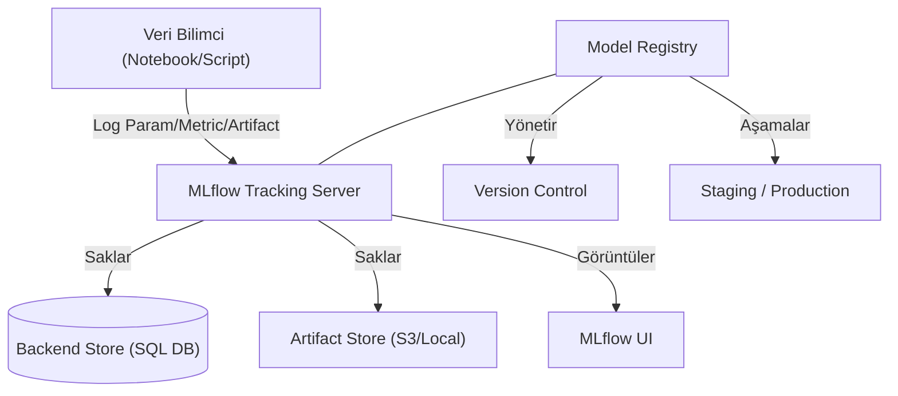

## 📌 Özet
MLflow, makine öğrenmesi yaşam döngüsünü uçtan uca yönetmek için tasarlanmış, dil bağımsız ve açık kaynaklı bir platformdur. Bu araç, binlerce deneyi (experiments) sistematik bir şekilde takip etmenize, her bir çalıştırmanın (run) parametrelerini, metriklerini ve çıktılarını (artifacts) merkezi bir veritabanında saklamanıza olanak tanır. Model Registry bileşeni sayesinde, farklı versiyonlardaki modelleri "Staging" veya "Production" gibi aşamalara taşıyarak takım içi işbirliğini ve model yönetişimini güçlendirir. Ayrıca, MLflow Tracking UI üzerinden modelleri görsel olarak karşılaştırarak en iyi performansı gösteren modeli hızlıca tespit etmenizi sağlar.

## 🧠 Detay



### Kurulum ve Başlatma
```bash
pip install mlflow scikit-learn pandas

# MLflow UI başlat
mlflow ui --port 5000
# → http://localhost:5000
```

### Temel Deney Takibi
```python
import mlflow
import mlflow.sklearn
from sklearn.ensemble import RandomForestClassifier
from sklearn.metrics import accuracy_score, f1_score
from sklearn.model_selection import train_test_split

# MLflow server bağlantısı
mlflow.set_tracking_uri("http://localhost:5000")
mlflow.set_experiment("kredi-onay-modeli")

X_train, X_test, y_train, y_test = train_test_split(X, y, test_size=0.2)

with mlflow.start_run(run_name="rf-deney-1"):
    # Parametreleri logla
    params = {"n_estimators": 100, "max_depth": 5, "random_state": 42}
    mlflow.log_params(params)

    # Model eğit
    model = RandomForestClassifier(**params)
    model.fit(X_train, y_train)

    # Metrikleri logla
    y_pred = model.predict(X_test)
    mlflow.log_metric("accuracy", accuracy_score(y_test, y_pred))
    mlflow.log_metric("f1_score", f1_score(y_test, y_pred))
    mlflow.log_metric("train_size", len(X_train))

    # Modeli kaydet
    mlflow.sklearn.log_model(model, "model",
        registered_model_name="KrediOnayModeli")

    # Artifact kaydet (grafik, dosya)
    mlflow.log_artifact("feature_importance.png")
    mlflow.log_artifact("confusion_matrix.png")

    print(f"Run ID: {mlflow.active_run().info.run_id}")
```

### Otomatik Loglama
```python
# Tek satırla tüm parametreleri otomatik logla
mlflow.sklearn.autolog()

with mlflow.start_run():
    model = RandomForestClassifier(n_estimators=100)
    model.fit(X_train, y_train)
    # params, metrics, model otomatik loglandı
```

### Model Karşılaştırma
```python
# Birden fazla deney çalıştır
parametreler_listesi = [
    {"n_estimators": 50, "max_depth": 3},
    {"n_estimators": 100, "max_depth": 5},
    {"n_estimators": 200, "max_depth": 10},
]

for params in parametreler_listesi:
    with mlflow.start_run(run_name=f"rf-{params['n_estimators']}-{params['max_depth']}"):
        mlflow.log_params(params)

        model = RandomForestClassifier(**params, random_state=42)
        model.fit(X_train, y_train)

        acc = accuracy_score(y_test, model.predict(X_test))
        mlflow.log_metric("accuracy", acc)
        mlflow.sklearn.log_model(model, "model")
```

### Model Registry
```python
from mlflow.tracking import MlflowClient

client = MlflowClient()

# En iyi modeli Production'a taşı
client.transition_model_version_stage(
    name="KrediOnayModeli",
    version=3,
    stage="Production"  # Staging, Production, Archived
)

# Production modelini yükle
model = mlflow.sklearn.load_model("models:/KrediOnayModeli/Production")
tahmin = model.predict(X_test)
```

### MLflow Projects
```yaml
# MLproject dosyası
name: kredi-modeli

conda_env: conda.yaml

entry_points:
  main:
    parameters:
      n_estimators: {type: int, default: 100}
      max_depth: {type: int, default: 5}
    command: "python train.py --n_estimators {n_estimators} --max_depth {max_depth}"
```

```bash
# Çalıştır
mlflow run . -P n_estimators=200 -P max_depth=8
```

## 💡 Bağlantılar
- [[MLOps - Giriş ve Temel Kavramlar]]
- [[MLOps - Model Packaging ve BentoML]]
- [[MLOps - GitHub Actions ile CI-CD]]

## ❓ Sorular / Anlamadıklarım
- MLflow Server vs SQLite backend ne zaman hangisi?
- Model versiyonlarını nasıl otomatik yönetirim?

## 🔗 Kaynaklar
- https://mlflow.org/docs/latest/index.html
