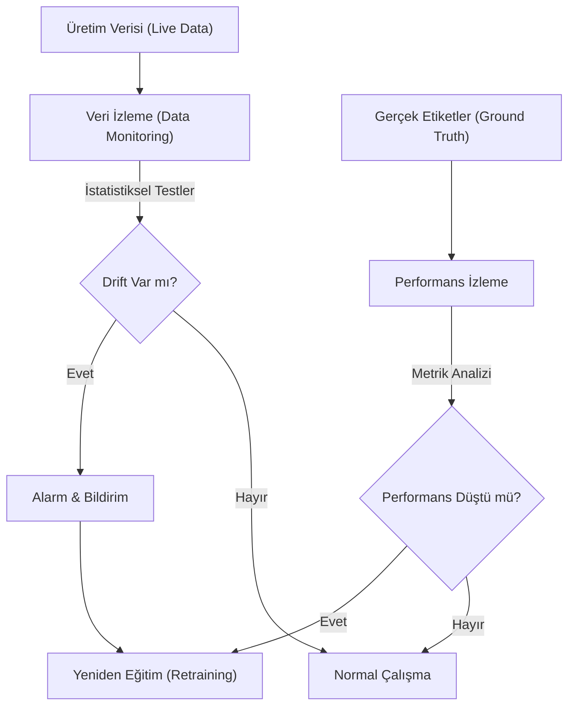

## 📌 Özet
Canlı ortamdaki makine öğrenmesi modelleri, veri dünyasındaki değişimlere karşı hassastır ve zamanla performans kaybına (model decay) uğrarlar. Model izleme süreci, girdi verilerinin dağılımındaki sapmaları (Data Drift) ve girdi ile çıktı arasındaki mantıksal ilişkinin değişmesini (Concept Drift) sürekli olarak analiz ederek bu bozulmaları erken aşamada yakalamayı hedefler. Evidently gibi araçlar kullanılarak oluşturulan raporlar, sadece istatistiksel testlerle drift tespiti yapmakla kalmaz, aynı zamanda modelin iş değerini koruyup korumadığını da denetler. Etkili bir izleme stratejisi, performans eşikleri aşıldığında veya kritik driftler saptandığında otomatik uyarılar göndererek veya yeniden eğitim (retraining) süreçlerini tetikleyerek sistemin güvenilirliğini sağlar.

## 🧠 Detay



### Drift Türleri
```
Data Drift (Kovaryans Kayması):
  → Giriş verisi dağılımı değişiyor
  → Örnek: Müşteri yaş dağılımı değişti

Concept Drift (Kavram Kayması):
  → X ile y arasındaki ilişki değişiyor
  → Örnek: Eski kredi riski kuralları artık geçersiz

Label Drift:
  → Hedef değişken dağılımı değişiyor

Prediction Drift:
  → Model tahmin dağılımı değişiyor
```

### Evidently ile Drift Analizi
```bash
pip install evidently
```

```python
import pandas as pd
from evidently.report import Report
from evidently.metric_preset import DataDriftPreset, DataQualityPreset
from evidently.metrics import *

# Referans (eğitim) ve güncel veri
referans = pd.read_csv("data/egitim_verisi.csv")
guncel = pd.read_csv("data/uretim_verisi.csv")

# Veri drift raporu
rapor = Report(metrics=[
    DataDriftPreset(),
    DataQualityPreset(),
])

rapor.run(reference_data=referans, current_data=guncel)
rapor.save_html("raporlar/drift_raporu.html")
```

### Sütun Bazlı Drift
```python
from evidently.metrics import ColumnDriftMetric, ColumnSummaryMetric

rapor = Report(metrics=[
    ColumnDriftMetric(column_name="yas"),
    ColumnDriftMetric(column_name="gelir"),
    ColumnSummaryMetric(column_name="kredi_skoru"),
])

rapor.run(reference_data=referans, current_data=guncel)
sonuc = rapor.as_dict()

# Drift var mı kontrol et
for metrik in sonuc["metrics"]:
    if "drift_detected" in str(metrik):
        print(metrik)
```

### Model Performans İzleme
```python
from evidently.metric_preset import ClassificationPreset

# Gerçek etiketler mevcut olduğunda
performans_raporu = Report(metrics=[
    ClassificationPreset(),
])

performans_raporu.run(
    reference_data=referans_tahminler,
    current_data=guncel_tahminler,
    column_mapping={"target": "gercek", "prediction": "tahmin"}
)
performans_raporu.save_html("raporlar/performans.html")
```

### Test Suite (Otomatik Kontrol)
```python
from evidently.test_suite import TestSuite
from evidently.tests import *

suite = TestSuite(tests=[
    TestNumberOfDriftedColumns(lt=3),           # max 3 sütun drift
    TestShareOfDriftedColumns(lt=0.3),          # max %30 drift
    TestColumnDrift("gelir", stattest_threshold=0.05),
    TestAccuracyScore(gt=0.85),                  # min %85 doğruluk
    TestF1Score(gt=0.80),
])

suite.run(reference_data=referans, current_data=guncel)

if not suite.as_dict()["summary"]["all_passed"]:
    print("⚠️ Testler başarısız! Yeniden eğitim gerekebilir.")
    # Alert gönder, yeniden eğitim tetikle
```

### Basit Drift Dedektörü (Manuel)
```python
import numpy as np
from scipy import stats

def drift_tespit(referans: pd.Series, guncel: pd.Series, esik=0.05):
    """KS testi ile drift tespit"""
    ks_stat, p_deger = stats.ks_2samp(referans.dropna(), guncel.dropna())

    return {
        "sutun": referans.name,
        "ks_istatistik": round(ks_stat, 4),
        "p_deger": round(p_deger, 4),
        "drift_var": p_deger < esik
    }

# Tüm sayısal sütunlar için
sayisal = referans.select_dtypes(include="number").columns
for sutun in sayisal:
    sonuc = drift_tespit(referans[sutun], guncel[sutun])
    if sonuc["drift_var"]:
        print(f"⚠️ DRIFT: {sonuc}")
```

### Yeniden Eğitim Tetikleyicileri
```python
ESIKLER = {
    "accuracy": 0.85,
    "f1_score": 0.80,
    "drift_sutun_orani": 0.20
}

def yeniden_egitim_gerekli(metrikler: dict) -> bool:
    if metrikler["accuracy"] < ESIKLER["accuracy"]:
        return True
    if metrikler["f1_score"] < ESIKLER["f1_score"]:
        return True
    if metrikler["drift_orani"] > ESIKLER["drift_sutun_orani"]:
        return True
    return False
```

## 💡 Bağlantılar
- [[MLOps - Giriş ve Temel Kavramlar]]
- [[MLOps - MLflow ile Deney Takibi]]
- [[MLOps - Otomatik Yeniden Eğitim]]
- [[API - FastAPI Loglama ve İzleme]]

## ❓ Sorular / Anlamadıklarım
- Ne sıklıkta monitoring yapılmalı?
- Ground truth geç gelirse model performansı nasıl izlenir?

## 🔗 Kaynaklar
- https://docs.evidentlyai.com/
