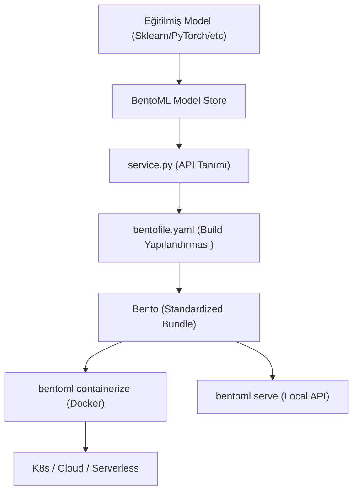

## 📌 Özet
BentoML, makine öğrenmesi modellerini "Bento" adı verilen standartlaştırılmış paketler haline getirerek, araştırma ortamından üretim ortamına geçişi hızlandıran modern bir framework'tür. Bu araç; model ağırlıklarını, gerekli Python bağımlılıklarını, API tanımlarını ve özel ön işleme kodlarını tek bir birim içerisinde izole ederek "benim makinemde çalışıyordu" sorununu ortadan kaldırır. Gelişmiş "Runner" mimarisi sayesinde, model çıkarım (inference) işlemlerini ana API döngüsünden ayırarak yüksek ölçeklenebilirlik ve performans sunar. Tek bir komutla Docker konteynerlarına veya Kubernetes (Yatai) kümelerine dönüşebilen Bento'lar, modellerin servis edilmesini hem güvenli hem de tekrarlanabilir kılar.

## 🧠 Detay



### Kurulum
```bash
pip install bentoml
```

### Model Kaydetme
```python
import bentoml
from sklearn.ensemble import RandomForestClassifier

# Eğitilmiş modeli BentoML'e kaydet
model.fit(X_train, y_train)

bento_model = bentoml.sklearn.save_model(
    "kredi_onay_modeli",
    model,
    signatures={
        "predict": {"batchable": True},
        "predict_proba": {"batchable": True}
    },
    metadata={
        "accuracy": 0.92,
        "egitim_tarihi": "2026-05-28",
        "veri_buyuklugu": len(X_train)
    }
)

print(f"Model kaydedildi: {bento_model.tag}")
# kredi_onay_modeli:a1b2c3d4
```

### Servis Tanımlama
```python
# service.py
import bentoml
import numpy as np
from bentoml.io import JSON, NumpyNdarray
from pydantic import BaseModel
from typing import List

class TahminGiris(BaseModel):
    yas: int
    gelir: float
    kredi_skoru: int
    egitim_yili: int
    is_suresi: float

class TahminCikis(BaseModel):
    tahmin: int
    karar: str
    olasilik: float

# Model runner oluştur
kredi_runner = bentoml.sklearn.get("kredi_onay_modeli:latest").to_runner()

# Servis oluştur
svc = bentoml.Service("kredi_onay_servisi", runners=[kredi_runner])

@svc.api(input=JSON(pydantic_model=TahminGiris), output=JSON(pydantic_model=TahminCikis))
async def tahmin(giris: TahminGiris) -> TahminCikis:
    veri = np.array([[
        giris.yas, giris.gelir, giris.kredi_skoru,
        giris.egitim_yili, giris.is_suresi
    ]])

    tahmin_val = await kredi_runner.predict.async_run(veri)
    olasilik = await kredi_runner.predict_proba.async_run(veri)

    return TahminCikis(
        tahmin=int(tahmin_val[0]),
        karar="Onaylandı" if tahmin_val[0] == 1 else "Reddedildi",
        olasilik=round(float(olasilik[0].max()), 4)
    )
```

### Çalıştırma
```bash
# Geliştirme
bentoml serve service:svc --reload

# Production
bentoml serve service:svc --production --port 8000
```

### Bento Build (Paketleme)
```yaml
# bentofile.yaml
service: "service:svc"
labels:
  owner: "veri-ekibi"
  stage: "production"

include:
  - "*.py"
  - "model/"

python:
  packages:
    - scikit-learn==1.4.2
    - numpy==1.26.4
    - pandas==2.2.2
```

```bash
# Bento oluştur
bentoml build

# Docker image oluştur
bentoml containerize kredi_onay_servisi:latest

# Docker çalıştır
docker run -p 8000:8000 kredi_onay_servisi:latest
```

### Model Versiyonlama
```python
# Tüm versiyonları listele
for model in bentoml.models.list():
    print(f"{model.tag} - {model.info.metadata}")

# Belirli versiyon yükle
model_v1 = bentoml.sklearn.get("kredi_onay_modeli:v1.0.0")
model_latest = bentoml.sklearn.get("kredi_onay_modeli:latest")

# Sil
bentoml.models.delete("kredi_onay_modeli:eski_versiyon")
```

### Batch Servis
```python
@svc.api(input=JSON(), output=JSON())
async def batch_tahmin(girisler: List[TahminGiris]) -> List[TahminCikis]:
    veri = np.array([[g.yas, g.gelir, g.kredi_skoru] for g in girisler])
    tahminler = await kredi_runner.predict.async_run(veri)
    return [TahminCikis(tahmin=int(t)) for t in tahminler]
```

## 💡 Bağlantılar
- [[MLOps - MLflow ile Deney Takibi]]
- [[API - ML Modeli Servis Etmek]]
- [[API - Docker ile Deploy]]

## ❓ Sorular / Anlamadıklarım
- BentoML vs FastAPI ne zaman hangisi?
- Runner'ların performans avantajı nedir?

## 🔗 Kaynaklar
- https://docs.bentoml.com/
