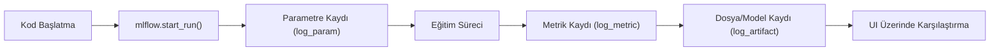

## 📌 Özet
MLflow Tracking, makine öğrenmesi deneyleri sırasında ortaya çıkan tüm önemli bilgilerin sistematik bir şekilde kaydedilmesini sağlayan bir bileşendir. Kodun her çalıştırılmasında kullanılan hiperparametreler, eğitim sonrası elde edilen performans metrikleri ve üretilen dosyalar (modeller, grafikler) "Run" adı verilen birimler altında toplanır. Bu yapı, yüzlerce deney arasından en iyi performansı gösteren modeli saniyeler içinde bulmayı ve geçmişe dönük izlenebilirliği sağlar.

---

## 🧠 Detay

### 🗺️ Tracking İş Akışı



### 1. Neler Kaydedilir?
- **Parameters:** Giriş değerleri (örn: `learning_rate=0.01`, `n_estimators=100`).
- **Metrics:** Eğitim sırasında veya sonunda değişen değerler (örn: `accuracy`, `rmse`, `loss`). Zaman içindeki değişimleri grafiklemek için birden fazla kez kaydedilebilir.
- **Artifacts:** Çıktı dosyaları (örn: `.pkl` model dosyaları, `.png` karmaşıklık matrisleri, `.csv` tahmin verileri).
- **Source:** Çalıştırılan kodun hangi dosya olduğu ve hangi Git commit'inden geldiği.

### 2. Temel Python Kullanımı

```python
import mlflow

# Deney adını belirle
mlflow.set_experiment("Musteri_Kaybi_Tahmini")

with mlflow.start_run():
    # Parametre kaydet
    mlflow.log_param("algoritma", "RandomForest")
    mlflow.log_param("max_depth", 5)
    
    # ... model eğitimi ...
    accuracy = 0.85
    
    # Metrik kaydet
    mlflow.log_metric("accuracy", accuracy)
    
    # Dosya kaydet
    mlflow.log_artifact("confusion_matrix.png")
    
    # Modeli kaydet (Flavor kullanımı)
    mlflow.sklearn.log_model(model, "random_forest_model")
```

### 3. Autologging (Otomatik Kayıt) ⭐
MLflow, popüler kütüphaneler (Scikit-learn, XGBoost, PyTorch) için parametre ve metrikleri otomatik kaydedebilir:
```python
import mlflow.sklearn
mlflow.sklearn.autolog() # Sadece bu satır yeterli!
```

### 4. MLflow UI
Deneyleri görselleştirmek için terminalden şu komut çalıştırılır:
`mlflow ui`
Varsayılan olarak `http://localhost:5000` adresinden erişilir.

---

## 💡 Bağlantılar
- [[MLflow - Giriş ve Temel Kavramlar]]
- [[MLflow - Model Registry]]
- [[ML - Model Değerlendirme Metrikleri]]

## ❓ Sorular / Anlamadıklarım
- `mlflow.start_run()` içinde `nested=True` parametresi ne zaman kullanılır?
- Tracking verileri varsayılan olarak nerede saklanır? (Cevap: mlruns klasörü)

## 🔗 Kaynaklar
- [MLflow Tracking API](https://mlflow.org/docs/latest/tracking.html)
