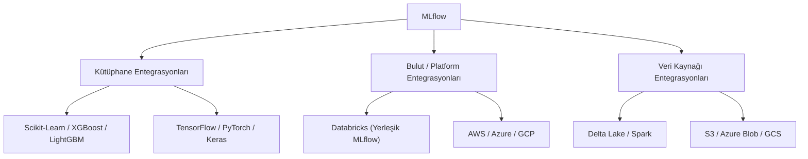

## 📌 Özet
MLflow, "açık platform" felsefesiyle tasarlandığı için modern makine öğrenmesi ekosistemindeki hemen hemen tüm popüler kütüphaneler ve bulut platformları ile derin entegrasyonlara sahiptir. Bu entegrasyonlar, model eğitim koduna sadece birkaç satır ekleyerek gelişmiş takip, görselleştirme ve dağıtım özelliklerinin kullanılmasını sağlar. MLflow, kütüphane bağımsız bir orkestrasyon katmanı görevi görür.

---

## 🧠 Detay

### 🗺️ MLflow Entegrasyon Ekosistemi



### 1. Kütüphane Bazlı Entegrasyonlar (Autologging) ⭐
MLflow, kütüphanelerin içindeki `fit()` veya `train()` fonksiyonlarını "kancalayarak" parametreleri otomatik yakalar.

| Kütüphane | Komut | Otomatik Yakalananlar |
|-----------|-------|-----------------------|
| Scikit-learn | `mlflow.sklearn.autolog()` | Tüm hiperparametreler, R2, MSE vb. |
| XGBoost | `mlflow.xgboost.autolog()` | Iteration sonuçları, feature importance |
| TensorFlow | `mlflow.tensorflow.autolog()` | Loss curves, epochs, model checkpoints |
| Spark | `mlflow.spark.autolog()` | Pipeline aşamaları |

### 2. Bulut ve Depolama Entegrasyonu
MLflow verileri (metadata ve artifact) farklı yerlerde saklanabilir:
- **Metadata (Params/Metrics):** SQLite, PostgreSQL, MySQL.
- **Artifacts (Models/Files):** S3, Azure Blob Storage, Google Cloud Storage, Local Filesystem.

Örnek uzak depo ayarı:
```python
mlflow.set_tracking_uri("http://uzak-sunucu-ip:5000")
```

### 3. Databricks ve MLflow
Databricks, MLflow'un yaratıcısı olduğu için platform içinde tamamen entegre bir deneyim sunar:
- Deneyler otomatik olarak çalışma alanına (Workspace) kaydedilir.
- "Managed MLflow" sayesinde sunucu kurulumu gerekmez.
- Model Registry, Databricks Unity Catalog ile entegre çalışır.

### 4. Dağıtım (Deployment) Entegrasyonları
MLflow modelleri şu platformlara doğrudan deploy edilebilir:
- **Kubernetes:** Seldon Core veya BentoML üzerinden.
- **AWS SageMaker:** `mlflow.sagemaker` modülü ile.
- **Azure ML:** `mlflow.azureml` üzerinden.

---

## 💡 Bağlantılar
- [[MLflow - Deney Takibi (Tracking)]]
- [[MLflow - Modeller ve Paketleme]]
- [[Cloud - Bulut Bilişime Giriş]]

## ❓ Sorular / Anlamadıklarım
- MLflow'u Docker konteynerleri içinde çalıştırırken `tracking_uri` nasıl yönetilmeli?
- HuggingFace modelleri için MLflow entegrasyonu mevcut mu?

## 🔗 Kaynaklar
- [MLflow Built-in Integrations](https://mlflow.org/docs/latest/tracking.html#built-in-model-flavors)
