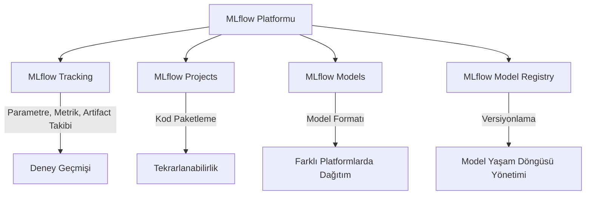

## 📌 Özet
MLflow, makine öğrenmesi yaşam döngüsünü (machine learning lifecycle) uçtan uca yönetmek için tasarlanmış açık kaynaklı bir platformdur. Deneylerin takibi, kodun paketlenmesi, modellerin yönetilmesi ve dağıtılması süreçlerini standartlaştırarak veri bilimcilerin ve mühendislerin daha verimli çalışmasını sağlar. MLflow, herhangi bir ML kütüphanesi (Scikit-learn, TensorFlow, PyTorch vb.) ve herhangi bir programlama dili ile kullanılabilen esnek bir yapıya sahiptir.

---

## 🧠 Detay

### 🗺️ MLflow Bileşenleri Mimarisi

### 1. MLflow Tracking
Deneylerin parametrelerini (öğrenme hızı, ağaç sayısı vb.), metriklerini (doğruluk, hata payı), kod versiyonlarını ve çıktı dosyalarını (artifact) kaydetmeye yarar. Bir UI üzerinden tüm deneyleri karşılaştırmanıza olanak tanır.

### 2. MLflow Projects
ML kodunu, bağımlılıkları (conda.yaml, requirements.txt) ile birlikte paketleyen bir formattır. Bu sayede kodun farklı ortamlarda (farklı bir sunucu veya iş arkadaşınızın bilgisayarı) aynı şekilde çalışması garanti edilir.

### 3. MLflow Models
Modelleri, farklı araçlar (Docker, Spark, Cloud) tarafından okunabilecek standart bir formatta paketler. "Flavor" mantığı ile modelin hem Python fonksiyonu hem de kütüphaneye özel (örn. keras) formatta saklanmasını sağlar.

### 4. MLflow Model Registry
Eğitilmiş modellerin merkezi bir depoda saklanması, versiyonlanması (v1, v2) ve yaşam döngüsü aşamalarının (Staging, Production, Archived) yönetilmesini sağlar.

---

## 💡 Bağlantılar
- [[MLflow - Deney Takibi (Tracking)]]
- [[MLflow - Modeller ve Paketleme]]
- [[MLOps - Giriş ve Temel Kavramlar]]

## ❓ Sorular / Anlamadıklarım
- MLflow'u yerel makinede mi yoksa bir sunucuda mı çalıştırmak daha mantıklıdır?
- Veri sızıntısını (Data Leakage) MLflow ile nasıl tespit edebiliriz?

## 🔗 Kaynaklar
- [MLflow Resmi Dokümantasyonu](https://mlflow.org/docs/latest/index.html)
