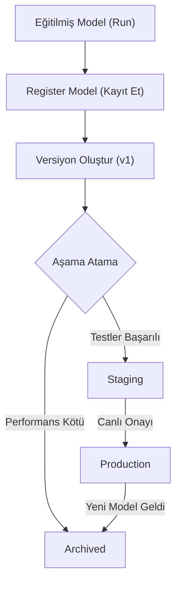

## 📌 Özet
MLflow Model Registry, makine öğrenmesi modellerinin tüm yaşam döngüsünü yönetmek için kullanılan merkezi bir model kataloğudur. Deney aşamasında başarılı olan bir modelin versiyonlanmasını (Version 1, 2, 3), ekibin onay süreçlerinden geçmesini ve Production (Üretim) gibi farklı aşamalara aktarılmasını sağlar. Bu bileşen, özellikle çok kişilik ekiplerde hangi modelin canlıda olduğunu, hangisinin test aşamasında (Staging) olduğunu takip etmek için hayati önem taşır.

---

## 🧠 Detay

### 🗺️ Model Yaşam Döngüsü Yönetimi



### 1. Temel Kavramlar
- **Registered Model:** Benzersiz bir isme sahip ana model kaydı (örn: `Kredi_Skorlama_Modeli`).
- **Model Version:** Her kayıt işlemi yeni bir versiyon numarası oluşturur.
- **Model Stage:** Bir model versiyonu şu dört aşamadan birinde olabilir:
    - `None`: Yeni kayıt edilmiş.
    - `Staging`: Test ortamında.
    - `Production`: Canlı sistemde.
    - `Archived`: Kullanım dışı.

### 2. Python ile Model Kaydı

```python
from mlflow.tracking import MlflowClient

client = MlflowClient()

# 1. Modeli kaydet
result = mlflow.register_model(
    "runs:/<run_id>/model",
    "Musteri_Segmentasyonu"
)

# 2. Modeli Production aşamasına geçir
client.transition_model_version_stage(
    name="Musteri_Segmentasyonu",
    version=1,
    stage="Production"
)
```

### 3. Production Modelini Çağırmak
Uygulamanızda versiyon numarası yerine aşama ismini kullanarak her zaman en güncel canlı modeli çekebilirsiniz:

```python
import mlflow.pyfunc

# Her zaman Production aşamasındaki en son versiyonu getirir
model_uri = "models:/Musteri_Segmentasyonu/Production"
model = mlflow.pyfunc.load_model(model_uri)
```

### 4. Registry Avantajları
- **Versiyon Kontrolü:** Modelin geçmişine tam hakimiyet.
- **İşbirliği:** Veri bilimcinin eğittiği modeli, DevOps mühendisinin Registry üzerinden onaylayıp canlıya alabilmesi.
- **Metadata:** Her versiyona açıklama, etiket (tag) ve kullanıcı bilgisi ekleyebilme.

---

## 💡 Bağlantılar
- [[MLflow - Modeller ve Paketleme]]
- [[MLflow - Deney Takibi (Tracking)]]
- [[MLOps - Giriş ve Temel Kavramlar]]

## ❓ Sorular / Anlamadıklarım
- Model Registry veritabanı olarak ne kullanır? (Cevap: SQL tabanlı backend store gerekir).
- Otomatik model onay (deployment) süreçleri CI/CD ile nasıl entegre edilir?

## 🔗 Kaynaklar
- [MLflow Model Registry Documentation](https://mlflow.org/docs/latest/model-registry.html)
