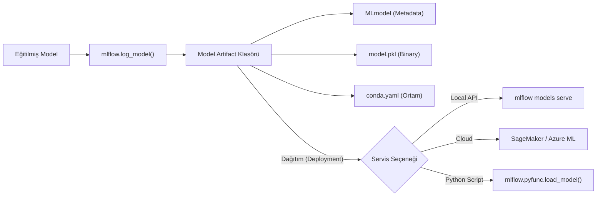

## 📌 Özet
MLflow Models, eğitilmiş makine öğrenmesi modellerini farklı servis araçları (Docker, AWS SageMaker, Azure ML, Apache Spark vb.) tarafından kullanılabilen standart bir formatta paketleme yöntemidir. "Flavor" adı verilen bir sistem kullanarak, bir modelin hem orijinal kütüphanesinde (örn: Scikit-learn) hem de genel bir "Python Function" (`pyfunc`) olarak saklanmasını sağlar. Bu çift taraflı yapı, modelin eğitim ortamından bağımsız olarak herhangi bir Python ortamında kolayca yüklenip tahmin yapabilmesini garanti eder.

---

## 🧠 Detay

### 🗺️ Model Paketleme ve Tahmin Akışı



### 1. Flavors (Tatlar/Formatlar) ⭐
MLflow'un en güçlü yanlarından biridir. Bir model klasöründe birden fazla "Flavor" bulunabilir:
- **python_function (pyfunc):** En genel format. `predict()` fonksiyonuna sahip her modele uyar.
- **sklearn, pytorch, keras, xgboost:** Kütüphaneye özel optimize edilmiş formatlar.

### 2. Model Kaydetme (Logging)

```python
import mlflow.sklearn

with mlflow.start_run():
    # ... model eğitimi ...
    mlflow.sklearn.log_model(sk_model=model, artifact_path="ev_fiyati_modeli")
```

### 3. Modeli Yükleme ve Tahmin Yapma (Serving)

```python
import mlflow.pyfunc

# Modeli Tracking'den veya dosyadan yükle
model_uri = "runs:/<run_id>/ev_fiyati_modeli"
yuklenen_model = mlflow.pyfunc.load_model(model_uri)

# Tahmin yap
tahminler = yuklenen_model.predict(X_test)
```

### 4. Modeli REST API Olarak Sunma
Modeli tek bir komutla bir web servisine dönüştürebilirsiniz:
```bash
mlflow models serve -m runs:/<run_id>/ev_fiyati_modeli -p 1234
```
Bu komut, model için otomatik olarak bir Flask sunucusu başlatır ve `/invocations` endpoint'i üzerinden tahmin kabul eder.

---

## 💡 Bağlantılar
- [[MLflow - Giriş ve Temel Kavramlar]]
- [[MLflow - Model Registry]]
- [[API - ML Modeli Servis Etmek]]

## ❓ Sorular / Anlamadıklarım
- Özel (custom) bir model türü için yeni bir Flavor nasıl oluşturulur?
- Model imzası (Model Signature) nedir ve girdi/çıktı doğrulaması için neden önemlidir?

## 🔗 Kaynaklar
- [MLflow Models Guide](https://mlflow.org/docs/latest/models.html)
