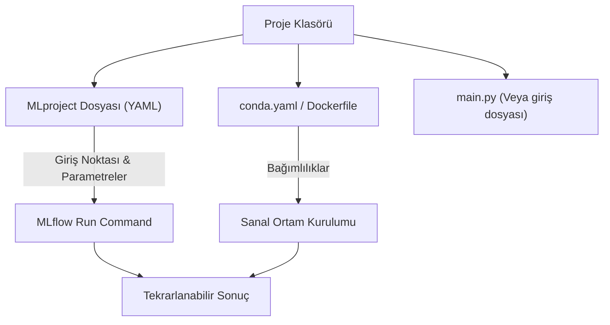

## 📌 Özet
MLflow Projects, veri bilimi kodunu tekrarlanabilir ve kendi kendine yeten (self-contained) bir formatta paketlemek için kullanılan bir standarttır. Bir proje dosyası; kodun hangi sırayla çalıştırılacağını, hangi kütüphanelere (Conda, Docker, Pip) ihtiyaç duyduğunu ve hangi parametreleri aldığını tanımlayan bir `MLproject` dosyası içerir. Bu sayede bir başkasının kodunu çalıştırmak için ortam kurmakla vakit kaybetmezsiniz; MLflow gerekli ortamı sizin için otomatik olarak hazırlar.

---

## 🧠 Detay

### 🗺️ MLflow Proje Yapısı



### 1. MLproject Dosyası Örneği
Bu dosya projenin kalbidir. YAML formatında yazılır.

```yaml
name: Konut_Fiyat_Tahmini

conda_env: conda.yaml # Bağımlılıkların olduğu dosya

entry_points:
  main:
    parameters:
      batch_size: {type: int, default: 32}
      epochs: {type: int, default: 10}
    command: "python train.py --batch_size {batch_size} --epochs {epochs}"
```

### 2. Bağımlılık Yönetimi (conda.yaml)
```yaml
name: konut_env
channels:
  - defaults
dependencies:
  - python=3.9
  - scikit-learn
  - pandas
  - pip:
    - mlflow
```

### 3. Projeyi Çalıştırma
Bir MLflow projesini yerelinizde, GitHub'daki bir repo'dan veya uzak bir sunucudan tek bir komutla çalıştırabilirsiniz:

```bash
# Yerel klasörü çalıştır
mlflow run . -P epochs=20

# GitHub repo'sundan çalıştır
mlflow run https://github.com/kullanici/repo.git -P epochs=50
```

### 4. Projelerin Avantajları
- **Bağımlılık İzolasyonu:** "Benim bilgisayarımda çalışıyordu" sorununa son.
- **Git Entegrasyonu:** MLflow, çalıştırdığınız kodun hangi commit ID'ye sahip olduğunu otomatik olarak Tracking bileşenine kaydeder.
- **Parametreli Çalıştırma:** Aynı kodu farklı parametrelerle komut satırından hızlıca test edebilirsiniz.

---

## 💡 Bağlantılar
- [[MLflow - Giriş ve Temel Kavramlar]]
- [[Docker - Giriş ve Temel Kavramlar]]
- [[Python - Virtual Environment]]

## ❓ Sorular / Anlamadıklarım
- MLflow Projects içinde Docker kullanmak Conda'ya göre ne gibi avantajlar sağlar?
- Çoklu giriş noktası (entry point) tanımlayarak bir pipeline (Veri Temizleme -> Eğitim) oluşturulabilir mi?

## 🔗 Kaynaklar
- [MLflow Projects Documentation](https://mlflow.org/docs/latest/projects.html)
