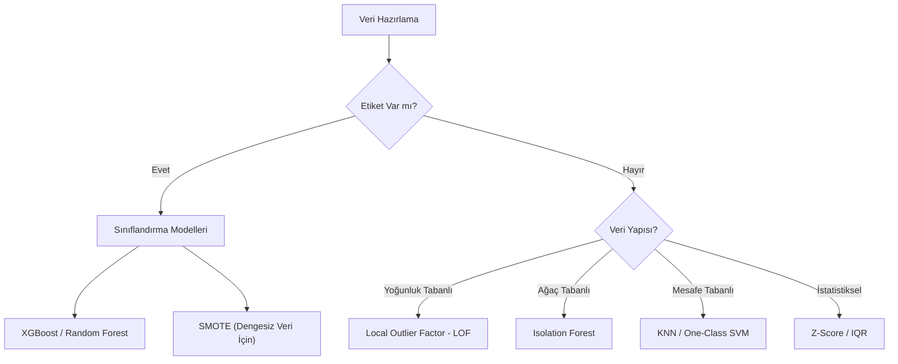

## 📌 Özet
Anomali tespiti, veri setindeki normal kalıplara uymayan nadir gözlemleri belirleme işlemidir. Dolandırıcılık tespiti, sistem arızaları ve sağlık teşhislerinde yaygın kullanılır. Modern sistemlerde anomaliler, verinin büyük bir kısmını oluşturan "normal" davranışlardan istatistiksel veya yapısal olarak ayrışan uç değerlerdir. Bu süreçte gözetimsiz öğrenme algoritmaları, etiketli veriye ihtiyaç duymadan veri içindeki aykırı yapıları keşfedebilme yetenekleri sayesinde kritik rol oynar.

---

## 🧠 Detay

### 🗺️ Anomali Tespiti Akış Şeması



### Temel Algoritmalar

#### 1. Isolation Forest ⭐
Veriyi rastgele özelliklerle bölerek izole eder. Anomaliler daha hızlı (daha az bölme ile) izole edilir.
```python
from sklearn.ensemble import IsolationForest

model = IsolationForest(contamination=0.05, random_state=42)
preds = model.fit_predict(X) # -1: anomali, 1: normal
```

#### 2. Local Outlier Factor (LOF)
Bir noktanın yoğunluğunu komşularıyla karşılaştırır. Yoğunluğu komşularından belirgin derecede düşükse anomalidir.
```python
from sklearn.neighbors import LocalOutlierFactor

lof = LocalOutlierFactor(n_neighbors=20, contamination=0.05)
preds = lof.fit_predict(X)
```

#### 3. One-Class SVM
Normal veriyi kapsayan bir sınır (hyperplane) çizer. Bu sınırın dışında kalanlar anomalidir.

### Değerlendirme Sorunu
Anomali tespitinde genellikle etiket olmaz. Değerlendirme için:
1. **İçsel Metrikler:** Siluet skoru (kümeleme gibi).
2. **Domain Uzmanı:** Tespit edilenlerin manuel incelenmesi.
3. **Sentetik Veri:** Bilinen anomaliler ekleyerek test etme.

---

## 💡 Bağlantılar
- [[FE - Aykırı Değer İşleme]]
- [[ML - Dengesiz Veri Seti Yönetimi]]
- [[ML - Support Vector Machines]]

## ❓ Sorular / Anlamadıklarım
- Anomaliler her zaman "kötü" müdür? (Hayır, bazen yeni keşifler olabilir).

## 🔗 Kaynaklar
- Scikit-learn Outlier Detection Guide
