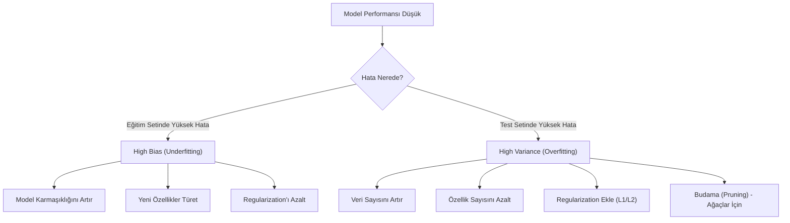

## 📌 Özet
Bias-Variance dengesi, bir modelin karmaşıklığı ile genelleme yeteneği arasındaki dengeyi ifade eder. Regularization (Lasso ve Ridge), katsayıları cezalandırarak varyansı düşürmek ve overfitting'i önlemek için kullanılır. İdeal bir model, eğitim verisindeki desenleri öğrenirken gürültüye (noise) kapılmamalı, yani hem düşük yanlılık (bias) hem de düşük varyans (variance) sergilemelidir. Bu dengeyi kurmak, makine öğrenmesi projelerinde modelin gerçek dünya verileri üzerindeki başarısını belirleyen en temel optimizasyon adımıdır.

---

## 🧠 Detay

### 🗺️ Bias vs Variance Karar Matrisi

### Bias ve Variance Tanımları

| Kavram | Tanım | Sorun | Çözüm |
|--------|-------|-------|-------|
| **Bias (Yanlılık)** | Modelin verideki gerçek ilişkiyi öğrenememesi (çok basit model). | Underfitting | Daha karmaşık model, daha fazla özellik. |
| **Variance (Varyans)** | Modelin eğitim verisindeki gürültüyü bile öğrenmesi (çok karmaşık model). | Overfitting | Daha fazla veri, regularization, budama. |

### Regularization (Düzenlileştirme)

Overfitting'i önlemek için maliyet fonksiyonuna bir ceza terimi eklenir.

#### 1. Ridge Regresyon (L2 Regularization)
Katsayıların karelerini cezalandırır. Katsayıları sıfıra yaklaştırır ama tam sıfır yapmaz.
- **Maliyet:** $MSE + \alpha \sum \beta_i^2$
- **Ne zaman?** Tüm özelliklerin önemli olduğunu düşünüyorsanız.

#### 2. Lasso Regresyon (L1 Regularization)
Katsayıların mutlak değerlerini cezalandırır. Bazı katsayıları tam sıfır yapar (özellik seçimi).
- **Maliyet:** $MSE + \alpha \sum |\beta_i|$
- **Ne zaman?** Gereksiz özellikler olduğunu ve özellik seçimi yapmak istediğinizde.

#### 3. Elastic Net
L1 ve L2'nin birleşimidir.
- **Maliyet:** $MSE + \alpha \rho \sum |\beta_i| + \frac{\alpha(1-\rho)}{2} \sum \beta_i^2$

---

## 💡 Bağlantılar
- [[ML - Lineer Regresyon]]
- [[ML - Overfitting ve Underfitting]]
- [[FE - Özellik Seçimi Yöntemleri]]

## ❓ Sorular / Anlamadıklarım
- $\alpha$ (lambda) parametresi nasıl seçilmeli? (Cevap: Cross-Validation ile)

## 🔗 Kaynaklar
- Introduction to Statistical Learning (ISLR) - Chapter 6
