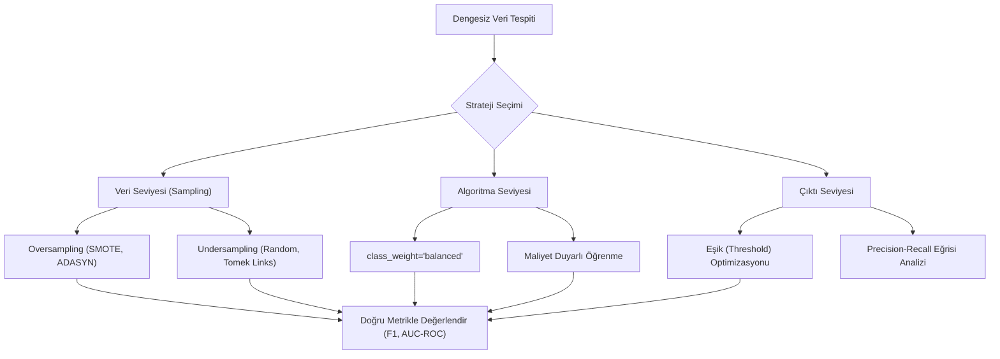

## 📌 Özet
Dengesiz veri seti yönetimi, sınıf dağılımının bir tarafa aşırı meyilli olduğu (örneğin %99'a %1) durumlarda modelin çoğunluk sınıfına "ezberlemesini" önlemek için kullanılan teknikler bütünüdür. Geleneksel doğruluk (accuracy) metrikleri bu senaryolarda yanıltıcıdır; çünkü model her şeye "çoğunluk sınıfı" diyerek yüksek skor alabilir ancak asıl önemli olan azınlık sınıfını tamamen kaçırabilir. Bu sorunu aşmak için veri seviyesinde örnekleme (sampling), algoritma seviyesinde ağırlıklandırma (class weighting) veya karar eşiği optimizasyonu (threshold tuning) gibi stratejiler uygulanarak modelin azınlık sınıfını ayırt etme yeteneği artırılır.

## 🧠 Detay

### İş Akışı ve Stratejiler


### Problemi Tespit Et
Veri setindeki dengesizliği anlamak için ilk adım hedef değişkenin dağılımını kontrol etmektir.
```python
import pandas as pd

print(y.value_counts())
print(y.value_counts(normalize=True) * 100)
# %95 negatif, %5 pozitif → ciddi dengesizlik
```

### class_weight ile Dengeleme
```python
from sklearn.linear_model import LogisticRegression
from sklearn.ensemble import RandomForestClassifier

# Otomatik dengeleme
lr = LogisticRegression(class_weight="balanced")
rf = RandomForestClassifier(class_weight="balanced")

# Manuel
lr = LogisticRegression(class_weight={0: 1, 1: 10})
```

### Oversampling — SMOTE
```python
from imblearn.over_sampling import SMOTE, ADASYN
from imblearn.pipeline import Pipeline as ImbPipeline

smote = SMOTE(random_state=42)
X_resampled, y_resampled = smote.fit_resample(X_train, y_train)

print(pd.Series(y_resampled).value_counts())
# Artık dengeli

# Pipeline ile
pipe = ImbPipeline([
    ("smote", SMOTE(random_state=42)),
    ("scaler", StandardScaler()),
    ("model", LogisticRegression())
])
```

### Undersampling
```python
from imblearn.under_sampling import RandomUnderSampler, TomekLinks

rus = RandomUnderSampler(random_state=42)
X_res, y_res = rus.fit_resample(X_train, y_train)
```

### Doğru Metrik Kullan
```python
# Dengesiz veride accuracy yanıltıcı!
# %95 negatif veri → hep negatif tahmin et → %95 accuracy

from sklearn.metrics import f1_score, roc_auc_score, average_precision_score

print(f"F1: {f1_score(y_test, y_pred):.3f}")
print(f"AUC-ROC: {roc_auc_score(y_test, y_prob):.3f}")
print(f"PR-AUC: {average_precision_score(y_test, y_prob):.3f}")
```

### Eşik Optimizasyonu
```python
from sklearn.metrics import precision_recall_curve
import numpy as np

precision, recall, thresholds = precision_recall_curve(y_test, y_prob)
f1_skorlari = 2 * (precision * recall) / (precision + recall)
optimal_esik = thresholds[np.argmax(f1_skorlari)]
print(f"Optimal eşik: {optimal_esik:.3f}")

y_pred_optimal = (y_prob >= optimal_esik).astype(int)
```

## 💡 Bağlantılar
- [[ML - Model Değerlendirme Metrikleri]]
- [[ML - Lojistik Regresyon]]
- [[ML - Random Forest]]

## ❓ Sorular / Anlamadıklarım
- SMOTE tam olarak nasıl sentetik veri üretir?
- Oversampling mi undersampling mi? Hangisi ne zaman?

## 🔗 Kaynaklar
- https://imbalanced-learn.org/stable/
