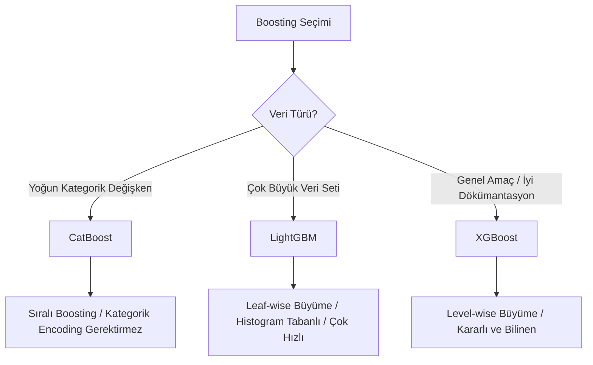

## 📌 Özet
Geleneksel Gradient Boosting modellerinin (XGBoost) ötesinde, daha hızlı ve kategorik verileri daha iyi işleyen LightGBM ve CatBoost gibi gelişmiş kütüphaneler günümüzde Kaggle yarışmalarında ve endüstride standarttır. Bu modeller, büyük veri kümeleri üzerinde yüksek performanslı ve düşük gecikmeli tahminler üretebilmek için optimize edilmiş algoritmalara sahiptir. LightGBM, yaprak bazlı (leaf-wise) büyüme stratejisiyle hızı maksimize ederken; CatBoost, kategorik değişkenleri ön işlemeye gerek kalmadan doğrudan ve daha verimli bir şekilde işleyerek sızıntıları (leakage) önler. Modern makine öğrenmesi boru hatlarında bu iki kütüphane, tahmin doğruluğunu artırmak için vazgeçilmez araçlardır.

---

## 🧠 Detay

### 🗺️ Boosting Algoritmaları Karşılaştırması



### 1. LightGBM (Microsoft) ⭐
- **Leaf-wise (Yaprak-bazlı) Büyüme:** Ağacı derinlik bazlı değil, hatayı en çok azaltan yapraktan büyütür. Daha hızlıdır ama küçük veride overfitting riski taşır.
- **GOSS (Gradient-based One-Side Sampling):** Küçük gradyanlı verileri eler, büyük olanlara odaklanır.
- **EFB (Exclusive Feature Bundling):** Seyrek (sparse) özellikleri birleştirerek boyut indirger.

```python
import lightgbm as lgb
model = lgb.LGBMClassifier(num_leaves=31, learning_rate=0.05, n_estimators=100)
model.fit(X_train, y_train)
```

### 2. CatBoost (Yandex) ⭐
- **Kategorik Veri Desteği:** Label encoding veya One-Hot gerektirmez; dahili olarak "Ordered Boosting" ve "Symmetric Trees" kullanır.
- **Overfitting Karşıtı:** Rastgele permütasyonlarla sızıntıyı önler.

```python
from catboost import CatBoostClassifier
model = CatBoostClassifier(iterations=500, cat_features=cat_indices, verbose=False)
model.fit(X_train, y_train)
```

### Karşılaştırma Tablosu

| Özellik | XGBoost | LightGBM | CatBoost |
|---------|---------|----------|----------|
| **Büyüme** | Level-wise | Leaf-wise | Symmetric |
| **Kategorik Veri** | Manuel Encoding | Bazı destekler | Mükemmel destek |
| **Hız** | Orta | Çok Hızlı | Hızlı (Tahminde Çok Hızlı) |
| **Hassasiyet** | Yüksek | Çok Yüksek | Çok Yüksek |

---

## 💡 Bağlantılar
- [[ML - Gradient Boosting ve XGBoost]]
- [[FE - Encoding Yöntemleri]]
- [[ML - Hiperparametre Optimizasyonu]]

## ❓ Sorular / Anlamadıklarım
- Leaf-wise büyüme neden overfitting riskini artırır? (Daha derin dallar oluşturabildiği için).

## 🔗 Kaynaklar
- LightGBM Documentation
- CatBoost Documentation
