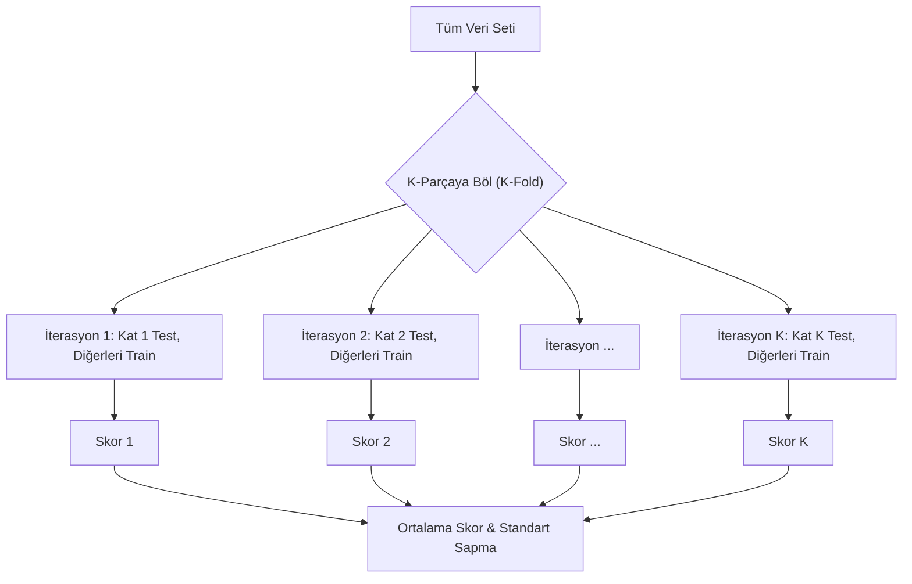

## 📌 Özet
Eğitim ve test verisi ayrımı, bir modelin gerçek dünya verilerindeki performansını (genelleme yeteneğini) ölçmek için kullanılan en temel tekniktir. Model eğitim verisini "ezberleyebilir" (overfitting), bu yüzden modelin başarısını ölçmek için daha önce hiç görmediği bir test setine ihtiyaç duyulur. Çapraz Doğrulama (Cross Validation) ise bu süreci daha güvenilir hale getirmek için veriyi birden fazla kez farklı kombinasyonlarda böler; böylece verinin tesadüfi dağılımından kaynaklanan performans sapmaları (varyans) minimize edilir ve modelin kararlılığı doğrulanmış olur.

## 🧠 Detay

### K-Fold Çapraz Doğrulama Süreci


### Train-Test Ayrımı (Hold-out Method)
Bu yöntem veriyi tek bir seferde ikiye veya üçe böler. Hızlıdır ancak verinin nasıl bölündüğüne çok duyarlıdır.
```python
from sklearn.model_selection import train_test_split

X_train, X_test, y_train, y_test = train_test_split(
    X, y,
    test_size=0.2,       # %20 test
    random_state=42,     # tekrarlanabilirlik
    stratify=y           # sınıf dağılımını koru
)
```

### Train / Validation / Test Ayrımı
```python
# Önce test'i ayır
X_temp, X_test, y_temp, y_test = train_test_split(
    X, y, test_size=0.2, random_state=42
)
# Sonra validation'ı ayır
X_train, X_val, y_train, y_val = train_test_split(
    X_temp, y_temp, test_size=0.25, random_state=42
)
# Sonuç: %60 train, %20 val, %20 test
```

### K-Fold Cross Validation
```python
from sklearn.model_selection import KFold, cross_val_score
from sklearn.linear_model import LogisticRegression

model = LogisticRegression()
kf = KFold(n_splits=5, shuffle=True, random_state=42)

skorlar = cross_val_score(model, X, y, cv=kf, scoring="accuracy")
print(f"Katlar: {skorlar}")
print(f"Ortalama: {skorlar.mean():.3f} ± {skorlar.std():.3f}")
```

### Stratified K-Fold
```python
from sklearn.model_selection import StratifiedKFold

# Dengesiz veri setleri için
skf = StratifiedKFold(n_splits=5, shuffle=True, random_state=42)
skorlar = cross_val_score(model, X, y, cv=skf)
```

### Leave-One-Out (LOO)
```python
from sklearn.model_selection import LeaveOneOut

# Küçük veri setleri için
loo = LeaveOneOut()
skorlar = cross_val_score(model, X, y, cv=loo)
```

### Hangi Yöntemi Kullanmalıyım?
| Durum | Yöntem |
|-------|--------|
| Standart | 5-fold veya 10-fold CV |
| Dengesiz veri | Stratified K-Fold |
| Küçük veri (<100) | LOO veya 10-fold |
| Zaman serisi | TimeSeriesSplit |

## 💡 Bağlantılar
- [[ML - Makine Öğrenmesine Giriş]]
- [[ML - Model Değerlendirme Metrikleri]]
- [[ML - Hiperparametre Optimizasyonu]]

## ❓ Sorular / Anlamadıklarım
- K-fold'da K değeri nasıl seçilir?
- Test seti hiç modele gösterilmemeli mi?

## 🔗 Kaynaklar
- https://scikit-learn.org/stable/modules/cross_validation.html
