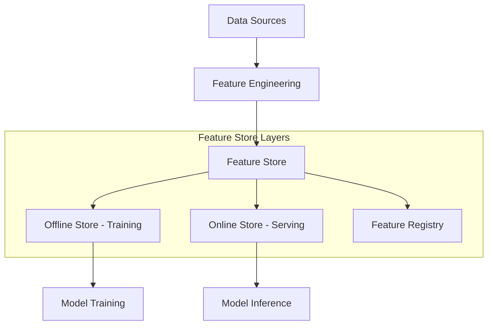

## 📌 Özet
Feature Store, makine öğrenmesi modelleri için kullanılan özelliklerin (features) merkezi bir deposudur. Veri bilimcilerin özellikleri saklamasını, paylaşmasını ve hem eğitim (offline) hem de canlı tahmin (online) sırasında aynı özellikleri düşük gecikmeyle kullanmasını sağlar. "Training-serving skew" (eğitim-sunum farkı) sorununu çözer.

## 🧠 Detay

### 1. Temel Bileşenler
- **Registry (Kayıt Defteri):** Özelliklerin tanımlarını ve meta verilerini tutar.
- **Offline Store:** Geçmiş verileri saklar, model eğitimi için (Point-in-time correctness) veri sağlar.
- **Online Store:** En güncel özellikleri saklar (Redis, DynamoDB vb.), düşük gecikmeli tahminler için kullanılır.
- **Ingestion:** Veriyi Feature Store a aktarma süreci (Batch veya Stream).

### 2. Neden Feature Store Kullanılır?
- **Tekrar Kullanılabilirlik:** Bir özellik bir kez yazılır, tüm ekip kullanır.
- **Zaman Yolculuğu (Time Travel):** Eğitim sırasında verinin o andaki durumunu doğru bir şekilde almayı sağlar.
- **Tutarlılık:** Eğitimde ve üretimde aynı kodun/verinin kullanıldığından emin olunur.

### 3. Popüler Araçlar
- **Feast:** Açık kaynaklı, bulut bağımsız feature store.
- **Hopsworks:** Tam kapsamlı veri ve feature platformu.
- **AWS SageMaker Feature Store:** AWS ekosistemi ile entegre.

## 💡 Bağlantılar
- [[MLOPS - Giriş ve Temel Kavramlar]]
- [[Feature Engineering - Giriş]]

## ❓ Sorular / Anlamadıklarım
- Feature Store ne zaman bir "overhead" (ek yük) haline gelir?
- "Online Ingestion" sırasında veri kalitesi kontrolleri nasıl yapılır?

## 🔗 Kaynaklar
- Feast Documentation
- Feature Store for ML (Tecton)
