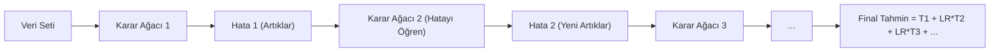

## 📌 Özet
Gradient Boosting, zayıf modelleri (genellikle sığ karar ağaçları) birbirine eklemleyerek (additive) çok güçlü bir topluluk (ensemble) modeli oluşturan, modern veri biliminin en başarılı algoritmalarından biridir. Bu yöntemin temel prensibi, her yeni ağacın bir önceki adımda yapılan hataları (artıklar/residuals) minimize etmeye odaklanmasıdır. XGBoost ise bu süreci paralel hesaplama kapasitesi, gelişmiş düzenlileştirme (regularization) teknikleri ve donanım optimizasyonları ile çok daha hızlı ve verimli hale getirmiş halidir. Özellikle tablo tipi verilerde model başarısı ve hızı nedeniyle endüstri standardı olarak kabul edilir.

## 🧠 Detay

### Gradient Boosting Çalışma Mantığı


### Scikit-learn GradientBoosting
Gradyan artırma algoritmasının standart implementasyonudur. Parametre ayarı hassastır.
```python
from sklearn.ensemble import GradientBoostingClassifier

gb = GradientBoostingClassifier(
    n_estimators=100,
    learning_rate=0.1,
    max_depth=3,
    subsample=0.8,
    random_state=42
)
gb.fit(X_train, y_train)
```

### XGBoost
```python
import xgboost as xgb
from sklearn.metrics import classification_report

xgb_model = xgb.XGBClassifier(
    n_estimators=200,
    learning_rate=0.05,
    max_depth=6,
    subsample=0.8,
    colsample_bytree=0.8,
    reg_alpha=0.1,        # L1
    reg_lambda=1.0,       # L2
    use_label_encoder=False,
    eval_metric="logloss",
    random_state=42
)

xgb_model.fit(
    X_train, y_train,
    eval_set=[(X_val, y_val)],
    early_stopping_rounds=20,
    verbose=False
)

print(classification_report(y_test, xgb_model.predict(X_test)))
```

### LightGBM
```python
import lightgbm as lgb

lgb_model = lgb.LGBMClassifier(
    n_estimators=500,
    learning_rate=0.05,
    max_depth=-1,
    num_leaves=31,
    subsample=0.8,
    random_state=42,
    n_jobs=-1
)
lgb_model.fit(X_train, y_train,
    eval_set=[(X_val, y_val)],
    callbacks=[lgb.early_stopping(50)])
```

### Özellik Önemi
```python
import matplotlib.pyplot as plt

xgb.plot_importance(xgb_model, max_num_features=15)
plt.show()
```

### Random Forest vs XGBoost
| Özellik | Random Forest | XGBoost |
|---------|--------------|---------|
| Eğitim | Paralel | Sıralı |
| Hız | Hızlı | Daha yavaş |
| Performans | İyi | Genelde daha iyi |
| Overfitting | Dayanıklı | Ayar gerekir |
| Parametre | Az | Çok |

## 💡 Bağlantılar
- [[ML - Random Forest]]
- [[ML - Hiperparametre Optimizasyonu]]
- [[ML - Özellik Seçimi]]

## ❓ Sorular / Anlamadıklarım
- `learning_rate` ile `n_estimators` nasıl dengelenir?
- Early stopping ne zaman durur?

## 🔗 Kaynaklar
- https://xgboost.readthedocs.io
- https://lightgbm.readthedocs.io
