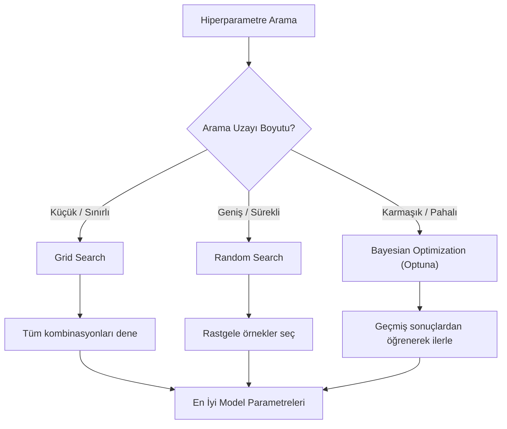

## 📌 Özet
Hiperparametre optimizasyonu, bir makine öğrenmesi modelinin öğrenme sürecini kontrol eden yapısal ayarların (örneğin bir ağacın maksimum derinliği veya öğrenme katsayısı) en iyi performans verecek şekilde sistematik olarak aranması sürecidir. Parametrelerin aksine hiperparametreler veri üzerinden otomatik öğrenilmez; eğitimden önce kullanıcı tarafından belirlenir. Bu süreçte temel amaç, modelin eğitim verisine aşırı uyum sağlamasını (overfitting) engelleyerek görmediği verilerdeki başarısını maksimize etmektir. GridSearchCV, RandomizedSearchCV ve Bayesian Optimization (Optuna) gibi yöntemler, bu "en iyi" ayarları bulmak için farklı stratejiler sunar.

## 🧠 Detay

### Optimizasyon Stratejileri Karşılaştırması


### GridSearchCV
Arama uzayındaki her bir kombinasyonu tek tek dener. Garantili sonuç verir ama zaman maliyeti çok yüksektir.
```python
from sklearn.model_selection import GridSearchCV
from sklearn.ensemble import RandomForestClassifier
from sklearn.pipeline import Pipeline
...
pipe = Pipeline([
    ("model", RandomForestClassifier(random_state=42))
])

param_grid = {
    "model__n_estimators": [100, 200, 300],
    "model__max_depth": [5, 10, 15, None],
    "model__min_samples_leaf": [1, 5, 10]
}

gs = GridSearchCV(
    pipe,
    param_grid,
    cv=5,
    scoring="f1",
    n_jobs=-1,
    verbose=1
)

gs.fit(X_train, y_train)
print(f"En iyi parametreler: {gs.best_params_}")
print(f"En iyi skor: {gs.best_score_:.3f}")

# En iyi modelle tahmin
y_pred = gs.predict(X_test)
```

### RandomizedSearchCV (Büyük arama uzayı için)
```python
from sklearn.model_selection import RandomizedSearchCV
from scipy.stats import randint, uniform

param_dist = {
    "model__n_estimators": randint(100, 500),
    "model__max_depth": randint(5, 20),
    "model__min_samples_leaf": randint(1, 20),
    "model__max_features": uniform(0.3, 0.7)
}

rs = RandomizedSearchCV(
    pipe,
    param_dist,
    n_iter=50,         # kaç kombinasyon dene
    cv=5,
    scoring="f1",
    n_jobs=-1,
    random_state=42
)
rs.fit(X_train, y_train)
```

### Optuna (Bayesian Optimizasyon)
```python
import optuna

def objective(trial):
    params = {
        "n_estimators": trial.suggest_int("n_estimators", 50, 500),
        "max_depth": trial.suggest_int("max_depth", 3, 20),
        "learning_rate": trial.suggest_float("learning_rate", 1e-4, 0.3, log=True)
    }
    model = xgb.XGBClassifier(**params, random_state=42)
    skor = cross_val_score(model, X_train, y_train, cv=5, scoring="f1").mean()
    return skor

study = optuna.create_study(direction="maximize")
study.optimize(objective, n_trials=100)
print(study.best_params)
```

### Sonuçları İnceleme
```python
import pandas as pd

sonuclar = pd.DataFrame(gs.cv_results_)
sonuclar = sonuclar.sort_values("mean_test_score", ascending=False)
print(sonuclar[["params", "mean_test_score", "std_test_score"]].head(10))
```

## 💡 Bağlantılar
- [[ML - Eğitim Test Ayrımı ve Cross Validation]]
- [[ML - Random Forest]]
- [[ML - Gradient Boosting ve XGBoost]]

## ❓ Sorular / Anlamadıklarım
- GridSearch ve RandomSearch ne zaman hangisi tercih edilmeli?
- Optuna, Bayesian optimizasyonu nasıl çalışır?

## 🔗 Kaynaklar
- https://scikit-learn.org/stable/modules/grid_search.html
- https://optuna.org
