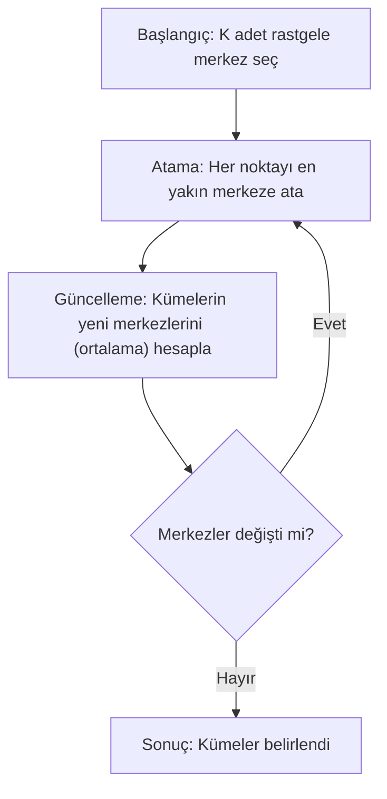

## 📌 Özet
K-Means, etiketlenmemiş verileri birbirine olan benzerliklerine (genellikle Öklid mesafesi) göre K adet ayrık gruba ayıran, en temel ve popüler gözetimsiz (unsupervised) öğrenme algoritmasıdır. Algoritma, her kümenin bir "merkez noktası" (centroid) olduğu varsayımıyla çalışır ve veri noktalarını en yakın merkeze atayarak kümeler oluşturur. K-Means, iteratif bir yaklaşımla merkezleri sürekli güncelleyerek toplam küme içi varyansı minimize etmeye çalışır. Müşteri segmentasyonu, anomali tespiti ve veri ön işleme gibi pek çok alanda yaygın olarak kullanılır; ancak algoritmanın başarısı, verinin ölçeklendirilmiş olmasına ve doğru K sayısının seçilmesine sıkı sıkıya bağlıdır.

## 🧠 Detay

### K-Means Algoritma Akışı


### Temel Kullanım
K-Means mesafeye dayalı bir algoritma olduğu için verilerin ölçeklendirilmesi (StandardScaler) zorunludur.
```python
from sklearn.cluster import KMeans
from sklearn.preprocessing import StandardScaler
import matplotlib.pyplot as plt

# Ölçekleme önemli
scaler = StandardScaler()
X_scaled = scaler.fit_transform(X)
...
kmeans = KMeans(
    n_clusters=3,
    init="k-means++",    # akıllı başlangıç
    n_init=10,           # farklı başlangıçları dene
    max_iter=300,
    random_state=42
)

kmeans.fit(X_scaled)
etiketler = kmeans.labels_
merkezler = kmeans.cluster_centers_
```

### Optimal K Seçimi — Elbow Yöntemi
```python
inertia_listesi = []
K_araligi = range(1, 11)

for k in K_araligi:
    km = KMeans(n_clusters=k, random_state=42, n_init=10)
    km.fit(X_scaled)
    inertia_listesi.append(km.inertia_)

plt.plot(K_araligi, inertia_listesi, "bo-")
plt.xlabel("K (Küme sayısı)")
plt.ylabel("Inertia")
plt.title("Elbow Yöntemi")
# Dirsek noktası → optimal K
```

### Silhouette Skoru
```python
from sklearn.metrics import silhouette_score

skorlar = []
for k in range(2, 11):
    km = KMeans(n_clusters=k, random_state=42, n_init=10)
    etiket = km.fit_predict(X_scaled)
    skor = silhouette_score(X_scaled, etiket)
    skorlar.append(skor)
    print(f"K={k}: Silhouette={skor:.3f}")

# En yüksek skor → optimal K
```

### Kümeleri Görselleştirme
```python
# 2D için
plt.scatter(X_scaled[:, 0], X_scaled[:, 1],
    c=etiketler, cmap="tab10", alpha=0.7)
plt.scatter(merkezler[:, 0], merkezler[:, 1],
    c="red", marker="X", s=200, label="Merkezler")
plt.legend()
plt.title("K-Means Kümeleme")
```

### Küme Analizi
```python
import pandas as pd

df["kume"] = etiketler
# Küme özeti
df.groupby("kume").mean()
df.groupby("kume").size()
```

## 💡 Bağlantılar
- [[ML - Makine Öğrenmesine Giriş]]
- [[ML - PCA - Boyut İndirgeme]]
- [[DS - Veri Dönüşümleri]]

## ❓ Sorular / Anlamadıklarım
- K-Means küresel olmayan kümeleri bulabilir mi?
- DBSCAN ile K-Means'in farkı nedir?

## 🔗 Kaynaklar
- https://scikit-learn.org/stable/modules/clustering.html
