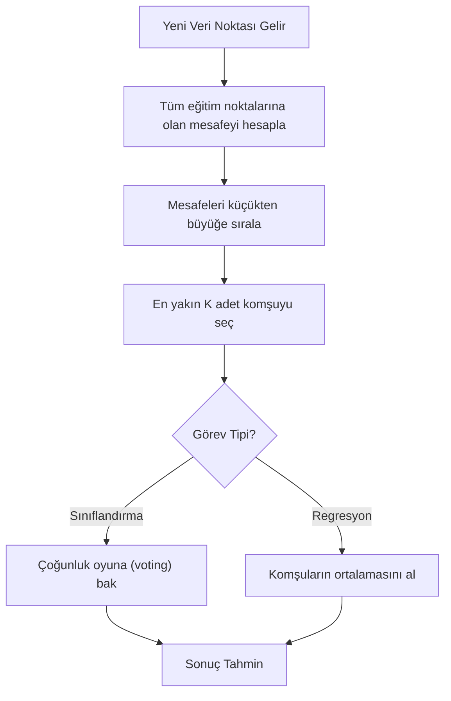

## 📌 Özet
K-Nearest Neighbors (KNN), yeni bir veri noktasını mevcut veri setindeki en yakın K adet komşusunun özelliklerine göre sınıflandıran veya değer atayan, basit ama oldukça güçlü bir gözetimli (supervised) öğrenme algoritmasıdır. KNN bir "tembel öğrenici" (lazy learner) olarak bilinir; çünkü eğitim sırasında karmaşık bir matematiksel model kurmak yerine tüm veriyi hafızasında tutar ve asıl hesaplamayı tahmin anında yapar. Algoritmanın başarısı, mesafe hesaplamalarına dayandığı için verinin ölçeklendirilmiş olması (scaling), uygun mesafe metriğinin (Öklid, Manhattan vb.) seçilmesi ve en uygun komşu sayısı (K) değerinin belirlenmesi kritik öneme sahiptir.

## 🧠 Detay

### KNN Tahmin Süreci


### KNN Sınıflandırma
KNN mesafeye dayalı olduğu için özelliklerin aynı ölçekte olması hayatidir. Pipeline kullanımı bu süreci otomatize eder.
```python
from sklearn.neighbors import KNeighborsClassifier
from sklearn.preprocessing import StandardScaler
from sklearn.pipeline import Pipeline
...
pipe.fit(X_train, y_train)
y_pred = pipe.predict(X_test)
```

### K Değeri Seçimi
```python
import matplotlib.pyplot as plt

train_skorlari = []
test_skorlari = []

for k in range(1, 31):
    pipe = Pipeline([
        ("scaler", StandardScaler()),
        ("knn", KNeighborsClassifier(n_neighbors=k))
    ])
    pipe.fit(X_train, y_train)
    train_skorlari.append(pipe.score(X_train, y_train))
    test_skorlari.append(pipe.score(X_test, y_test))

plt.plot(range(1, 31), train_skorlari, label="Train")
plt.plot(range(1, 31), test_skorlari, label="Test")
plt.xlabel("K değeri")
plt.ylabel("Doğruluk")
plt.legend()
# Test eğrisinin tepe noktası → optimal K
```

### KNN Regresyon
```python
from sklearn.neighbors import KNeighborsRegressor

knn_reg = Pipeline([
    ("scaler", StandardScaler()),
    ("knn", KNeighborsRegressor(n_neighbors=5))
])
```

### Mesafe Metrikleri
```python
# Öklid (Euclidean) → sürekli değişkenler
KNeighborsClassifier(metric="euclidean")

# Manhattan → aykırı değere dayanıklı
KNeighborsClassifier(metric="manhattan")

# Minkowski → genel form
KNeighborsClassifier(metric="minkowski", p=2)
```

### Avantaj ve Dezavantajlar
```
✅ Basit, yorumlanabilir
✅ Eğitim süresi yok
✅ Doğrusal olmayan sınırlar

❌ Büyük veri setlerinde yavaş
❌ Yüksek boyutlarda kötü (curse of dimensionality)
❌ Ölçeklemeye çok duyarlı
❌ Aykırı değerlerden etkilenir
```

## 💡 Bağlantılar
- [[ML - Makine Öğrenmesine Giriş]]
- [[ML - Model Değerlendirme Metrikleri]]
- [[DS - Veri Dönüşümleri]]

## ❓ Sorular / Anlamadıklarım
- Curse of dimensionality nedir?
- `weights="distance"` ne zaman daha iyi sonuç verir?

## 🔗 Kaynaklar
- https://scikit-learn.org/stable/modules/neighbors.html
