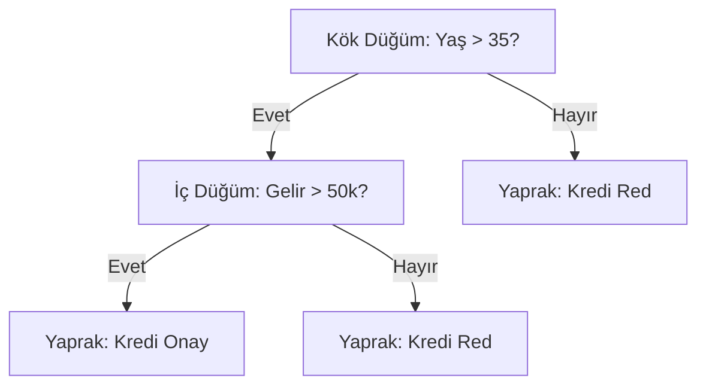

## 📌 Özet
Karar Ağaçları, veriyi belirli özelliklere göre mantıksal sorular sorarak (örneğin: "Yaş > 30 mu?") hiyerarşik bir yapıda bölen, hem sınıflandırma hem de regresyon için kullanılan şeffaf bir makine öğrenmesi algoritmasıdır. Algoritma, her adımda veriyi en iyi ayrıştıran özelliği seçmek için Gini safsızlığı veya Bilgi Kazancı (Information Gain) gibi metrikleri kullanır. Karar ağaçlarının en büyük gücü yorumlanabilir olmalarıdır; ancak kontrol edilmediklerinde verinin en ince detaylarını bile öğrenerek aşırı uyum (overfitting) sağlama eğilimindedirler. Bu durumu engellemek için budama (pruning) veya derinlik kısıtlama gibi teknikler uygulanır.

## 🧠 Detay

### Karar Ağacı Yapısı ve Bölünme


### Temel Kavramlar
Aşağıdaki terimler bir karar ağacının anatomisini anlamak için kritiktir:
* **Kök Düğüm (Root):** Tüm verinin başladığı ve ilk bölünmenin gerçekleştiği noktadır.
* **İç Düğüm (Internal Node):** Karar verme sürecinin devam ettiği ara duraklar.
* **Yaprak (Leaf):** Nihai tahminin yapıldığı, artık daha fazla bölünmenin olmadığı uç noktalar.
* **Safsızlık (Impurity):** Bir düğümdeki verilerin ne kadar karışık olduğunu gösterir (Gini veya Entropy ile ölçülür).
...
### Scikit-learn ile Uygulama
```python
from sklearn.tree import DecisionTreeClassifier, plot_tree
from sklearn.model_selection import train_test_split
from sklearn.metrics import classification_report
import matplotlib.pyplot as plt

model = DecisionTreeClassifier(
    max_depth=5,
    min_samples_leaf=10,
    criterion="gini",
    random_state=42
)

model.fit(X_train, y_train)
y_pred = model.predict(X_test)
print(classification_report(y_test, y_pred))
```

### Ağacı Görselleştirme
```python
plt.figure(figsize=(20, 10))
plot_tree(model,
    feature_names=X.columns,
    class_names=["Hayır", "Evet"],
    filled=True,
    rounded=True,
    fontsize=10)
plt.show()
```

### Özellik Önemi
```python
onem = pd.DataFrame({
    "Özellik": X.columns,
    "Önem": model.feature_importances_
}).sort_values("Önem", ascending=False)

onem.plot(kind="bar", x="Özellik", y="Önem")
```

### Overfitting Kontrolü
```python
# Eğitim vs Test karşılaştırması
train_skor = model.score(X_train, y_train)
test_skor = model.score(X_test, y_test)
print(f"Train: {train_skor:.3f}, Test: {test_skor:.3f}")

# Derinlik etkisi
for derinlik in range(1, 15):
    dt = DecisionTreeClassifier(max_depth=derinlik)
    dt.fit(X_train, y_train)
    print(f"Derinlik {derinlik}: Train={dt.score(X_train, y_train):.3f}, Test={dt.score(X_test, y_test):.3f}")
```

### Önemli Hiperparametreler
| Parametre | Açıklama | Öneri |
|-----------|----------|-------|
| `max_depth` | Max derinlik | 3-10 |
| `min_samples_leaf` | Yaprak min örnek | 5-20 |
| `min_samples_split` | Bölünme min örnek | 10-20 |
| `criterion` | Gini / Entropy | Gini hızlı |

## 💡 Bağlantılar
- [[ML - Random Forest]]
- [[ML - Gradient Boosting]]
- [[ML - Özellik Seçimi]]

## ❓ Sorular / Anlamadıklarım
- Gini impurity ile entropy arasındaki fark nedir?
- Pruning (budama) ne zaman gerekir?

## 🔗 Kaynaklar
- https://scikit-learn.org/stable/modules/tree.html
