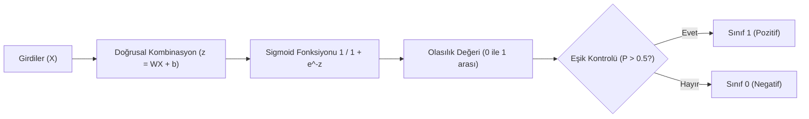

## 📌 Özet
Lojistik Regresyon, isminde "regresyon" geçmesine rağmen temel bir sınıflandırma algoritmasıdır ve özellikle ikili (binary) sınıflandırma problemlerinde dünyada en yaygın kullanılan yöntemlerden biridir. Temel çalışma prensibi, girdilerin doğrusal bir kombinasyonunu hesaplayıp bu sonucu Sigmoid (Lojistik) fonksiyonundan geçirerek 0 ile 1 arasında bir olasılık değerine dönüştürmektir. Bu olasılık değeri, belirlenen bir eşik değeriyle (genellikle 0.5) karşılaştırılarak nihai sınıf kararı verilir. Yüksek yorumlanabilirliği, katsayılar üzerinden özellik etkilerinin net analizi (Odds Ratio) ve hesaplama hızı nedeniyle, özellikle tıp, finans ve pazarlama gibi alanlarda temel model olarak tercih edilir.

## 🧠 Detay

### Lojistik Regresyon Akış Şeması


### Matematiksel Temel
Lojistik regresyonun kalbi olan Sigmoid fonksiyonu, herhangi bir gerçek sayıyı (z) dar bir olasılık aralığına sıkıştırır:
```
P(y=1) = 1 / (1 + e^(-z))
z = β₀ + β₁x₁ + ... + βₙxₙ

Sigmoid → [0,1] arasında olasılık döndürür
Eşik (threshold) → Genellikle 0.5 seçilir (ihtiyaca göre değiştirilebilir)
```
...
### Scikit-learn ile Uygulama
```python
from sklearn.linear_model import LogisticRegression
from sklearn.model_selection import train_test_split
from sklearn.metrics import classification_report

X_train, X_test, y_train, y_test = train_test_split(
    X, y, test_size=0.2, random_state=42, stratify=y
)

model = LogisticRegression(max_iter=1000, random_state=42)
model.fit(X_train, y_train)

y_pred = model.predict(X_test)
y_prob = model.predict_proba(X_test)[:, 1]

print(classification_report(y_test, y_pred))
```

### Katsayı Yorumlama
```python
import pandas as pd

katsayilar = pd.DataFrame({
    "Özellik": X.columns,
    "Katsayı": model.coef_[0],
    "Odds Ratio": np.exp(model.coef_[0])
}).sort_values("Katsayı", ascending=False)

print(katsayilar)
# Pozitif katsayı → pozitif sınıf olasılığını artırır
```

### Eşik Ayarlama
```python
# Varsayılan eşik 0.5
y_pred_default = model.predict(X_test)

# Özel eşik
esik = 0.3
y_pred_custom = (y_prob >= esik).astype(int)

# Recall/Precision dengesi için eşik seç
from sklearn.metrics import precision_recall_curve
precision, recall, thresholds = precision_recall_curve(y_test, y_prob)
```

### Çok Sınıflı (Multiclass)
```python
model = LogisticRegression(
    multi_class="multinomial",
    solver="lbfgs",
    max_iter=1000
)
```

### Regularization
```python
# C → 1/lambda, küçük C = güçlü regularization
model_l1 = LogisticRegression(penalty="l1", C=0.1, solver="liblinear")
model_l2 = LogisticRegression(penalty="l2", C=1.0)
```

## 💡 Bağlantılar
- [[ML - Model Değerlendirme Metrikleri]]
- [[ML - Lineer Regresyon]]
- [[ML - Karar Ağaçları]]

## ❓ Sorular / Anlamadıklarım
- Lineer regresyon ile lojistik regresyon arasındaki temel fark?
- Eşiği nasıl optimal seçerim?

## 🔗 Kaynaklar
- https://scikit-learn.org/stable/modules/linear_model.html#logistic-regression
