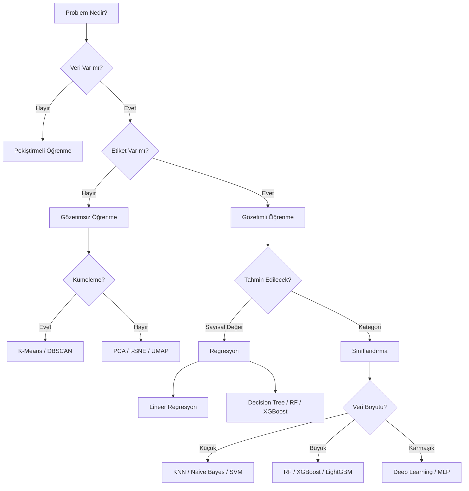

## 📌 Özet
Makine öğrenmesi, bilgisayarların açıkça programlanmadan veriden öğrenmesini sağlayan yapay zeka dalıdır. Üç ana kategoriye ayrılır: gözetimli, gözetimsiz ve pekiştirmeli öğrenme.

## 🧠 Detay

### 🗺️ Algoritma Seçim Rehberi (Yol Haritası)



---

### ML Kategorileri

#### Gözetimli Öğrenme (Supervised Learning)
- Etiketli veri ile eğitilir
- Girdi → Çıktı eşlemesi öğrenir
- Örnekler: Sınıflandırma, Regresyon
```
X (özellikler) + y (etiket) → Model → Tahmin
```

#### Gözetimsiz Öğrenme (Unsupervised Learning)
- Etiketsiz veri ile çalışır
- Veri içindeki gizli yapıyı keşfeder
- Örnekler: Kümeleme, Boyut indirgeme

#### Pekiştirmeli Öğrenme (Reinforcement Learning)
- Ajan, ortamla etkileşerek öğrenir
- Ödül/ceza sistemi
- Örnekler: Oyun oynama, Robotik

### Temel Kavramlar
| Kavram | Açıklama |
|--------|----------|
| Özellik (Feature) | Girdi değişkenleri (X) |
| Hedef (Target) | Tahmin edilecek değer (y) |
| Eğitim seti | Modeli eğitmek için veri |
| Test seti | Modeli değerlendirmek için veri |
| Overfitting | Eğitim verisini ezberlemek |
| Underfitting | Yeterince öğrenememek |

### ML İş Akışı
```
1. Problem tanımla
2. Veri topla
3. EDA yap
4. Veri ön işle
5. Model seç
6. Eğit
7. Değerlendir
8. İyileştir
9. Dağıt (Deploy)
```

### Scikit-learn API Yapısı
```python
from sklearn.linear_model import LinearRegression

model = LinearRegression()          # 1. oluştur
model.fit(X_train, y_train)         # 2. eğit
tahminler = model.predict(X_test)   # 3. tahmin et
skor = model.score(X_test, y_test)  # 4. değerlendir
```

## 💡 Bağlantılar
- [[ML - Veri Ön İşleme Pipeline]]
- [[ML - Model Değerlendirme Metrikleri]]
- [[ML - Eğitim Test Ayrımı ve Cross Validation]]

## ❓ Sorular / Anlamadıklarım
- Hangi problem için hangi algoritma seçilmeli?
- Overfitting ile underfitting arasındaki denge nasıl kurulur?

## 🔗 Kaynaklar
- https://scikit-learn.org/stable/getting_started.html
