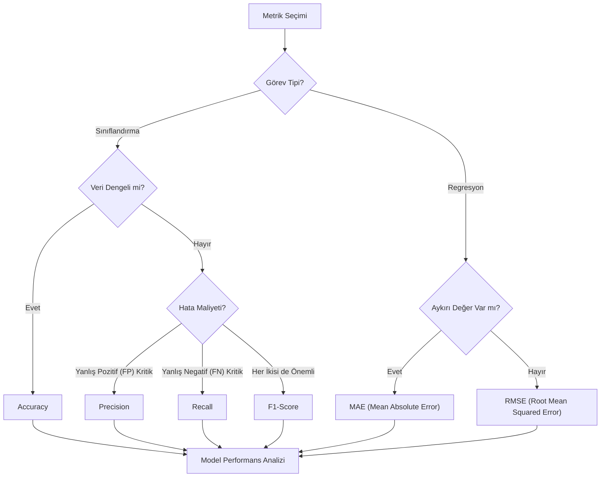

## 📌 Özet
Model değerlendirme metrikleri, bir makine öğrenmesi modelinin performansını ve güvenilirliğini ölçmek için kullanılan temel araçlardır. Doğru metriğin seçilmesi, iş probleminin doğasına ve veri setinin dengesine (class imbalance) doğrudan bağlıdır; örneğin, dengeli veri setlerinde 'Accuracy' yeterli olabilirken, nadir olayların tespiti gibi durumlarda 'Recall' veya 'F1-Score' çok daha kritik hale gelir. Performans ölçümü sadece sayısal bir çıktı değil, aynı zamanda modelin zayıf yanlarını (yanlış pozitifler vs. yanlış negatifler) anlamamızı sağlayarak iyileştirme stratejilerini belirlememize rehberlik eder.

## 🧠 Detay

### Metrik Seçim Akış Diyagramı


### Sınıflandırma Metrikleri

```python
from sklearn.metrics import (accuracy_score, precision_score,
    recall_score, f1_score, confusion_matrix, classification_report)

y_gercek = [1, 0, 1, 1, 0, 1]
y_tahmin = [1, 0, 0, 1, 0, 1]

print(accuracy_score(y_gercek, y_tahmin))    # 0.833
print(precision_score(y_gercek, y_tahmin))   # 1.0
print(recall_score(y_gercek, y_tahmin))      # 0.75
print(f1_score(y_gercek, y_tahmin))          # 0.857
```

### Confusion Matrix
```python
import seaborn as sns
import matplotlib.pyplot as plt

cm = confusion_matrix(y_gercek, y_tahmin)
sns.heatmap(cm, annot=True, fmt="d", cmap="Blues",
    xticklabels=["Negatif","Pozitif"],
    yticklabels=["Negatif","Pozitif"])
plt.xlabel("Tahmin")
plt.ylabel("Gerçek")
```

### Metrik Açıklamaları
| Metrik | Formül | Ne Zaman Önemli |
|--------|--------|-----------------|
| Accuracy | (TP+TN) / toplam | Dengeli veri |
| Precision | TP / (TP+FP) | Yanlış pozitif maliyetli |
| Recall | TP / (TP+FN) | Yanlış negatif maliyetli |
| F1 Score | 2*(P*R)/(P+R) | Dengesiz veri |

### ROC ve AUC
```python
from sklearn.metrics import roc_curve, roc_auc_score

y_prob = model.predict_proba(X_test)[:, 1]
fpr, tpr, _ = roc_curve(y_test, y_prob)
auc = roc_auc_score(y_test, y_prob)

plt.plot(fpr, tpr, label=f"AUC = {auc:.3f}")
plt.plot([0,1], [0,1], "k--")
plt.xlabel("FPR")
plt.ylabel("TPR (Recall)")
plt.title("ROC Eğrisi")
plt.legend()
```

### Regresyon Metrikleri
```python
from sklearn.metrics import mean_absolute_error, mean_squared_error, r2_score
import numpy as np

mae = mean_absolute_error(y_test, y_pred)
mse = mean_squared_error(y_test, y_pred)
rmse = np.sqrt(mse)
r2 = r2_score(y_test, y_pred)

print(f"MAE:  {mae:.3f}")
print(f"RMSE: {rmse:.3f}")
print(f"R²:   {r2:.3f}")
```

### Hangi Metriği Seçmeliyim?
```
Sınıflandırma:
  Dengeli veri → Accuracy
  Dengesiz veri → F1, AUC-ROC
  Spam tespiti → Precision önemli
  Kanser tespiti → Recall önemli

Regresyon:
  Genel → RMSE
  Aykırı değer varsa → MAE
  Açıklanabilirlik → R²
```

## 💡 Bağlantılar
- [[ML - Makine Öğrenmesine Giriş]]
- [[ML - Eğitim Test Ayrımı ve Cross Validation]]
- [[ML - Lojistik Regresyon]]

## ❓ Sorular / Anlamadıklarım
- AUC 0.5 ne anlama gelir?
- Çok sınıflı problemlerde F1 nasıl hesaplanır?

## 🔗 Kaynaklar
- https://scikit-learn.org/stable/modules/model_evaluation.html
