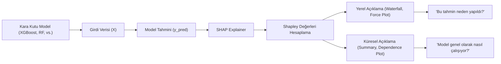

## 📌 Özet
SHAP (SHapley Additive exPlanations), karmaşık makine öğrenmesi modellerinin çıktılarını 'oyun teorisi' prensiplerine dayanarak açıklayan güçlü bir yöntemdir. Her bir özelliğin (feature) model tahminine olan katkısını, o özelliğin tüm olası alt kümelerle birlikte modelde yer alması veya almaması durumlarını kıyaslayarak (Shapley değerleri) hesaplar. Bu yaklaşım hem bireysel tahminlerin nedenlerini açıklayan 'yerel' (local) yorumlanabilirlik, hem de tüm modelin hangi değişkenlere ne kadar önem verdiğini gösteren 'küresel' (global) yorumlanabilirlik sağlar; böylece karmaşık 'kara kutu' modellerin güvenilirliği ve şeffaflığı artırılır.

## 🧠 Detay

### SHAP Çalışma Mantığı


### Kurulum ve Temel Kullanım
```python
pip install shap
import shap
import xgboost as xgb

model = xgb.XGBClassifier().fit(X_train, y_train)

# SHAP açıklayıcı oluştur
explainer = shap.TreeExplainer(model)
shap_values = explainer.shap_values(X_test)
```

### Global Özellik Önemi
```python
# Summary plot — tüm veri
shap.summary_plot(shap_values, X_test, feature_names=X.columns)

# Bar plot — ortalama mutlak etki
shap.summary_plot(shap_values, X_test,
    feature_names=X.columns, plot_type="bar")
```

### Tek Tahmin Açıklama
```python
# Waterfall plot — tek örnek
shap.plots.waterfall(
    shap.Explanation(
        values=shap_values[0],
        base_values=explainer.expected_value,
        data=X_test.iloc[0],
        feature_names=X.columns
    )
)

# Force plot
shap.force_plot(
    explainer.expected_value,
    shap_values[0],
    X_test.iloc[0],
    feature_names=X.columns
)
```

### Bağımlılık Grafiği
```python
# Bir özelliğin SHAP değeri ile orijinal değer ilişkisi
shap.dependence_plot("yas", shap_values, X_test,
    feature_names=X.columns)
```

### Lineer Modeller İçin
```python
explainer_lr = shap.LinearExplainer(lr_model, X_train)
shap_values_lr = explainer_lr.shap_values(X_test)
```

### Pratik Kullanım
```python
# En etkili özellikleri bul
mean_shap = pd.DataFrame({
    "Özellik": X.columns,
    "Ortalama |SHAP|": np.abs(shap_values).mean(axis=0)
}).sort_values("Ortalama |SHAP|", ascending=False)

print(mean_shap.head(10))
```

## 💡 Bağlantılar
- [[ML - Gradient Boosting ve XGBoost]]
- [[ML - Random Forest]]
- [[ML - Özellik Seçimi]]

## ❓ Sorular / Anlamadıklarım
- SHAP değeri ile özellik önemi arasındaki fark nedir?
- LIME ile SHAP karşılaştırması?

## 🔗 Kaynaklar
- https://shap.readthedocs.io
