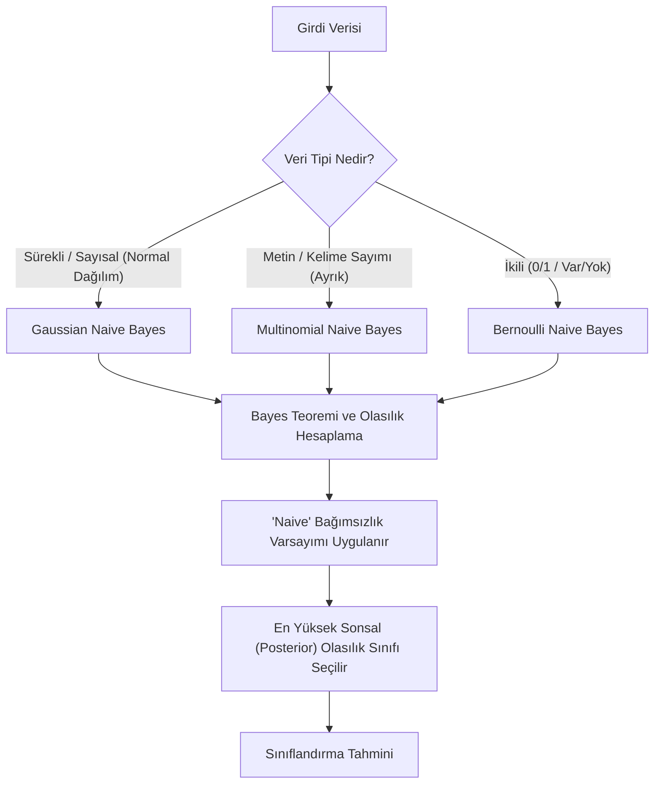

## 📌 Özet
Naive Bayes, Bayes Teoremi'ne dayanan ve özniteliklerin birbirinden bağımsız olduğu varsayımıyla (bu yüzden 'naive' yani saf/safdil denir) çalışan olasılıksal bir sınıflandırma algoritmasıdır. Özellikle yüksek boyutlu veri setlerinde son derece hızlı ve verimli çalışmasıyla bilinir; bu özelliği onu gerçek zamanlı tahmin sistemleri ve metin sınıflandırma (spam tespiti, duygu analizi) için ideal kılar. Verinin dağılımına göre Gaussian, Multinomial ve Bernoulli gibi farklı türevleri bulunur ve her biri farklı veri tipleri (sürekli, sayım tabanlı veya ikili) için özelleşmiştir. Karmaşık modellere kıyasla daha az veriyle etkili sonuçlar verebilmesi, başlangıç seviyesi projeler ve temel modeller (baseline) için büyük bir avantajdır.

## 🧠 Detay

### Naive Bayes Çalışma Akışı


### Bayes Teoremi
```
P(y|X) = P(X|y) * P(y) / P(X)

P(y|X) → Posterior: X verildiğinde y olasılığı
P(X|y) → Likelihood: y verildiğinde X olasılığı
P(y)   → Prior: y'nin önceki olasılığı
"Naive" → Özellikler birbirinden bağımsız varsayımı
```

### Gaussian Naive Bayes (Sayısal Veri)
```python
from sklearn.naive_bayes import GaussianNB
from sklearn.metrics import classification_report

gnb = GaussianNB()
gnb.fit(X_train, y_train)
y_pred = gnb.predict(X_test)
print(classification_report(y_test, y_pred))

# Sınıf olasılıkları
y_prob = gnb.predict_proba(X_test)
```

### Multinomial Naive Bayes (Metin / Sayım Verisi)
```python
from sklearn.naive_bayes import MultinomialNB
from sklearn.feature_extraction.text import CountVectorizer, TfidfVectorizer
from sklearn.pipeline import Pipeline

# Metin sınıflandırma
pipe = Pipeline([
    ("vectorizer", TfidfVectorizer(max_features=5000)),
    ("model", MultinomialNB(alpha=1.0))  # alpha = Laplace smoothing
])

pipe.fit(X_train_text, y_train)
y_pred = pipe.predict(X_test_text)
```

### Bernoulli Naive Bayes (İkili Veri)
```python
from sklearn.naive_bayes import BernoulliNB

# Her özellik 0 veya 1 olduğunda
bnb = BernoulliNB(alpha=1.0)
bnb.fit(X_train, y_train)
```

### Örnek: Spam Tespiti
```python
from sklearn.naive_bayes import MultinomialNB
from sklearn.feature_extraction.text import TfidfVectorizer

emailler = ["Para kazanın hemen!", "Toplantı saatini onaylayın",
            "Ücretsiz hediye kazan", "Proje raporu hazır"]
etiketler = [1, 0, 1, 0]  # 1=spam, 0=normal

pipe = Pipeline([
    ("tfidf", TfidfVectorizer()),
    ("nb", MultinomialNB())
])
pipe.fit(emailler, etiketler)
print(pipe.predict(["Bedava iPhone kazan!"]))  # [1] → spam
```

## 💡 Bağlantılar
- [[ML - Lojistik Regresyon]]
- [[ML - Model Değerlendirme Metrikleri]]
- [[İstatistik - Olasılık ve Bayes Teoremi]]

## ❓ Sorular / Anlamadıklarım
- "Naive" bağımsızlık varsayımı gerçekte hiç sağlanmasa da neden çalışır?
- Laplace smoothing neden gerekli?

## 🔗 Kaynaklar
- https://scikit-learn.org/stable/modules/naive_bayes.html
