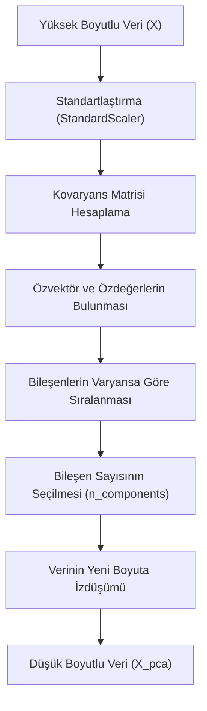

## 📌 Özet
Temel Bileşen Analizi (PCA), yüksek boyutlu veri setlerindeki karmaşıklığı azaltmak için kullanılan, gözetimsiz bir boyut indirgeme tekniğidir. Verideki temel yapıyı bozmadan, değişkenler arasındaki korelasyonu kullanarak veriyi birbiriyle ilişkisiz 'Temel Bileşenlere' (Principal Components) dönüştürür ve maksimum varyansı (bilgiyi) en az sayıda bileşenle temsil etmeyi hedefler. Bu süreç, 'Boyut Laneti' (Curse of Dimensionality) ile başa çıkılmasını sağlar, model eğitim sürelerini kısaltır ve verinin iki veya üç boyutta görselleştirilmesine imkan tanır. Ancak PCA uygulanmadan önce verilerin mutlaka standartlaştırılması (Scaling) gerekir, çünkü değişkenlerin ölçekleri bileşenlerin yönünü doğrudan etkiler.

## 🧠 Detay

### PCA Uygulama Adımları


### Temel Kullanım
```python
from sklearn.decomposition import PCA
from sklearn.preprocessing import StandardScaler

# Ölçekleme zorunlu
scaler = StandardScaler()
X_scaled = scaler.fit_transform(X)

pca = PCA(n_components=2)
X_pca = pca.fit_transform(X_scaled)

print(f"Orijinal boyut: {X_scaled.shape}")
print(f"PCA sonrası: {X_pca.shape}")
print(f"Açıklanan varyans: {pca.explained_variance_ratio_}")
```

### Kaç Bileşen Seçmeliyim?
```python
# Tüm bileşenlerle fit et
pca_full = PCA()
pca_full.fit(X_scaled)

# Kümülatif varyans grafiği
import numpy as np
import matplotlib.pyplot as plt

kumulatif = np.cumsum(pca_full.explained_variance_ratio_)

plt.plot(kumulatif)
plt.axhline(0.95, color="red", linestyle="--", label="%95 varyans")
plt.xlabel("Bileşen Sayısı")
plt.ylabel("Kümülatif Açıklanan Varyans")
plt.legend()
# %95 varyans için gereken bileşen sayısını oku

# Otomatik seçim
pca_95 = PCA(n_components=0.95)  # %95 varyansı tut
X_95 = pca_95.fit_transform(X_scaled)
print(f"Seçilen bileşen: {pca_95.n_components_}")
```

### 2D Görselleştirme
```python
pca2 = PCA(n_components=2)
X_2d = pca2.fit_transform(X_scaled)

plt.figure(figsize=(8, 6))
scatter = plt.scatter(X_2d[:, 0], X_2d[:, 1],
    c=y, cmap="tab10", alpha=0.7)
plt.colorbar(scatter)
plt.xlabel(f"PC1 ({pca2.explained_variance_ratio_[0]:.1%})")
plt.ylabel(f"PC2 ({pca2.explained_variance_ratio_[1]:.1%})")
plt.title("PCA 2D Görselleştirme")
```

### Pipeline'da PCA
```python
from sklearn.pipeline import Pipeline
from sklearn.linear_model import LogisticRegression

pipe = Pipeline([
    ("scaler", StandardScaler()),
    ("pca", PCA(n_components=0.95)),
    ("model", LogisticRegression())
])
pipe.fit(X_train, y_train)
```

### t-SNE (Görselleştirme için)
```python
from sklearn.manifold import TSNE

tsne = TSNE(n_components=2, perplexity=30, random_state=42)
X_tsne = tsne.fit_transform(X_scaled)
# PCA'dan daha iyi görselleştirme, ama yorumlanamaz
```

## 💡 Bağlantılar
- [[ML - K-Means Kümeleme]]
- [[ML - Özellik Seçimi]]
- [[DS - Veri Dönüşümleri]]

## ❓ Sorular / Anlamadıklarım
- PCA bileşenleri orijinal özelliklerle nasıl ilişkili?
- PCA ne zaman yararlı, ne zaman gereksiz?

## 🔗 Kaynaklar
- https://scikit-learn.org/stable/modules/decomposition.html
