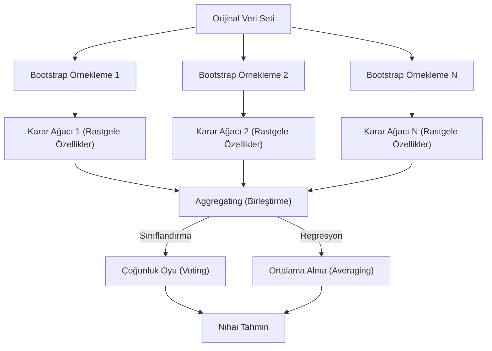

## 📌 Özet
Random Forest (Rastgele Orman), çok sayıda karar ağacının tahminlerini birleştirerek (ensemble) tek bir güçlü tahmin modeli oluşturan, gözetimli bir makine öğrenmesi algoritmasıdır. Algoritma, hem veri setinden (Bootstrap) hem de özniteliklerden (Feature Randomness) rastgele örnekler seçerek farklı ağaçlar eğitir; sınıflandırma için çoğunluk oyunu, regresyon için ise ortalamayı alarak nihai sonucu belirler. Bu 'topluluk öğrenmesi' yaklaşımı, tekil karar ağaçlarının en büyük sorunu olan 'ezberleme' (overfitting) riskini önemli ölçüde azaltırken modelin genelleme başarısını artırır. Ayrıca, eksik verilerle başa çıkabilmesi ve hangi değişkenlerin tahmin üzerinde daha etkili olduğunu (feature importance) göstermesi bakımından veri biliminde çok yaygın kullanılan, esnek bir araçtır.

## 🧠 Detay

### Random Forest Çalışma Mekanizması


### Nasıl Çalışır?
```
1. Bootstrap örnekleme ile N farklı eğitim seti oluştur
2. Her set için rastgele özellik seçerek karar ağacı eğit
3. Sınıflandırma → Çoğunluk oyu
   Regresyon → Ortalama
```

### Sınıflandırma
```python
from sklearn.ensemble import RandomForestClassifier
from sklearn.metrics import classification_report

rf = RandomForestClassifier(
    n_estimators=100,      # ağaç sayısı
    max_depth=10,
    min_samples_leaf=5,
    max_features="sqrt",   # her split'te kaç özellik
    n_jobs=-1,             # tüm CPU'ları kullan
    random_state=42
)

rf.fit(X_train, y_train)
y_pred = rf.predict(X_test)
print(classification_report(y_test, y_pred))
```

### Regresyon
```python
from sklearn.ensemble import RandomForestRegressor
from sklearn.metrics import r2_score, mean_squared_error

rf_reg = RandomForestRegressor(
    n_estimators=200,
    max_depth=15,
    random_state=42,
    n_jobs=-1
)
rf_reg.fit(X_train, y_train)
y_pred = rf_reg.predict(X_test)
print(f"R²: {r2_score(y_test, y_pred):.3f}")
```

### Özellik Önemi
```python
import pandas as pd
import matplotlib.pyplot as plt

onem = pd.DataFrame({
    "Özellik": X.columns,
    "Önem": rf.feature_importances_
}).sort_values("Önem", ascending=False)

plt.figure(figsize=(10, 6))
plt.barh(onem["Özellik"][:15], onem["Önem"][:15])
plt.title("Top 15 Özellik Önemi")
plt.gca().invert_yaxis()
plt.show()
```

### OOB (Out-of-Bag) Skoru
```python
rf = RandomForestClassifier(
    n_estimators=100,
    oob_score=True,     # cross-validation'a gerek kalmaz
    random_state=42
)
rf.fit(X, y)
print(f"OOB Skoru: {rf.oob_score_:.3f}")
```

### Önemli Hiperparametreler
| Parametre | Açıklama | Öneri |
|-----------|----------|-------|
| `n_estimators` | Ağaç sayısı | 100-500 |
| `max_depth` | Max derinlik | None veya 10-20 |
| `max_features` | Split'te özellik | sqrt (sınıf), 1/3 (regresyon) |
| `min_samples_leaf` | Yaprak min | 1-10 |

## 💡 Bağlantılar
- [[ML - Karar Ağaçları]]
- [[ML - Gradient Boosting]]
- [[ML - Hiperparametre Optimizasyonu]]

## ❓ Sorular / Anlamadıklarım
- n_estimators artırmak her zaman daha iyi mi?
- Random Forest ile XGBoost hangi durumda daha iyi?

## 🔗 Kaynaklar
- https://scikit-learn.org/stable/modules/ensemble.html#forest
