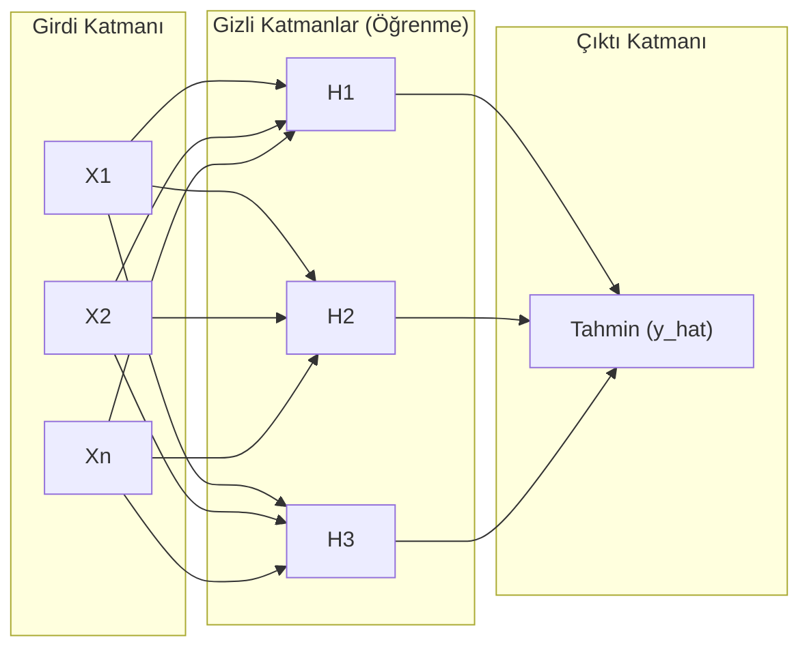

## 📌 Özet
Yapay Sinir Ağları (YSA), insan beyninin biyolojik yapısından ilham alan, birbirine bağlı işlem birimlerinden (nöronlar) oluşan katmanlı bir hesaplama mimarisidir. Veriden öğrenme süreci, girdilerin ağırlıklandırılarak katmanlar boyunca ilerlediği 'İleri Yayılım' (Forward Propagation) ve elde edilen hatanın geriye doğru dağıtılarak ağırlıkların güncellendiği 'Geriye Yayılım' (Backpropagation) mekanizmalarına dayanır. Derin Öğrenmenin (Deep Learning) temel yapı taşını oluşturan bu ağlar, özellikle geleneksel algoritmaların zorlandığı görüntü tanıma, doğal dil işleme ve ses analizi gibi doğrusal olmayan, karmaşık örüntülerin tespitinde benzersiz bir yeteneğe sahiptir. Modelin başarısı; katman sayısı, nöron yoğunluğu, aktivasyon fonksiyonları ve öğrenme oranı gibi hiperparametrelerin hassas bir şekilde optimize edilmesine bağlıdır.

## 🧠 Detay

### Sinir Ağı Mimarisi (Feedforward)


### Temel Kavramlar
```
Girdi Katmanı → Özellikler
Gizli Katmanlar → Öğrenme
Çıktı Katmanı → Tahmin

Nöron → Ağırlıklı toplam + aktivasyon fonksiyonu
Aktivasyon → ReLU, Sigmoid, Tanh, Softmax
Backpropagation → Hata geriye yayılımı
Epoch → Tüm veriyi bir kez görmek
Batch → Her adımda kaç örnek kullanılır
```

### Scikit-learn MLPClassifier
```python
from sklearn.neural_network import MLPClassifier
from sklearn.preprocessing import StandardScaler
from sklearn.pipeline import Pipeline

pipe = Pipeline([
    ("scaler", StandardScaler()),
    ("mlp", MLPClassifier(
        hidden_layer_sizes=(128, 64, 32),  # 3 gizli katman
        activation="relu",
        solver="adam",
        learning_rate_init=0.001,
        max_iter=500,
        early_stopping=True,
        validation_fraction=0.1,
        random_state=42
    ))
])

pipe.fit(X_train, y_train)
```

### Keras / TensorFlow ile
```python
import tensorflow as tf
from tensorflow import keras

model = keras.Sequential([
    keras.layers.Dense(128, activation="relu", input_shape=(X_train.shape[1],)),
    keras.layers.Dropout(0.3),
    keras.layers.Dense(64, activation="relu"),
    keras.layers.Dropout(0.2),
    keras.layers.Dense(1, activation="sigmoid")  # ikili sınıflandırma
])

model.compile(
    optimizer="adam",
    loss="binary_crossentropy",
    metrics=["accuracy"]
)

history = model.fit(
    X_train, y_train,
    epochs=100,
    batch_size=32,
    validation_split=0.2,
    callbacks=[keras.callbacks.EarlyStopping(patience=10)]
)
```

### Eğitim Geçmişi
```python
import matplotlib.pyplot as plt

plt.plot(history.history["loss"], label="Eğitim Loss")
plt.plot(history.history["val_loss"], label="Validation Loss")
plt.xlabel("Epoch")
plt.ylabel("Loss")
plt.legend()
```

### Aktivasyon Fonksiyonları
| Fonksiyon | Kullanım |
|-----------|----------|
| ReLU | Gizli katmanlar (varsayılan) |
| Sigmoid | İkili çıktı |
| Softmax | Çok sınıflı çıktı |
| Tanh | RNN'lerde |

## 💡 Bağlantılar
- [[ML - Overfitting ve Underfitting]]
- [[ML - Hiperparametre Optimizasyonu]]
- [[ML - Makine Öğrenmesine Giriş]]

## ❓ Sorular / Anlamadıklarım
- Kaç katman ve kaç nöron seçmeliyim?
- Batch size modeli nasıl etkiler?

## 🔗 Kaynaklar
- https://keras.io/guides/
- https://scikit-learn.org/stable/modules/neural_networks_supervised.html
